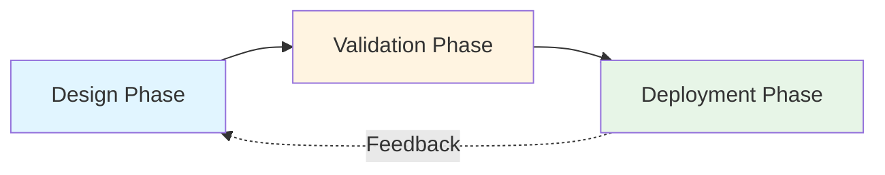
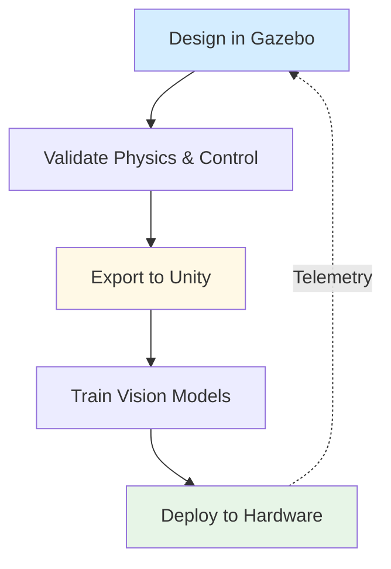

# Chapter 1: Digital Twin Fundamentals

Before deploying a humanoid robot in the real world, engineers validate it in a **virtual replica**—a digital twin. This chapter introduces digital twins as a core concept in physical AI development, explains the trade-offs between simulation and real-world testing, and clarifies when to use Gazebo versus Unity for humanoid robotics.

## 1.1 The Concept of Digital Twins

A **digital twin** is a virtual representation of a physical robot that mirrors its geometry, physics, sensors, and control systems. Unlike static CAD models, digital twins are *dynamic*: they simulate how a robot behaves under realistic conditions—gravity, collisions, sensor noise, actuator limits—before hardware exists or is deployed.

The digital twin lifecycle follows three phases:

1. **Design Phase**: Engineers define the robot's structure (URDF), sensors (cameras, LiDAR), and control logic (ROS 2 nodes) in a simulation environment.
2. **Validation Phase**: The digital twin runs scenarios—navigating stairs, grasping objects, recovering from falls—to identify failures early. Engineers iterate on design without physical prototypes.
3. **Deployment Phase**: Once validated, the design transfers to hardware. Telemetry from real robots feeds back into the twin to refine future simulations.

**Example**: Boston Dynamics uses digital twins to test Atlas's parkour routines. Before a robot attempts a backflip, the twin validates joint torques, landing stability, and recovery strategies across hundreds of simulated attempts. This prevents costly hardware damage and accelerates development.

Digital twins reduce risk, enable parallel testing (simulate 100 scenarios overnight), and allow geographically distributed teams to collaborate on a shared virtual platform.

## 1.2 Simulation vs Real-World Deployment

Simulation offers speed and safety, but the **sim-to-real gap**—differences between virtual and physical behavior—remains a central challenge. Understanding when to simulate versus deploy hardware is critical.

### Benefits of Simulation

| Aspect | Simulation | Real-World Deployment |
|--------|-----------|----------------------|
| **Cost** | Low (no hardware wear) | High (repairs, maintenance) |
| **Speed** | Fast (parallel runs, no setup) | Slow (sequential, charging, travel) |
| **Safety** | Risk-free (crashes are virtual) | Risky (falls can destroy hardware) |
| **Scenarios** | Unlimited (extreme weather, rare events) | Limited (must physically recreate) |
| **Iteration** | Instant (revert to checkpoint) | Slow (rebuild, recalibrate) |

Simulation shines in early development: testing control algorithms, sensor fusion logic, and edge cases (e.g., a humanoid slipping on ice). Teams can run thousands of training episodes for reinforcement learning without waiting for battery charges or repairing actuators.

### The Sim-to-Real Gap

However, simulation is an *approximation*. Key discrepancies include:

- **Physics Accuracy**: Simulated friction, contact dynamics, and material deformation differ from reality. A robot that walks perfectly in Gazebo may stumble on real carpet.
- **Sensor Noise**: Virtual LiDAR returns clean point clouds; real sensors produce reflections, occlusions, and outliers.
- **Latency**: Simulations often assume zero communication delay; real ROS 2 networks introduce jitter.
- **Unmodeled Effects**: Air resistance, cable drag, temperature effects on actuators—simulation may omit these.

**Bridging the Gap**: Modern workflows use **domain randomization** (varying simulation parameters—lighting, surface friction, sensor noise) to train robust models that generalize to hardware. Another strategy is **hardware-in-the-loop (HIL)** testing: running controllers on real hardware while interacting with a simulated environment.

### Decision Criteria

Use simulation when:
- Designing initial prototypes or testing untested algorithms
- Training AI models requiring millions of iterations
- Validating unsafe scenarios (high falls, collision recovery)

Deploy to hardware when:
- Fine-tuning control based on real sensor feedback
- Validating perception in unstructured environments (outdoor terrain, crowds)
- Demonstrating to stakeholders or preparing for production

## 1.3 Role of Gazebo and Unity in Humanoid Robotics

Two tools dominate digital twin development for humanoid robots: **Gazebo** and **Unity**. Each serves distinct purposes, and many teams use both in a hybrid pipeline.

### Gazebo: Physics-Accurate Simulation

**Gazebo** (specifically Gazebo Fortress and later) is an open-source robotics simulator built for ROS 2 integration. It prioritizes **physics accuracy** over visual realism.

Key capabilities:
- **Rigid-Body Dynamics**: Simulates gravity, collisions, joint constraints, and actuator torques using physics engines (ODE, Bullet, DART).
- **ROS 2 Native**: Publishes sensor data (camera, LiDAR, IMU) and subscribes to control commands via ROS 2 topics—identical to real hardware.
- **URDF Integration**: Directly loads robot models defined in URDF, ensuring consistency between simulation and deployment.
- **Sensor Plugins**: Emulates depth cameras, GPS, force-torque sensors with configurable noise.

**Use Case**: Validating whether a humanoid's gait algorithm maintains balance under varying payloads. Gazebo's physics engine computes accurate joint torques and center-of-mass dynamics.

### Unity: High-Fidelity Visualization and HRI

**Unity** is a game engine adapted for robotics via the **Unity Robotics Hub**. It excels in **visual realism** and **human-robot interaction (HRI)** scenarios.

Key capabilities:
- **Photorealistic Rendering**: Ray tracing, dynamic lighting, and texture detail enable training computer vision models on realistic synthetic images.
- **Diverse Environments**: Pre-built assets (buildings, furniture, crowds) allow rapid scenario creation—e.g., a humanoid navigating a hospital.
- **HRI Simulation**: Animate virtual humans to test collaborative tasks (handing objects, following gestures).
- **ROS 2 Bridge**: Communicates with ROS 2 nodes via TCP, enabling Unity to visualize data from Gazebo or real robots.

**Use Case**: Training a vision model to detect human hand gestures in varied lighting (indoors, sunset, shadows). Unity generates thousands of labeled images faster than real data collection.

### Gazebo vs Unity: Decision Matrix

| Criterion | Gazebo | Unity |
|-----------|--------|-------|
| **Physics Accuracy** | High (research-grade) | Moderate (game-oriented) |
| **Visual Fidelity** | Low (functional graphics) | High (photorealistic) |
| **ROS 2 Integration** | Native (zero overhead) | Bridge (TCP latency) |
| **Sensor Simulation** | Robotics-specific (LiDAR, IMU) | Vision-focused (RGB, depth) |
| **Use Case** | Control validation, dynamics | Perception training, HRI |

### Hybrid Workflow

Many teams combine both:

1. **Gazebo** validates that a humanoid can climb stairs without falling (physics correctness).
2. **Unity** generates training data for a stair-detection vision model (perception realism).
3. Both models deploy to hardware, with Unity also serving as a real-time visualization dashboard.

---

Understanding digital twins, the sim-to-real gap, and tool selection prepares you to build robust humanoid systems. In Chapter 2, we'll dive into Gazebo's physics engine to simulate gravity, collisions, and environments that stress-test your robot's control algorithms.
