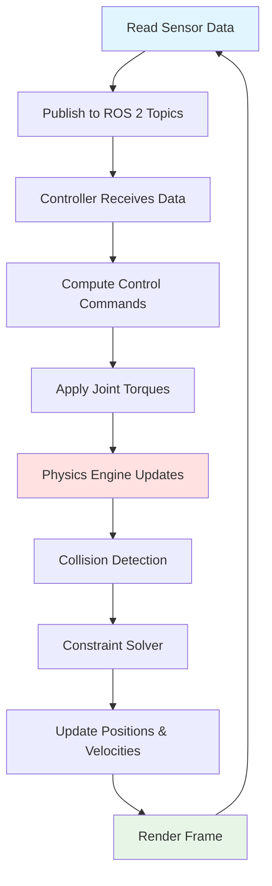

# Chapter 2: Gazebo Physics Simulation

Digital twins are only as useful as the physics engines that power them. In this chapter, we explore **Gazebo**—the open-source simulator built for robotics—and how it models gravity, collisions, and complex environments to validate humanoid behavior before real-world deployment.

## 2.1 Gravity, Collisions, and Rigid-Body Dynamics

At the heart of Gazebo lies a **physics engine** that computes how forces (gravity, contact, joint torques) affect robot motion. Understanding this simulation loop is essential for interpreting results and debugging unexpected behaviors.

### Physics Engines in Gazebo

Gazebo supports multiple physics backends, each with trade-offs:

- **ODE (Open Dynamics Engine)**: Default engine, fast for real-time simulation, stable for wheeled and legged robots
- **Bullet**: More accurate contact dynamics, better for manipulation tasks (grasping, pushing), GPU-accelerated
- **DART (Dynamic Animation and Robotics Toolkit)**: Research-grade accuracy, handles complex kinematic chains (humanoids with 30+ joints)

For humanoid robotics, **DART** is often preferred because it models joint compliance, friction, and momentum transfer with higher fidelity—critical when simulating balance recovery or full-body contact (e.g., a robot catching itself during a fall).

### The Simulation Loop

Every physics tick (typically 1 ms), Gazebo executes this cycle:



**Key stages**:
1. **Sensor Reading**: Virtual cameras, LiDAR, IMUs capture simulated data
2. **Control Computation**: ROS 2 nodes (your Python code) compute desired joint velocities/torques
3. **Physics Update**: Engine applies forces, checks collisions (URDF collision geometries), solves constraints (joint limits, contact forces)
4. **State Update**: Robot's position, velocity, and acceleration updated for next tick

**Example**: A humanoid walking controller publishes ankle torque commands every 10 ms. Gazebo's physics engine computes whether those torques produce stable foot contact or cause slipping (based on ground friction coefficients in the world file). If the center of mass shifts too far, collision detection triggers (robot falls), and the IMU reflects the tumble.

### Humanoid Locomotion Challenges

Simulating bipedal walking exposes edge cases:
- **Contact Switching**: When a foot leaves the ground, constraints change instantly. Poor contact modeling causes foot "tunneling" (passing through floor) or jittering.
- **Joint Limits**: Real actuators have position/velocity/torque limits. Gazebo enforces these via URDF `<limit>` tags, but controllers must respect them to avoid unnatural motion.
- **Damping and Friction**: Without joint damping (energy dissipation), simulated robots oscillate unrealistically. Ground friction determines slip—too low and the robot slides; too high and it sticks unnaturally.

**Validation Insight**: Compare simulated joint torques to manufacturer specs. If Gazebo reports 200 Nm on an ankle joint rated for 150 Nm, the gait is unrealistic and must be adjusted.

## 2.2 Environment and Terrain Modeling

Validating humanoid navigation requires diverse test scenarios: stairs, ramps, rubble, indoor corridors. Gazebo uses **SDF (Simulation Description Format)** world files to define environments.

### World Files and SDF Format

A world file specifies:
- **Ground Plane**: Friction, restitution (bounciness), material properties
- **Static Models**: Buildings, furniture, walls (collision geometry without physics updates)
- **Dynamic Objects**: Movable obstacles (boxes, chairs) with mass and inertia
- **Lighting**: Affects visual sensors (cameras) but not LiDAR or force sensors
- **Physics Plugins**: Custom forces (wind, magnetic fields), ROS 2 bridges

**Example Scenario: Staircase Navigation**

```xml
<!-- Simplified SDF snippet -->
<world name="stairs_test">
  <physics type="ode">
    <real_time_update_rate>1000</real_time_update_rate>
  </physics>
  <model name="stairs">
    <static>true</static>
    <link name="step_1">
      <collision>
        <geometry><box><size>1.0 0.3 0.2</size></box></geometry>
      </collision>
    </link>
    <!-- Repeat for each step -->
  </model>
</world>
```

This defines 10 steps (each 20 cm high, 30 cm deep). A humanoid controller must detect step edges (vision or LiDAR), plan foot placements, and execute torque sequences to climb without tipping.

### Heightmaps for Realistic Terrain

For outdoor scenarios (rough trails, slopes), **heightmaps** encode elevation as grayscale images—white = high, black = low. Gazebo tessellates this into a 3D mesh.

**Use Case**: Testing a search-and-rescue humanoid on rocky terrain. A heightmap derived from real terrain data (LIDAR scans of disaster sites) ensures the robot encounters realistic footholds, slopes, and obstacles.

### Dynamic Obstacles and Interaction

Unlike static walls, dynamic objects respond to robot contact:
- **Pushing a Cart**: Gazebo computes reaction forces when the robot's gripper applies force to a cart's handle. If the controller doesn't account for cart mass (inertia), the robot may lose balance.
- **Debris Field**: Scattered boxes test collision avoidance—does the robot's vision detect objects in time? Does the controller reroute or stop?

### Lighting and Shadows

Visual sensors depend on lighting:
- **Bright Daylight**: High-contrast shadows challenge edge detection algorithms
- **Low Light**: Tests camera exposure limits and night-vision modes
- **Dynamic Lighting**: Flickering lights (fire simulation) or moving shadows (clouds) stress robustness

Gazebo renders these effects for RGB cameras but not LiDAR (which uses laser reflectivity, unaffected by ambient light).

## 2.3 Validating Robot Behavior in Simulation

Simulation fidelity determines whether results transfer to hardware. Validation workflows catch discrepancies early.

### Validation Checklist

| What to Verify | How to Verify | Acceptable Threshold |
|----------------|---------------|---------------------|
| **Joint Torques** | Compare sim vs. datasheet limits | Within 10% of max rated torque |
| **Trajectory Accuracy** | Plot commanded vs. actual joint angles | Less than 2° error over 1-second window |
| **Contact Forces** | Log foot-ground forces during stance | Match expected body weight ± 15% |
| **Sensor Latency** | Timestamp sensor data vs. physics ticks | Less than 5 ms delay (single tick) |
| **Collision Detection** | Trigger known collisions (wall bump) | 100% detection, no phantom collisions |
| **Energy Consistency** | Monitor total system energy (KE + PE) | Less than 1% drift per 10 seconds (no external forces) |

**Example Validation Workflow**:
1. **Record Baseline**: Run a simple task (walk forward 5 meters) in simulation. Log all joint states, torques, IMU readings.
2. **Deploy to Hardware**: Execute identical command sequence on real robot.
3. **Compare Metrics**: Overlay plots—do joint angles match? Do IMU accelerations align? If sim shows stable walking but hardware falls, investigate friction/damping mismatches.
4. **Iterate**: Adjust URDF parameters (joint damping, surface friction) in simulation to match hardware behavior, then revalidate.

### Common Fidelity Issues

- **Overly Optimistic Friction**: Sim uses default µ=1.0 (high grip); real floors may be µ=0.6 (linoleum). Robot slips in reality.
- **Ignored Cable Drag**: Real humanoids trail power/data cables adding 1-2 kg drag; simulation omits this, causing balance errors.
- **Contact Noise**: Real force sensors report noisy readings (ADC quantization, vibration); sim returns perfect values, making controllers brittle to noise.

**Solution**: Add **sensor noise plugins** in Gazebo—Gaussian noise to cameras, bias drift to IMUs, contact jitter to force sensors. Train controllers on noisy sim data for robust hardware transfer.

### Pre-Deployment Checklist

Before moving to hardware:
- ✅ Robot survives 100 consecutive trials (no falls, collisions)
- ✅ Joint torques stay within safe limits across all scenarios
- ✅ Vision/LiDAR detect obstacles at required distances (e.g., 3m for navigation)
- ✅ Emergency stop logic tested (manual stop, collision-triggered stop)
- ✅ Controller parameters tuned for worst-case scenarios (low battery, max payload)

## 2.4 Computational Considerations

Simulation speed directly impacts development iteration time and training efficiency.

### Real-Time vs Faster-Than-Real-Time

- **Real-Time Simulation** (1× speed): Physics steps match wall-clock time (1 sim second = 1 real second). Required when running hardware-in-the-loop or testing human-robot interaction timing.
- **Faster-Than-Real-Time** (2-10× speed): Accelerate physics for batch testing or RL training. Requires powerful CPU/GPU to maintain accuracy—if compute lags, Gazebo drops frames (physics divergence).

**RL Training Example**: Training a humanoid to walk from scratch requires 10 million steps. At real-time (1× speed), this takes 116 days. At 10× speed (achievable with GPU acceleration and simplified collision), it completes in 12 days.

### GPU Requirements

- **Rendering**: Cameras require GPU for ray tracing (shadows, reflections). Headless mode disables rendering for faster physics-only simulation.
- **Physics Acceleration**: Bullet and PhysX engines leverage CUDA for parallel collision detection—critical for multi-robot scenarios (10+ humanoids).
- **Sensor Simulation**: Depth cameras and LiDAR benefit from GPU raycasting (10× faster than CPU).

**Recommended Specs**:
- CPU: 8+ cores (parallel world updates)
- GPU: NVIDIA RTX 3060+ (6GB VRAM) for multi-robot or camera-heavy scenarios
- RAM: 16GB minimum (large worlds with many dynamic objects)

**Cloud Alternative**: Services like AWS RoboMaker or Google Cloud Batch run Gazebo clusters—distribute 1000 training runs across 100 VMs, aggregate results overnight.

---

With Gazebo's physics engine validated and environments built, the next challenge is **sensor realism and human interaction**. Chapter 3 explores Unity's strengths—photorealistic rendering, synthetic data generation, and HRI scenario design—to complement Gazebo's physics foundation.
