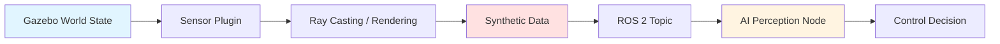

# Chapter 3: Sensors and Unity HRI

Physics simulation forms the foundation of digital twins, but perception and human interaction require another layer: **realistic sensor data** and **high-fidelity visualization**. This chapter explores sensor simulation in Gazebo, Unity's rendering capabilities for human-robot interaction (HRI), and how to design collaborative scenarios that prepare humanoids for real-world deployment.

## 3.1 Simulating LiDAR, Depth Cameras, and IMUs

Humanoid robots rely on sensors to perceive their environment. Simulating these sensors accurately ensures AI perception models trained in simulation transfer to hardware.

### Gazebo Sensor Plugins Architecture

Gazebo uses **sensor plugins** to generate synthetic data that mirrors real sensor outputs. Each plugin:
1. **Reads simulation state** (object positions, materials, lighting)
2. **Simulates physical sensing** (ray-casting for LiDAR, image rendering for cameras)
3. **Publishes to ROS 2 topics** (same message types as hardware)



This pipeline is **transparent to AI code**—your Python node subscribes to `/scan` or `/camera/depth/image` and processes data identically in simulation and on hardware.

### LiDAR Simulation

**LiDAR** (Light Detection and Ranging) emits laser pulses and measures time-of-flight to compute distances. Gazebo's **GPU Ray Sensor** plugin:
- Casts rays in a specified pattern (e.g., 360° horizontal, ±15° vertical)
- Computes intersections with collision geometries
- Returns `sensor_msgs/LaserScan` (2D) or `sensor_msgs/PointCloud2` (3D)

**URDF Configuration Example**:
```xml
<gazebo reference="lidar_link">
  <sensor name="lidar" type="gpu_ray">
    <ray>
      <scan>
        <horizontal>
          <samples>720</samples>  <!-- 0.5° resolution -->
          <min_angle>-3.14159</min_angle>
          <max_angle>3.14159</max_angle>
        </horizontal>
      </scan>
      <range>
        <min>0.1</min>
        <max>30.0</max>  <!-- 30m range -->
      </range>
    </ray>
    <plugin name="lidar_plugin" filename="libgazebo_ros_ray_sensor.so">
      <ros><namespace>/robot</namespace></ros>
      <output_type>sensor_msgs/LaserScan</output_type>
      <frame_name>lidar_link</frame_name>
    </plugin>
  </sensor>
</gazebo>
```

**Realism Considerations**:
- **Noise**: Add Gaussian noise to range measurements (real LiDAR has ±2 cm error)
- **Material Reflectivity**: Configure absorption—glass reflects weakly, metal strongly
- **Occlusion**: Ensure plugin respects obstacles (a wall should block rays)

**Use Case**: A humanoid navigates a cluttered warehouse. LiDAR detects pallet edges at 10m, enabling path planning around obstacles. Without noise simulation, the perception model fails on hardware (real sensors report spurious reflections from dust).

### Depth Camera Simulation

**RGB-D cameras** (e.g., Intel RealSense, Kinect) combine color images with per-pixel depth. Gazebo's **Depth Camera Plugin**:
- Renders scene from camera viewpoint (RGB frame)
- Computes depth via z-buffer (distance to nearest surface)
- Publishes `sensor_msgs/Image` (RGB) + `sensor_msgs/Image` (depth, 16-bit grayscale)

**Key Parameters**:
- **Field of View**: Horizontal/vertical angles (e.g., 87° × 58° for RealSense D435)
- **Resolution**: 640×480 @ 30 Hz (higher resolution → slower simulation)
- **Depth Range**: 0.3m–10m (objects outside range return invalid depth)

**Depth Noise Model**:
Real depth cameras suffer from:
- **Quantization Error**: Depth discretized to 1mm steps
- **IR Interference**: Sunlight washes out infrared patterns (depth fails outdoors)
- **Edge Bleeding**: Depth bleeds across object boundaries

Gazebo plugins support noise injection (`<depth><noise type="gaussian"><stddev>0.01</stddev></noise></depth>`) to mimic these effects.

**Use Case**: Training a grasping model. The robot must estimate object pose from depth images. Simulated noise ensures the model tolerates real-world depth inaccuracies (e.g., shiny surfaces causing depth dropout).

### IMU Simulation

**Inertial Measurement Units (IMUs)** report linear acceleration and angular velocity. Gazebo's **IMU Plugin** computes these from the robot's physics state:
- **Linear Acceleration**: Derived from velocity changes (includes gravity)
- **Angular Velocity**: From orientation changes (roll, pitch, yaw rates)
- **Orientation** (optional): Quaternion or Euler angles

**Noise Sources**:
- **Bias Drift**: Readings slowly drift over time (real IMUs accumulate 0.1°/s error)
- **Random Walk**: Short-term noise (Gaussian)
- **Temperature Sensitivity**: Bias changes with actuator heat (advanced simulation)

**Configuration**:
```xml
<gazebo reference="imu_link">
  <sensor name="imu" type="imu">
    <imu>
      <angular_velocity>
        <x><noise type="gaussian"><stddev>0.009</stddev></noise></x>
      </angular_velocity>
      <linear_acceleration>
        <x><noise type="gaussian"><stddev>0.017</stddev></noise></x>
      </linear_acceleration>
    </imu>
    <plugin name="imu_plugin" filename="libgazebo_ros_imu_sensor.so">
      <ros><namespace>/robot</namespace></ros>
      <frame_name>imu_link</frame_name>
    </plugin>
  </sensor>
</gazebo>
```

**Use Case**: Balance control for a humanoid. The IMU detects tipping (pitch exceeds 5°), triggering ankle torque corrections. Without bias drift simulation, the controller over-relies on IMU and fails when hardware IMU drifts.

### Perception Pipeline Example

A complete perception workflow:
1. **LiDAR** detects obstacles → SLAM node builds 3D map
2. **RGB-D Camera** segments objects → grasp pose estimator computes pickup points
3. **IMU** monitors balance → control node adjusts foot placement

All three sensors publish concurrently, and AI nodes fuse data (e.g., combining LiDAR obstacles with camera object detection). Simulating all three with realistic noise trains robust multi-modal perception.

## 3.2 High-Fidelity Rendering in Unity

While Gazebo excels at physics, its rendering is functional—think early 2000s game graphics. For training vision models or demonstrating HRI, **Unity** provides photorealism.

### Unity Rendering Capabilities

Unity is a game engine with:
- **Physically-Based Rendering (PBR)**: Materials simulate light interactions (metallic reflection, subsurface scattering for skin)
- **Ray Tracing**: Real-time shadows, reflections, global illumination (requires RTX GPU)
- **Post-Processing**: Depth of field, motion blur, bloom—effects that cameras exhibit
- **High-Resolution Textures**: 4K building facades, detailed human skin, realistic foliage

**Why This Matters**:
- **Computer Vision Training**: Models trained on Unity's synthetic images generalize better to real cameras (diverse lighting, occlusions, textures)
- **Stakeholder Demos**: Investors and regulators understand robot capabilities better via photorealistic videos
- **Human Subjects**: Virtual humans in Unity look realistic enough for HRI experiments (gesture recognition, eye contact)

### Unity Robotics Hub Integration

The **Unity Robotics Hub** bridges Unity and ROS 2:
- **ROS-TCP-Connector**: Unity scripts publish/subscribe to ROS topics via TCP
- **URDF Importer**: Converts robot URDF to Unity GameObjects (preserves joint hierarchies)
- **Sensor Simulation**: Unity cameras output ROS `sensor_msgs/Image` messages

**Hybrid Workflow**:
1. **Gazebo** runs physics simulation (accurate dynamics, collision)
2. **Unity** subscribes to `/joint_states` from Gazebo, rendering the robot in a photorealistic scene
3. **Unity** publishes RGB camera feed to ROS → vision model processes images
4. Vision outputs (bounding boxes) sent back to Gazebo's controller

This separates concerns: physics fidelity in Gazebo, visual fidelity in Unity.

### Gazebo vs Unity Rendering Comparison

| Criterion | Gazebo | Unity |
|-----------|--------|-------|
| **Visual Fidelity** | Low (basic shading, flat textures) | High (PBR, ray tracing, 4K textures) |
| **Physics Accuracy** | High (research-grade engines) | Moderate (PhysX for games) |
| **ROS 2 Integration** | Native (zero latency) | Bridge (TCP, ~5-10 ms latency) |
| **Rendering Speed** | Fast (simple shaders) | Slow (ray tracing expensive) |
| **Use Case** | Control validation, sensor accuracy | Vision training, HRI demos, stakeholder presentations |
| **Asset Ecosystem** | Limited (robotics-specific models) | Vast (Unity Asset Store: buildings, humans, nature) |
| **Learning Curve** | ROS-centric (roboticists comfortable) | Game-dev-centric (requires Unity Editor familiarity) |

**Decision Rule**:
- Use **Gazebo** when physics correctness is critical (locomotion, manipulation dynamics)
- Use **Unity** when visual realism drives the task (training object detectors, HRI experiments, marketing demos)
- Use **both** for comprehensive validation (Gazebo for control, Unity for perception)

### HRI Visualization Use Case

**Scenario**: A humanoid nurse delivers medication to hospital patients. The robot must:
1. Navigate crowded hallways (avoid staff, carts)
2. Recognize patient faces (computer vision)
3. Hand medication bottle (grasp + handover)

**Why Unity**:
- **Photorealistic Humans**: Virtual patients and staff with realistic clothing, faces, gaits
- **Hospital Environment**: Pre-built Unity assets (hospital beds, IV stands, lighting fixtures)
- **Camera Training**: Generate 100,000 labeled images (patient faces, medication bottles) across lighting conditions (daylight, fluorescent, evening)

The vision model trained in Unity detects real patients accurately, while Gazebo-validated locomotion ensures safe navigation.

## 3.3 Human-Robot Interaction Scenarios

HRI goes beyond perception—it requires **social intelligence**: understanding human intent, predicting actions, and collaborating safely.

### Virtual Human Agents

Unity and specialized tools (Unreal Engine, CARLA) simulate humans:
- **Animations**: Walking, reaching, sitting (motion-captured from real actors)
- **Gaze Tracking**: Virtual humans look at objects/robots (tests robot's social awareness)
- **Speech**: Synchronized lip movements with text-to-speech (for dialog interaction)

**Agent Autonomy**:
- **Scripted**: Human follows fixed path (e.g., walks from door to chair, sits)
- **Reactive**: Human responds to robot (if robot approaches, human turns to face it)
- **AI-Driven**: Human uses reinforcement learning (e.g., competes with robot to reach a goal)

### Collaborative Task Design

**Example: Object Handover**

A foundational HRI task: human extends arm with object → robot grasps → human releases.

**Simulation Steps**:
1. **Human Approach**: Virtual human walks to robot, stops 1m away
2. **Offer Gesture**: Human extends arm, holds object (bottle) forward
3. **Robot Detection**: Vision model detects bottle, estimates 3D pose from depth camera
4. **Grasp Planning**: Robot computes gripper approach trajectory (avoid hitting human's hand)
5. **Handover**: Robot closes gripper, applies gentle force (force sensor detects object weight)
6. **Confirmation**: Human releases (force increases), robot retracts arm

**HRI Metrics**:
- **Task Success Rate**: % of trials where robot successfully grasps (target: greater than 95%)
- **Handover Time**: Time from offer to grasp completion (target: less than 5 seconds)
- **Safety Violations**: Collisions with human (target: 0%)
- **Smoothness**: Jerk in robot motion (abrupt stops stress human)

### Safety Constraints in Simulation

Real HRI demands **safety guarantees**—robots must never harm humans. Simulation validates safety logic:

**Constraint 1: Speed Limits Near Humans**
- If human detected within 2m → robot speed capped at 0.3 m/s
- If human within 0.5m → robot stops immediately

**Constraint 2: Force Limits**
- Gripper force sensor: if contact force exceeds 10 N → open gripper (drop object rather than crush human)

**Constraint 3: Emergency Stop**
- If IMU detects unexpected collision (acceleration spike) → cut all actuator power
- Virtual humans deliberately bump robot to test E-stop responsiveness

**Testing Adversarial Scenarios**:
- **Unpredictable Human**: Human suddenly moves during handover (does robot adapt or collide?)
- **Object Drop**: Human releases object early (does robot catch or let it fall safely?)
- **Distraction**: Human talks to another person (does robot wait patiently or interrupt?)

Simulating these edge cases—dangerous or impractical with real humans—ensures robust HRI controllers.

### HRI Design Best Practices

1. **Legibility**: Robot motions should be predictable (smooth, deliberate)—sudden movements startle humans
2. **Feedback**: Visual/audio cues (LED colors, beeps) signal robot state (idle, working, need help)
3. **Personalization**: Adapt to user preferences (faster handover for experienced users, slower for elderly)
4. **Failure Recovery**: If handover fails, robot retracts and signals human to retry (don't freeze awkwardly)

Unity's realistic humans enable testing these social nuances before hardware deployment.

---

## Module 2 Conclusion

This module introduced **digital twins** as a bridge between software development and physical robotics. You've learned:

- **Chapter 1**: Digital twins replicate robot behavior in simulation, reducing hardware risk and enabling parallel testing. Gazebo provides physics accuracy, Unity delivers visual realism, and hybrid workflows leverage both.
- **Chapter 2**: Gazebo's physics engines simulate gravity, collisions, and environments. Validation workflows ensure simulation fidelity, catching discrepancies before deployment. Computational trade-offs (real-time vs accelerated) affect iteration speed.
- **Chapter 3**: Sensor simulation (LiDAR, depth cameras, IMUs) trains robust perception. Unity's photorealistic rendering enhances vision training and HRI experiments. Collaborative scenarios with virtual humans validate safety constraints.

**Next Steps**: Future modules will apply these concepts hands-on—building URDF models, writing ROS 2 controllers, training vision models on synthetic data, and deploying to real humanoid hardware. Digital twins remain your testing ground, accelerating iteration and de-risking real-world deployment.

The transition from digital AI to physical AI is challenging, but with simulation as your foundation, you're equipped to tackle humanoid robotics with confidence.
