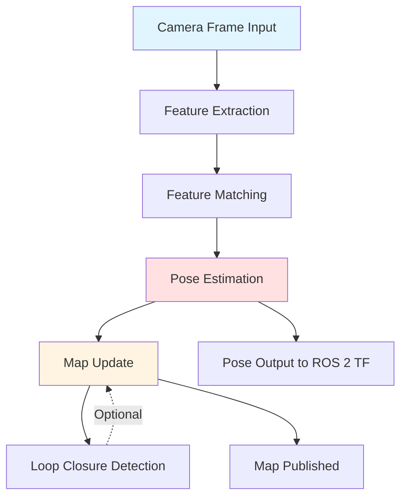
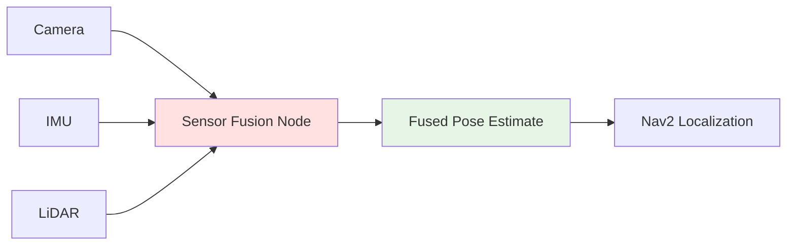

# Chapter 2: Isaac ROS: Perception & VSLAM

Isaac Sim provides the training ground, but real-world humanoid operation demands **real-time perception**—understanding where the robot is, what obstacles surround it, and how the environment is changing. This chapter introduces **Isaac ROS**, NVIDIA's GPU-accelerated perception stack that brings hardware-level speed to Visual SLAM, sensor fusion, and environment mapping for autonomous humanoid navigation.

## 2.1 Hardware-Accelerated Perception with Isaac ROS

Traditional ROS 2 perception nodes run on CPU, limiting real-time performance for compute-intensive tasks like Visual SLAM or deep learning inference. **Isaac ROS** offloads these workloads to NVIDIA GPUs using CUDA and TensorRT, achieving 10-100× speed improvements.

### Isaac ROS Package Ecosystem

Isaac ROS provides modular, GPU-accelerated perception packages that integrate seamlessly with standard ROS 2 workflows:

| Package | Purpose | Input Sensors | Output |
|---------|---------|---------------|--------|
| **isaac_ros_visual_slam** | Localization & mapping | Stereo camera | Robot pose (TF), 3D map |
| **isaac_ros_apriltag** | Fiducial marker detection | RGB camera | Tag pose (TF) |
| **isaac_ros_depth_segmentation** | Obstacle detection | Depth camera | Segmented point cloud |
| **isaac_ros_image_proc** | Image preprocessing | RGB camera | Rectified/debayered images |
| **isaac_ros_dnn_inference** | Object detection/segmentation | RGB camera | Bounding boxes, masks |
| **isaac_ros_nvblox** | 3D reconstruction | Depth camera | Voxel map, mesh |

**Key Advantage**: Each package runs as a standard ROS 2 node—subscribe to `/camera/image_raw`, publish to `/detections`. The *only* difference is execution speed: Isaac ROS leverages Tensor Cores (specialized AI hardware on NVIDIA GPUs) for parallel processing.

### GPU Acceleration Benefits

**Example: Visual SLAM Performance**

- **CPU-based SLAM** (ORB-SLAM3 on Intel i7): 15 FPS, 200ms latency
- **Isaac ROS Visual SLAM** (on NVIDIA Jetson Orin): 60 FPS, 30ms latency

**Why This Matters for Humanoids**:
- **Faster reaction**: 30ms latency means the robot updates its position 6× faster, enabling quicker obstacle avoidance
- **Higher throughput**: 60 FPS processes more camera frames, improving tracking robustness in fast motion (running, turning)
- **Power efficiency**: GPUs process in parallel, using less total energy than multi-threaded CPU for equivalent performance

**Hardware Context**: Isaac ROS targets NVIDIA Jetson platforms (Orin, Xavier) for embedded deployment and RTX GPUs (3060+) for development. Non-NVIDIA hardware won't benefit from acceleration (falls back to slower CPU execution).

### ROS 2 Node Architecture

Isaac ROS nodes follow standard ROS 2 patterns (from Module 1):
- **Publishers/Subscribers**: Same topic interfaces (`sensor_msgs/Image`, `nav_msgs/Odometry`)
- **Services**: Request-response for on-demand processing
- **TF Integration**: Publishes robot pose to ROS 2 TF tree (coordinate transforms)

**Compatibility**: Isaac ROS nodes are drop-in replacements for CPU nodes. Swap `image_proc` for `isaac_ros_image_proc` in your launch file—no code changes required.

## 2.2 Visual SLAM (VSLAM) Workflow

**Visual SLAM** (Simultaneous Localization and Mapping) solves a chicken-and-egg problem: to navigate, a robot must know its position (localization), but to determine position, it must recognize landmarks (mapping). VSLAM does both simultaneously using camera images.

### VSLAM Stages

**Stage 1: Feature Extraction**
- Identify distinct visual features in each camera frame (corners, edges, blobs)
- Common algorithms: ORB (Oriented FAST and Rotated BRIEF), SIFT, AKAZE
- Output: 500-1000 feature points per frame with descriptors (numeric signatures)

**Stage 2: Feature Matching**
- Match current frame's features to previous frames
- Tracks feature motion across frames (e.g., a corner moves 10 pixels left → camera moved right)
- Handles occlusions (features disappearing when objects block view)

**Stage 3: Pose Estimation**
- Compute camera motion from feature correspondences
- If 10 features all shifted right, the camera likely moved left
- Outputs 6-DOF pose (x, y, z position + roll, pitch, yaw orientation)

**Stage 4: Map Update**
- Add new features as 3D landmarks in the map
- Update existing landmark positions based on new observations
- Maintains consistency (same landmark seen from different angles should have same 3D position)

**Stage 5: Loop Closure Detection**
- Recognizes when robot returns to a previously visited location
- Corrects accumulated drift (pose estimates degrade over time)
- Example: Humanoid walks around building, returns to start—loop closure adjusts entire trajectory to close the loop

**Output to ROS 2**:
- **Pose (TF)**: Published to `/tf` topic, available to all ROS 2 nodes
- **Map**: Published as `sensor_msgs/PointCloud2` or `nav_msgs/OccupancyGrid`

### Troubleshooting VSLAM Failures

**Failure Mode 1: Feature-Poor Environments**
- **Symptom**: Tracking lost in white-walled corridors, uniform floors
- **Why**: VSLAM needs distinct features (corners, textures)—blank walls provide none
- **Solution**: Add visual markers (AprilTags), use LiDAR as backup, increase camera exposure to detect faint textures

**Failure Mode 2: Fast Motion**
- **Symptom**: Pose jumps erratically during rapid turns
- **Why**: Features move too far between frames (matching fails)
- **Solution**: Increase camera frame rate (60 FPS), reduce robot speed during turns, use IMU to predict motion

**Failure Mode 3: Dynamic Environments**
- **Symptom**: Map includes moving objects (humans, carts), causing false landmarks
- **Why**: VSLAM assumes static world
- **Solution**: Filter dynamic objects with semantic segmentation (detect "human" class, exclude from SLAM features)

## 2.3 Sensor Fusion and Real-Time Perception

A single sensor type has weaknesses: cameras fail in darkness, LiDAR struggles with glass/mirrors, IMUs drift over time. **Sensor fusion** combines complementary sensors for robust perception.

### Sensor Fusion Architecture

**Camera Contribution**:
- **Strengths**: Rich visual features (textures, colors), passive (no active emission)
- **Weaknesses**: Fails in darkness, affected by lighting changes, no direct depth (stereo required)

**IMU Contribution**:
- **Strengths**: High-frequency updates (200 Hz), works in any lighting, measures acceleration/rotation directly
- **Weaknesses**: Drifts over time (integrating acceleration accumulates error), no absolute position

**LiDAR Contribution**:
- **Strengths**: Accurate depth (±2cm), works in darkness, unaffected by lighting
- **Weaknesses**: Sparse data (360 points vs. 1M pixels in camera), fails on reflective/transparent surfaces

### How Sensor Fusion Works (Intuitive Explanation)

Isaac ROS uses an **Extended Kalman Filter (EKF)**—a mathematical framework that:
1. **Predicts** robot pose based on IMU (fast updates between camera frames)
2. **Corrects** prediction when camera VSLAM or LiDAR provides absolute position
3. **Weighs** each sensor by confidence (if camera is blurry, trust IMU more; if IMU has drifted, trust camera more)

**Intuition**: Imagine estimating your position while blindfolded:
- **IMU alone**: "I walked 10 steps forward, 5 steps left"—works short-term but accumulates error
- **Camera alone**: "I see the door landmark"—accurate but updates only when landmarks visible
- **Fusion**: Use IMU for smooth position updates, use camera to correct drift when landmarks appear

**Real-World Example**:
- Humanoid walks down a corridor (IMU tracks motion at 200 Hz)
- Every 0.1 seconds, camera VSLAM provides position update (corrects IMU drift)
- Robot turns a corner—camera temporarily loses features (relies on IMU)
- Camera re-acquires features after turn—corrects accumulated IMU error

### Covariance and Uncertainty

Sensor fusion doesn't just estimate pose—it estimates **uncertainty**. If the camera is blurry (low confidence), the fusion node increases pose uncertainty. Nav2 path planners use this: if localization uncertainty is high, increase safety margins (wider clearance from obstacles).

**Practical Insight**: IMU-only localization drifts 1%/second. After 10 seconds of walking, the robot might be 10cm off. Camera correction resets uncertainty every 0.1 seconds, keeping error under 2cm.

## 2.4 Mapping and Environment Understanding

VSLAM produces **pose estimates** (where am I?), but autonomous navigation requires **maps** (what's around me?). Isaac ROS supports multiple map representations for different tasks.

### Mapping Types Comparison

| Map Type | Representation | Use Case | Isaac ROS Package |
|----------|----------------|----------|-------------------|
| **Occupancy Grid** | 2D grid (occupied/free/unknown) | Floor-based navigation | `isaac_ros_occupancy_grid` |
| **Point Cloud** | 3D points (x, y, z, intensity) | Manipulation, 3D obstacles | `isaac_ros_pointcloud_utils` |
| **Semantic Map** | Objects with labels (chair, table, human) | Task planning ("sit on chair") | `isaac_ros_dnn_inference` |
| **Voxel Map** | 3D grid of cubes (TSDF representation) | Dense reconstruction, collision | `isaac_ros_nvblox` |

**Occupancy Grid** (2D Navigation):
- Divides floor into cells (10cm × 10cm)
- Each cell: 0 (free space), 100 (occupied by obstacle), -1 (unknown)
- Nav2 planners use this for path planning (avoid occupied cells)

**Point Cloud** (3D Obstacles):
- Raw 3D points from LiDAR or depth camera
- Useful for detecting overhanging obstacles (table edges, doorways)
- High resolution but computationally expensive

**Semantic Map** (Task Planning):
- Adds labels to objects ("This is a chair at position X,Y,Z")
- Enables high-level commands: "Go to the red chair"
- Requires object detection (Isaac ROS DNN inference)

**Voxel Map** (Dense Reconstruction):
- 3D grid representing space as small cubes (voxels)
- Stores signed distance (how far to nearest surface)
- Isaac ROS Nvblox package—optimized for real-time updates

### Dynamic Object Handling

Static maps fail in dynamic environments (humans walking, doors opening). Isaac ROS filters dynamic objects:

1. **Temporal Filtering**: If a voxel changes state (free ↔ occupied) frequently, mark it as dynamic, exclude from static map
2. **Semantic Filtering**: Use object detection to identify "human" class, remove those points from costmap
3. **Decay**: Gradually clear old obstacle observations (object moved, costmap should reflect it)

**Use Case**: Humanoid navigates office. A colleague walks across its path. Semantic filtering detects "human", excludes from static map, tracks as temporary obstacle. Once human passes, path becomes clear again.

---

Mastering Isaac ROS equips you with the perception toolkit for autonomous humanoids—Visual SLAM for localization, sensor fusion for robust estimates, and environment mapping for spatial understanding. In Chapter 3, we'll connect these perception outputs to **Nav2**, the ROS 2 navigation stack that translates "where I am" and "what's around me" into "how to get there safely" through path planning and obstacle avoidance.

**External References**:
- [Isaac ROS Visual SLAM](https://github.com/NVIDIA-ISAAC-ROS/isaac_ros_visual_slam) - Visual SLAM package documentation and examples
- [Isaac ROS Packages](https://nvidia-isaac-ros.github.io/repositories_and_packages/index.html) - Complete package index with usage guides
- [ROS 2 TF2 Transforms](https://docs.ros.org/en/humble/Tutorials/Intermediate/Tf2/Introduction-To-Tf2.html) - Coordinate transform system for sensor fusion
- [NVIDIA Jetson Orin](https://www.nvidia.com/en-us/autonomous-machines/embedded-systems/jetson-orin/) - Recommended embedded GPU for Isaac ROS deployment
