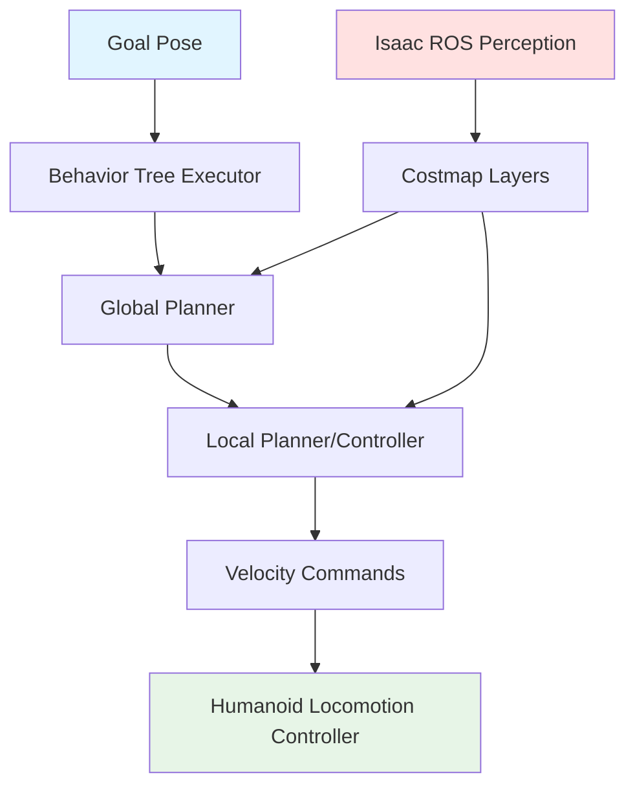
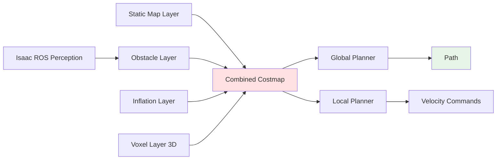
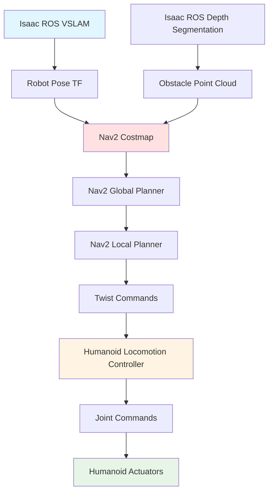

# Chapter 3: Navigation & Path Planning with Nav2

Perception answers "where am I?" and "what's around me?"—but autonomous humanoid operation requires a third capability: **"how do I get there safely?"** This chapter explores **Nav2** (Navigation2), the ROS 2 navigation stack that transforms perception data from Isaac ROS into safe, efficient paths for bipedal robots navigating dynamic environments.

## 3.1 Nav2 Stack for Bipedal Humanoid Movement

**Nav2** is ROS 2's standard navigation framework, originally designed for wheeled robots but adaptable to humanoids with careful configuration. It orchestrates perception, planning, and control into an autonomous navigation pipeline.

### Nav2 Architecture



**Component Roles**:

1. **Goal Pose**: Target position/orientation (e.g., "navigate to (x=5.0, y=2.0, yaw=90°)")
2. **Behavior Tree Executor**: High-level logic (retry if path blocked, cancel if goal unreachable)
3. **Global Planner**: Computes optimal path from current pose to goal using static map (A*, Theta*)
4. **Local Planner/Controller**: Adjusts path in real-time for dynamic obstacles (humans, moving carts), outputs velocity commands
5. **Costmap Layers**: Spatial representation of environment (obstacles, free space, inflation zones)
6. **Isaac ROS Perception**: Provides robot pose (VSLAM) and obstacle data (depth segmentation)
7. **Humanoid Locomotion Controller**: Converts velocity commands (linear, angular) to joint torques for bipedal walking

### Nav2 vs. Wheeled Robot Navigation

Bipedal humanoids add constraints that wheeled robots ignore:

- **Gait Stability**: Must maintain center-of-mass over support polygon (footprint). Sharp turns risk tipping.
- **Step Height Limits**: Cannot traverse obstacles taller than ~20cm (human step capability). Nav2 must avoid stairs/curbs.
- **Minimum Turning Radius**: Humanoid can't spin in place like a differential-drive robot. Requires forward motion to turn.
- **Dynamic Balance**: Stopping abruptly destabilizes. Nav2 must plan smooth deceleration.

**Configuration Implication**: Nav2's local planner parameters must encode these constraints (e.g., `min_turning_radius: 0.5m`, `max_vel_theta: 0.3 rad/s` for slow angular velocity).

### ROS 2 Actions for Navigation

Nav2 uses ROS 2 **actions** (from Module 1) for goal-directed tasks:

```python
# Simplified conceptual example (not executable)
from nav2_msgs.action import NavigateToPose

goal = NavigateToPose.Goal()
goal.pose.position.x = 5.0
goal.pose.position.y = 2.0

# Send goal to Nav2 (asynchronous)
client.send_goal_async(goal)

# Nav2 executes: plan path → follow path → reach goal
# Publishes feedback (current progress)
# Returns result (success or failure reason)
```

**Behavior Tree Logic**: If path blocked → replan. If replanning fails 3 times → abort, report failure. This fault tolerance is critical for real-world deployment.

## 3.2 Path Planning Algorithms

Nav2 separates planning into **global** (long-horizon, optimal paths) and **local** (short-horizon, reactive adjustments).

### Path Planning Algorithm Comparison

| Planner | Algorithm Type | Best For | Humanoid Suitability | Replanning Speed |
|---------|----------------|----------|---------------------|------------------|
| **A*** | Grid-based search | Static environments, optimal paths | Moderate (may have sharp turns) | Slow (seconds) |
| **Theta*** | Any-angle search | Smooth paths, minimal turns | High (gentle curves fit gait) | Moderate (100ms) |
| **DWB** | Dynamic window | Dynamic obstacles, frequent replanning | Very High (adapts to humans) | Fast (10ms) |
| **Smac Planner** | Hybrid A* | Non-holonomic constraints | High (models turning radius) | Moderate (100ms) |

### Global Planners: Long-Range Path Optimization

**A* (A-Star)**:
- Searches grid cells for lowest-cost path from start to goal
- **Cost function**: Distance + obstacle proximity
- **Limitation**: Produces grid-aligned paths (90° turns) unless post-processed
- **Humanoid Use**: Works but requires smoothing to avoid sharp direction changes

**Theta***:
- Extends A* to allow any-angle paths (not just grid-aligned)
- Produces smoother trajectories with fewer waypoints
- **Humanoid Use**: Better—gentle curves match natural gait, fewer stops to reorient

**Smac Planner (State Lattice)**:
- Searches pre-computed motion primitives (e.g., "arc left 30°", "straight 1m")
- Respects non-holonomic constraints (turning radius, velocity limits)
- **Humanoid Use**: Excellent—motion primitives can encode bipedal gait patterns

### Local Planners: Real-Time Obstacle Avoidance

**DWB (Dynamic Window Approach)**:
- Samples possible velocity commands (v_linear, v_angular) within robot's kinematic limits
- Simulates forward motion for each sample (3 seconds into future)
- Selects trajectory that: (1) follows global plan, (2) avoids obstacles, (3) stays within gait constraints
- Re-runs every 100ms (high-frequency replanning)

**Humanoid Configuration**:
- `max_vel_x: 0.5 m/s` (slow walking speed for stability)
- `max_vel_theta: 0.3 rad/s` (gentle turning to avoid tipping)
- `vx_samples: 20` (test 20 forward velocities)
- `vtheta_samples: 40` (test 40 turning rates)

**Why DWB for Humanoids**: Frequent replanning handles dynamic obstacles (moving humans) without stopping. Velocity sampling respects gait limits.

### Selecting Planners for Scenarios

**Scenario 1: Office Navigation (Static, Known Map)**
- **Global**: Theta* (smooth paths around desks, minimal turns)
- **Local**: DWB (adjust for occasional moving colleague)

**Scenario 2: Warehouse (Dynamic, Forklifts/Workers)**
- **Global**: Smac Planner (models turning radius, avoids tight corners)
- **Local**: DWB (high replanning frequency for moving obstacles)

**Scenario 3: Outdoor Terrain (Unknown, No GPS)**
- **Global**: A* (robust, handles unknown regions)
- **Local**: DWB + increased inflation (wider safety margins for uneven ground)

## 3.3 Obstacle Avoidance & Costmap Layers

Nav2 represents the environment as a **costmap**—a grid where each cell has a cost (0 = free, 100 = occupied, 1-99 = risky proximity). Planners minimize path cost.

### Costmap Layers Architecture



**Layer 1: Static Map Layer**
- Pre-built map of permanent obstacles (walls, furniture)
- Loaded from a saved map file (e.g., SLAM-generated occupancy grid)
- Never changes during operation

**Layer 2: Obstacle Layer**
- Real-time obstacles from sensors (Isaac ROS depth segmentation, LiDAR)
- Updated every sensor cycle (30 Hz for cameras)
- Marks cells occupied if depth reading detects object

**Layer 3: Inflation Layer**
- "Inflates" obstacles by robot radius + safety margin
- Ensures paths maintain clearance (humanoid won't clip corners)
- Example: 30cm robot radius + 20cm safety = 50cm inflation around obstacles

**Layer 4: Voxel Layer (3D)**
- Extends costmap vertically (detects overhanging obstacles)
- Critical for humanoids (head height ~1.8m, must avoid low ceilings, shelves)

**Layer Fusion**: Nav2 combines layers—if *any* layer marks a cell as occupied, the combined costmap marks it occupied. Planners then route around high-cost cells.

### Dynamic Obstacle Handling

Static costmaps fail when obstacles move. Nav2 handles dynamics:

**Temporal Decay**:
- Obstacle observations expire after 2-5 seconds
- If a human walked past, their "footprint" clears from costmap automatically
- Prevents outdated obstacles from blocking paths

**Object Tracking**:
- Track moving objects (Kalman filter on object centroids)
- Predict future positions (if human walking at 1 m/s east, predict they'll be 2m east in 2 seconds)
- Local planner avoids predicted positions (proactive avoidance)

**Safety Zones for Humanoids**:
- **Critical Zone** (0.3m radius): Never allow path planning (too close, collision risk)
- **Caution Zone** (0.5m radius): High cost (planner avoids unless necessary)
- **Awareness Zone** (1.0m radius): Moderate cost (planner prefers alternatives)

**Example**: Humanoid navigating crowded lobby. Human walking perpendicular to robot's path. Nav2:
1. Detects human in obstacle layer (Isaac ROS depth segmentation)
2. Predicts human will cross path in 3 seconds
3. Local planner slows down (lets human pass) or re-routes (goes around predicted position)

## 3.4 Perception-to-Control Pipeline

Nav2 doesn't exist in isolation—it consumes perception data (Isaac ROS) and produces motion commands (locomotion controller). Understanding this **end-to-end pipeline** is critical for debugging and optimization.

### End-to-End Data Flow



**Step 1: Perception (Isaac ROS)**
- VSLAM estimates robot pose (x, y, yaw) at 30 Hz
- Depth segmentation detects obstacles, publishes point cloud
- Both outputs publish to standard ROS 2 topics

**Step 2: Costmap Update (Nav2)**
- Costmap subscribes to `/odom` (pose) and `/obstacle_points` (obstacles)
- Updates obstacle layer with new depth data
- Combines with static map and inflation layers

**Step 3: Global Planning**
- Runs when new goal received or significant map change
- Computes optimal path from current pose to goal
- Publishes path as sequence of waypoints

**Step 4: Local Planning**
- Runs at 10-20 Hz (high frequency)
- Adjusts global path for new obstacles
- Samples velocity commands, selects best trajectory

**Step 5: Velocity Commands (Twist)**
- Publishes `geometry_msgs/Twist`: linear velocity (m/s), angular velocity (rad/s)
- Standard ROS 2 message type

**Step 6: Locomotion Controller**
- Humanoid-specific (outside Nav2 scope)
- Converts Twist commands to footstep plans
- Example: "0.3 m/s forward" → "step left foot 30cm forward, shift weight, step right foot 30cm forward"

**Step 7: Joint Commands**
- Locomotion controller outputs joint trajectories
- Published to `/joint_trajectory_controller/command`
- Actuators execute (humanoid walks)

### Latency Considerations

Each stage adds latency:
- Isaac ROS VSLAM: 30ms
- Costmap update: 10ms
- Local planner: 50ms
- Locomotion controller: 20ms

**Total**: ~110ms from perception to actuation

**Impact**: At 0.5 m/s walking speed, robot moves 5.5cm during this delay. Nav2 must account for this (predict future position when issuing commands).

### Failure Recovery Strategies

**Scenario: Path Blocked**
- Local planner detects obstacle in global path
- Attempts local deviation (go around)
- If deviation fails (dead end) → requests global replan
- If global replan fails → behavior tree triggers "recovery behaviors" (rotate in place to scan, back up)

**Scenario: Localization Lost**
- VSLAM loses tracking (feature-poor environment)
- Nav2 detects high pose uncertainty (covariance threshold exceeded)
- Stops motion (safety first), switches to recovery mode (rotate to re-acquire features)

## 3.5 Module 3 Conclusion

This module equipped you with the **AI-robot brain**—the perception and navigation intelligence that transforms humanoid robots from remotely-controlled machines into autonomous agents.

**Chapter 1 (Isaac Sim)**: Introduced photorealistic simulation and automated synthetic data generation for training perception AI at scale. You learned how Isaac Sim's Replicator generates thousands of labeled images, how domain randomization bridges the sim-to-real gap, and how Isaac Sim integrates with ROS 2 and Gazebo for hybrid workflows.

**Chapter 2 (Isaac ROS)**: Explored hardware-accelerated perception with GPU-optimized ROS 2 nodes. You understood Visual SLAM's workflow (feature tracking → pose estimation → map building), sensor fusion techniques for robust localization (camera + IMU + LiDAR), and environment mapping strategies for different navigation tasks (occupancy grids, point clouds, semantic maps).

**Chapter 3 (Nav2)**: Connected perception to autonomous movement through the Nav2 navigation stack. You learned how path planning algorithms (A*, Theta*, DWB) generate trajectories, how costmap layers fuse perception data for obstacle avoidance, and how the perception-to-control pipeline delivers velocity commands to humanoid locomotion controllers.

**The Complete Stack**:
```
Sensors (Camera, IMU, LiDAR)
    ↓
Isaac ROS Perception (VSLAM, Sensor Fusion, Mapping)
    ↓
Nav2 Navigation (Path Planning, Obstacle Avoidance)
    ↓
Locomotion Controller (Footstep Planning, Balance Control)
    ↓
Actuators (Joint Motors)
```

**Next Steps**: Future modules will transition from conceptual understanding to hands-on implementation—installing Isaac Sim and Isaac ROS, configuring Nav2 for your humanoid's specific gait, deploying perception models trained on synthetic data, and field-testing autonomous navigation in real environments.

The journey from digital AI to physical AI is complex, but with simulation (Modules 2-3), perception (Isaac ROS), and navigation (Nav2) as your foundation, you're prepared to build intelligent, autonomous humanoid systems that operate safely in the real world.

---

**External References**:
- [ROS 2 Nav2 Documentation](https://navigation.ros.org/) - Official Nav2 stack architecture and tutorials
- [Nav2 Planners](https://navigation.ros.org/plugins/index.html) - Plugin documentation for all available planners
- [Nav2 Behavior Trees](https://navigation.ros.org/behavior_trees/index.html) - Behavior tree executor and recovery behaviors
- [Nav2 Costmap Layers](https://navigation.ros.org/configuration/packages/configuring-costmaps.html) - Costmap configuration guide
