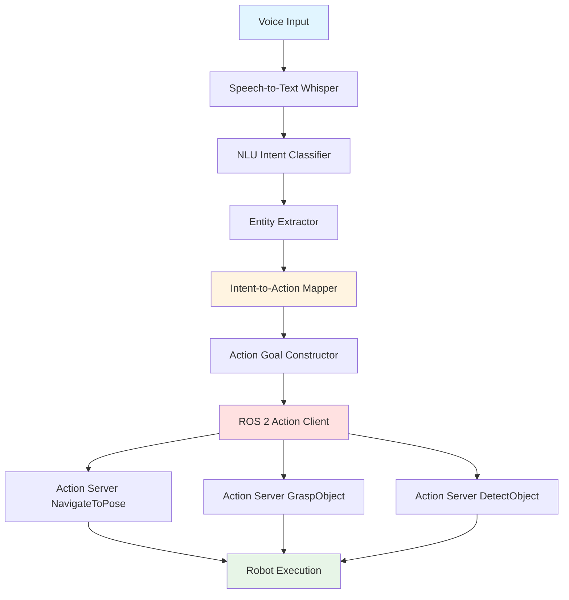

# Chapter 1: Voice-to-Action with OpenAI Whisper

Modules 1-3 equipped humanoid robots with perception, navigation, and autonomy—but controlling them still requires programming expertise. **Voice control** democratizes robotics: anyone can command a humanoid with natural speech. This chapter explores how speech recognition converts voice commands to text, how natural language understanding (NLU) extracts intent, and how these systems integrate with ROS 2 actions to enable voice-controlled autonomous humanoids.

## 1.1 Speech Recognition and Audio Processing

Turning spoken words into robot actions begins with **speech-to-text**: converting acoustic waveforms into written text that machines can process.

### Audio Capture and Preprocessing

**Microphone Input**:
- Humanoid robots use directional microphones (often arrays with 2-8 mics) to capture voice commands
- Sampling rate: 16 kHz standard for speech (higher than phone calls at 8 kHz, lower than music at 44.1 kHz)
- Audio format: Raw PCM (pulse-code modulation) or compressed formats (FLAC for lossless)

**Noise Reduction**:
Real-world environments are noisy—robot motors humming, ambient conversations, air conditioning. Noise reduction filters clean the audio:
- **Spectral Subtraction**: Estimates background noise spectrum, subtracts from signal
- **Beamforming**: Microphone arrays focus on sound from a specific direction (user's voice), attenuate off-axis noise
- **Deep Learning Denoisers**: Neural networks trained to separate speech from noise (RNNoise, Facebook Demucs)

**Why This Matters**: Without noise reduction, a humanoid in a warehouse hears "pick up the box" as garbled input, causing transcription errors ("lick cup the fox"). Clean audio improves speech-to-text accuracy from 70% to 95%+.

### Wake Word Detection

Continuous speech recognition drains power and processes irrelevant audio. **Wake words** activate listening:
- **Examples**: "Hey Robot", "Okay Humanoid", custom names
- **Detection**: Lightweight neural networks (1-5MB models) run continuously, listening for specific phrase
- **Activation**: When wake word detected → start full speech-to-text processing

**Trade-Off**: Wake words add friction (user must remember phrase) but save compute and prevent false activations (robot doesn't respond to ambient speech).

### Speech-to-Text with OpenAI Whisper

**Whisper** is OpenAI's speech recognition model, trained on 680,000 hours of multilingual data. It converts audio to text with high accuracy across accents, languages, and noisy conditions.

**Whisper Workflow**:

**Whisper Architecture** (Conceptual):
- **Encoder**: Processes audio mel-spectrogram (visual representation of sound frequencies)
- **Decoder**: Generates text tokens sequentially (auto-regressive transformer)
- **Output**: Transcribed text + confidence scores + language detection

**Accuracy Considerations**:
- **Clean speech**: 95-98% word accuracy
- **Noisy environments**: 85-90% (noise reduction helps)
- **Accents**: Robust (trained on global data) but may struggle with rare dialects
- **Domain-specific terms**: May mis-transcribe robotics jargon ("Nav2" might become "nav two")

**Deployment Options**:
- **Cloud API**: Send audio to OpenAI servers (requires internet, ~1-2 second latency)
- **Local Model**: Run Whisper on robot's onboard GPU (NVIDIA Jetson, faster but requires compute)

## 1.2 Natural Language Understanding (NLU)

Transcribed text like "pick up the red cup" is just a string—the robot must understand **intent** (what action?) and **entities** (which objects?).

### Intent Classification

**Intent** identifies the user's goal:
- **Navigate**: User wants robot to move somewhere
- **Grasp**: User wants robot to pick up an object
- **Place**: User wants robot to put object down
- **Query**: User asks for information ("where is the kitchen?")
- **Stop**: User wants robot to halt

**Classification Methods**:
- **Keyword Matching**: Simple rules ("go to" → navigate, "pick up" → grasp)
- **Machine Learning**: Train classifier on labeled voice commands (effective for 100+ intent types)
- **LLM-Based**: Use GPT to classify intent (flexible but requires API call)

### Entity Extraction

**Entities** are parameters for the action:
- **Objects**: "red cup", "the box", "water bottle"
- **Locations**: "kitchen", "meeting room", "table"
- **Quantities**: "three plates", "all the trash"
- **Colors**: "red", "blue", "green"
- **Modifiers**: "carefully", "quickly", "quietly"

**Extraction Example**:
- Command: "Bring me the red cup from the kitchen"
- Intent: `fetch`
- Entities: `object=cup, color=red, location=kitchen, target=user`

### NLU Intent Mapping Table

| Voice Command | Intent | Entities | ROS 2 Action |
|--------------|--------|----------|--------------|
| "Go to the kitchen" | navigate | location: kitchen | NavigateToPose(kitchen_pose) |
| "Pick up the red cup" | grasp | object: cup, color: red | DetectObject(red, cup) + GraspObject |
| "Bring me water" | fetch | object: water, target: user | Navigate + Grasp + Navigate + Handover |
| "Stop" | halt | none | CancelAllGoals |

### Handling Ambiguity

Voice commands are often unclear:
- **Ambiguous References**: "Pick up the cup" (which cup if multiple present?)
- **Underspecified Actions**: "Clean the table" (wipe it? Clear objects?)
- **Contradictory Commands**: "Go to kitchen quietly" (speed constraint conflicts with urgency)

**Strategies**:
1. **Clarification Questions**: Robot asks "Which cup—the red one or blue one?"
2. **Default Assumptions**: If unspecified, choose closest object or most recent reference
3. **Confirmation**: Robot repeats command "I will pick up the red cup. Confirm?"

## 1.3 Voice-to-ROS 2 Action Integration

NLU outputs intent and entities—but robots execute **ROS 2 actions** (from Module 1, Chapter 2). The integration layer maps intents to action goals.

### Integration Architecture

**Component Roles**:
1. **Voice Input**: User speaks command
2. **Speech-to-Text**: Whisper converts to text
3. **NLU**: Classifies intent, extracts entities
4. **Intent-to-Action Mapper**: Maps intent to ROS 2 action type (navigate → NavigateToPose, grasp → GraspObject)
5. **Action Goal Constructor**: Fills action goal parameters from entities (location=kitchen → pose coordinates)
6. **Action Client**: Sends goal to appropriate action server (from Module 1)
7. **Action Server**: Executes action (navigation, manipulation)
8. **Robot Execution**: Humanoid performs commanded task

### Parameter Mapping

Voice entities must map to ROS 2 action goal fields:

**Example: Navigate Intent**
- Entity: `location="kitchen"`
- Mapping: Look up "kitchen" in semantic map → (x=5.0, y=2.0, yaw=90°)
- Action Goal: `NavigateToPose.Goal(pose=PoseStamped(x=5.0, y=2.0, yaw=90°))`

**Example: Grasp Intent**
- Entities: `object="cup", color="red"`
- Mapping: Trigger object detection → get object pose → plan grasp
- Action Sequence: `DetectObject(class=cup, color=red)` → get pose → `GraspObject(pose=detected_pose)`

### Error Handling

Voice commands can fail at multiple stages:

**Speech-to-Text Errors**:
- Misheard command ("pick up the box" → "lick up the fox")
- Solution: Confidence thresholds (reject if Whisper confidence is less than 80%), confirmation dialogs

**Invalid Intents**:
- Command not in recognized set ("do a backflip")
- Solution: Fallback response "I don't know how to do that. Try: go to [location], pick up [object]"

**Missing Entities**:
- Command incomplete ("go to the...")
- Solution: Clarification "Go to where? Kitchen or living room?"

**Impossible Actions**:
- Entity doesn't exist ("pick up the unicorn")
- Solution: Perception check—if object not detected, reply "I don't see a unicorn"

## 1.4 Use Cases and Limitations

Voice control excels in certain scenarios but has trade-offs.

### When to Use Voice Control

**Advantages**:
- **Accessibility**: Non-experts can command robots (no programming required)
- **Hands-Free**: User can direct robot while multitasking
- **Natural**: Speaking is faster than typing or GUI interaction for simple commands

**Ideal Use Cases**:
- **Home Assistance**: "Bring me my medication", "turn off the lights"
- **Warehouse Logistics**: "Move pallet to zone B", "count boxes on shelf 3"
- **Elderly Care**: "Call for help", "remind me to take pills"

### Limitations

**Latency**:
- Speech-to-text: 500ms-2 seconds (cloud Whisper)
- Total voice-to-execution: 2-5 seconds including NLU, planning, action initiation
- **Impact**: Not suitable for real-time control ("stop immediately" has dangerous delay)

**Privacy**:
- Cloud speech recognition sends audio to external servers
- Concern for sensitive environments (hospitals, homes)
- **Mitigation**: Local Whisper model (no cloud) or edge processing

**Noise Sensitivity**:
- Fails in extremely loud environments (construction sites, concerts)
- Competing voices confuse intent

**Complexity Limit**:
- Good for simple commands ("go there", "pick that")
- Struggles with complex multi-step tasks ("rearrange the living room for the party")
- **Solution**: Use LLM planning (Chapter 2) for complex tasks

### Safety Considerations

**Confirmation for Risky Actions**:
- Before executing potentially dangerous commands (moving near humans, grasping fragile objects), robot confirms: "I will pick up the glass vase. Confirm?"
- User must say "yes" or "confirm" before execution

**Restricted Action Sets**:
- In human-proximity mode, disable fast motion commands
- Example: If human detected within 2m, reject "move quickly"

**Emergency Voice Stop**:
- Dedicated phrase "Emergency stop" bypasses all processing → immediate halt
- Must work even if other systems failing

---

Voice control transforms humanoid robots from programmer-controlled machines to **user-friendly assistants**. However, voice alone handles only simple, well-defined tasks. In Chapter 2, we'll explore **LLM-based cognitive planning**—enabling robots to decompose complex natural language goals ("prepare dinner") into sequences of actions, unlocking true task-level autonomy.

**External References**:
- [OpenAI Whisper Documentation](https://platform.openai.com/docs/guides/speech-to-text) - Speech recognition API and model details
- [Whisper GitHub Repository](https://github.com/openai/whisper) - Open-source Whisper model and usage examples
- [ROS 2 Audio Common](https://github.com/ros-perception/audio_common) - ROS 2 packages for audio capture and processing
- [Voice User Interfaces for Robotics Research](https://arxiv.org/abs/2109.04456) - Academic paper on voice-controlled robots (if available)
