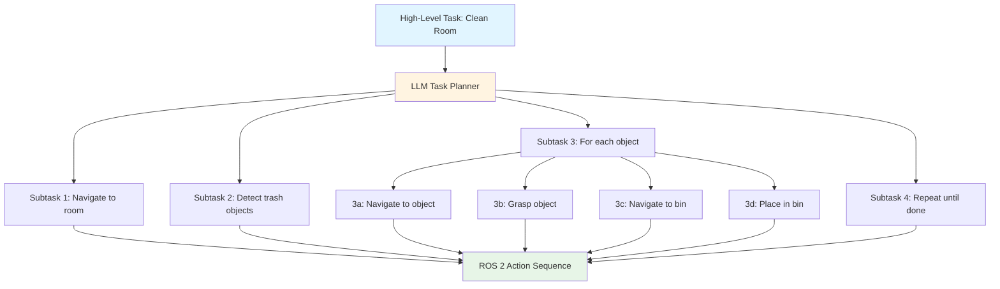
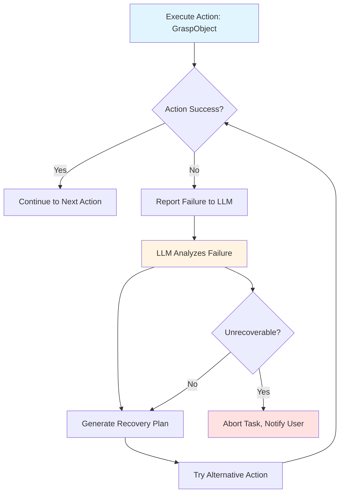

# Chapter 2: Cognitive Planning with LLMs

Voice control (Chapter 1) enables simple commands like "pick up the cup"—but what about **complex tasks** requiring multiple steps and decision-making? "Clean the room" involves navigating, detecting objects, grasping items, navigating to disposal, and repeating—dozens of actions. **Large Language Models (LLMs)** like GPT-4 can decompose high-level goals into robot-executable action sequences, enabling cognitive planning for autonomous humanoids.

## 2.1 LLM Task Decomposition

Traditional robot programming requires engineers to script every action. LLMs flip this: users describe goals in natural language, and the LLM generates the action plan.

### High-Level Task Understanding

**What LLMs Do**:
- Parse human intent from vague descriptions ("tidy up the workspace")
- Break down abstract goals into concrete subtasks
- Sequence subtasks respecting dependencies (navigate before grasp, detect before navigate)

**Example: "Clean the Room"**

**Human Goal**: "Clean the living room"

**LLM Decomposition** (conceptual prompt to GPT-4):

```
You are a humanoid robot planner. Decompose this task into ROS 2 actions:
Task: Clean the living room
Available actions: Navigate(location), DetectObjects(class), GraspObject(pose), PlaceObject(location)

Output plan:
```

**LLM Output** (example):
1. `Navigate(living_room_center)` — Move to room
2. `DetectObjects(class=trash)` — Find trash items
3. For each detected object:
   a. `Navigate(object_pose)` — Approach object
   b. `GraspObject(object_pose)` — Pick up trash
   c. `Navigate(trash_bin)` — Go to disposal
   d. `PlaceObject(trash_bin)` — Release object
4. Repeat until no trash detected

### Task Decomposition Workflow



**Why LLMs Excel**:
- **Generalization**: Trained on vast text (code, instructions, documentation), LLMs understand common task structures
- **Few-Shot Learning**: Providing 1-3 example task decompositions teaches the LLM your robot's action format
- **Flexible**: Works for novel tasks without reprogramming ("organize bookshelf by color" → LLM figures out steps)

### Mapping to Robot Primitives

LLMs must translate abstract concepts to **robot primitives**—basic actions the robot can execute:

**Primitive Actions** (from Modules 1-3):
- `Navigate(pose)` — Move to location (Module 3, Nav2)
- `DetectObjects(class, color)` — Find objects (Module 3, Isaac ROS)
- `GraspObject(pose)` — Pick up object (manipulation controller)
- `PlaceObject(location)` — Release object at location
- `ScanEnvironment()` — Build map (Module 3, VSLAM)

**Decomposition Example**: "Set the table for dinner"

LLM breaks down into:
1. Navigate(dining_table)
2. ScanEnvironment() — Verify table clear
3. For each item in [plate, cup, fork, knife]:
   a. Navigate(kitchen_cabinet)
   b. DetectObjects(item)
   c. GraspObject(item_pose)
   d. Navigate(dining_table)
   e. PlaceObject(table_position)

## 2.2 Mapping Tasks to Robot Capabilities

LLMs are powerful but don't inherently know what robots can and cannot do. **Grounded planning** ensures LLM plans are executable given real robot constraints.

### Robot Affordances and Constraints

**Affordances**: What the robot CAN do
- Navigate on flat ground (Nav2 path planning)
- Detect known object classes (Isaac ROS trained models)
- Grasp objects within reach (arm workspace)

**Constraints**: What the robot CANNOT do
- Cannot fly or jump
- Cannot grasp objects heavier than payload limit (e.g., 5 kg)
- Cannot navigate stairs without special hardware
- Cannot detect objects without line-of-sight

**Example Failure**: User says "bring me the book from the upstairs bedroom"
- LLM generates: `Navigate(upstairs_bedroom)` → `DetectObjects(book)` → `GraspObject` → `Navigate(downstairs)`
- **Problem**: Robot cannot climb stairs
- **Solution**: LLM must be informed of robot's limitations

### Capability Mapping Table

| Task Component | Robot Capability Required | Module Reference |
|----------------|---------------------------|------------------|
| "Navigate to kitchen" | Nav2 path planning + VSLAM localization | Module 3, Ch 2-3 |
| "Find red cup" | Isaac ROS object detection (with color filtering) | Module 3, Ch 2 |
| "Pick up cup" | Manipulation controller + grasp planning | (Manipulation module) |
| "Avoid obstacles" | Nav2 costmap + dynamic obstacle avoidance | Module 3, Ch 3 |
| "Recognize person" | Isaac ROS human pose estimation | Module 3, Ch 2 |
| "Open door" | Manipulation (if door is handle-type) OR NOT POSSIBLE (if push-bar) | Depends on hardware |

**Grounding Strategy**: Provide LLM with robot's **capability manifest** in the prompt:

```
You are planning for a humanoid robot with these capabilities:
- Navigation: Flat ground only, max speed 1 m/s, Nav2 path planning
- Perception: Isaac ROS DetectNet (classes: cup, book, bottle, person)
- Manipulation: Grasp objects 100g-5kg within 0.8m reach
- Constraints: Cannot climb stairs, cannot grasp liquids, requires 0.5m clearance

Task: [user's task]
Generate feasible plan using ONLY available capabilities.
```

### Reality Grounding and Feasibility Checking

LLMs can **hallucinate** plans—generating actions that sound reasonable but are impossible.

**Example Hallucination**:
- Task: "Make me coffee"
- LLM Plan: `Navigate(kitchen)` → `GraspCoffeeBeans` → `OperateCoffeeMaker` → `PourCoffee` → `BringCoffeeToUser`
- **Problem**: Robot may not have `OperateCoffeeMaker` action or fine manipulation for pouring

**Feasibility Checks**:
1. **Action Validation**: Verify each planned action exists in robot's action library
2. **Parameter Validation**: Check if action parameters are valid (object exists, location reachable)
3. **Pre-Execution Simulation**: Test plan in Gazebo/Isaac Sim (Module 2) before real execution
4. **Perception-Driven Replanning**: After each action, check if world state matches expectations

## 2.3 LLM Planning Strategies

Effective LLM planning requires **prompt engineering**—structuring requests to guide LLM reasoning.

### Few-Shot Prompting

**Few-shot learning**: Provide examples of task decompositions to teach the LLM your format.

**Example Few-Shot Prompt**:

```
Decompose tasks into ROS 2 actions for a humanoid robot.

Example 1:
Task: Bring me water
Plan:
1. Navigate(kitchen)
2. DetectObjects(class=bottle, contents=water)
3. GraspObject(detected_bottle_pose)
4. Navigate(user_location)
5. HandoverObject(user)

Example 2:
Task: Clear the table
Plan:
1. Navigate(table)
2. DetectObjects(class=dish, class=cup, class=utensil)
3. For each object:
   a. GraspObject(object_pose)
   b. Navigate(kitchen_counter)
   c. PlaceObject(counter)

Now decompose this task:
Task: [user's new task]
Plan:
```

**Why It Works**: LLMs pattern-match from examples. Showing 2-3 examples teaches:
- Action syntax (`Navigate(location)` format)
- Common patterns (detect before grasp, navigate before interact)
- Iteration structures (for-each loops)

### Chain-of-Thought Reasoning

**Chain-of-thought (CoT)**: Ask LLM to explain reasoning before generating plan.

**CoT Prompt**:

```
Task: Organize the bookshelf by color

First, explain the steps needed:
[LLM explanation]: "To organize by color, I need to: (1) detect all books and their colors, (2) group books by color, (3) remove books from shelf, (4) place books back in color-sorted order."

Now generate the action plan:
1. Navigate(bookshelf)
2. ScanEnvironment() — Detect all books
3. DetectObjects(class=book) WITH color detection
4. GroupByColor(detected_books) — Internal planning step
5. For each book in current_shelf_order:
   a. GraspObject(book_pose)
   b. PlaceObject(temporary_staging_area)
6. For each color_group in [red, blue, green, ...]:
   a. For each book in color_group:
      i. GraspObject(book_pose)
      ii. PlaceObject(shelf, position=next_slot)
```

**Benefit**: Explicit reasoning reduces errors. LLM less likely to skip steps or generate infeasible actions.

### Error Recovery and Replanning

Robot actions fail: object not detected, navigation blocked, grasp missed. LLMs can **replan** when failures occur.

**Error Recovery Workflow**:



**Example Recovery Prompt**:

```
Original task: Pick up the red cup
Action attempted: GraspObject(red_cup_pose)
Failure reason: Grasp unsuccessful, object slipped
Current state: Robot hand empty, cup still on table

Generate recovery plan:
```

**LLM Recovery Plan**:
1. Navigate(cup) — Re-approach from different angle
2. DetectObjects(class=cup, color=red) — Refresh object pose
3. AdjustGraspPose(detected_pose, angle=+30deg) — Try different grasp orientation
4. GraspObject(adjusted_pose)

### Validation Before Execution

**Validation**: Check plan feasibility before sending actions to robot.

**Validation Checks**:
1. **Syntax Check**: Do all actions exist in robot's API?
2. **Dependency Check**: Does action order make sense? (Can't grasp before navigating to object)
3. **Resource Check**: Do required sensors/actuators work? (Camera functional for detect, gripper operational for grasp)
4. **Simulation Check**: Run plan in Gazebo/Isaac Sim (Module 2) — does it succeed?

**Validation Prompt** (for LLM):

```
Review this plan for feasibility:
[Generated plan]

Check:
- Are all actions executable by robot?
- Is action ordering correct?
- Are there missing steps?

If issues found, revise plan.
```

## 2.4 LLM Planning vs. Scripted Behaviors

LLMs aren't always the answer. **Scripted behaviors** (pre-programmed action sequences) are better for certain tasks.

### When to Use LLM Planning

**LLM Advantages**:
- **Open-Ended Tasks**: "Clean the room" (environment varies, object count unknown)
- **Natural Language Input**: User describes task in conversational language
- **Adaptability**: Can handle novel tasks without reprogramming
- **Few-Shot Learning**: New behaviors taught via examples, not code

**Best Use Cases**:
- Home assistance (tasks vary daily)
- Warehouse logistics (inventory changes, orders vary)
- Research robots (experimenting with new tasks)

### When to Use Scripted Behaviors

**Scripted Advantages**:
- **Deterministic**: Same input → same output (no LLM variability)
- **Fast**: No API call latency (scripts execute immediately)
- **Safe**: Pre-validated, no risk of LLM generating unsafe action
- **Offline**: Works without internet (no cloud LLM dependency)

**Best Use Cases**:
- **Safety-Critical**: Emergency stop, collision avoidance (must be deterministic)
- **High-Frequency**: Reactive control (balance correction at 100 Hz)
- **Known Tasks**: Repetitive actions (assembly line, picking known objects)

### Hybrid Approaches

**Combine LLM planning with scripted safety**:

1. **LLM Generates High-Level Plan**: "Bring me the cup"
2. **Scripted Execution with Safety Checks**:
   - Navigate action → scripted Nav2 planner with collision avoidance
   - Grasp action → scripted grasp controller with force limits
   - Human proximity detection → scripted safety stop (overrides LLM)

**Example Hybrid System**:
- **LLM Layer**: Task decomposition, replanning, natural language understanding
- **Scripted Layer**: Low-level motion control, safety monitors, sensor drivers

| Aspect | LLM Planning | Scripted Behaviors | Hybrid Approach |
|--------|--------------|-------------------|-----------------|
| **Flexibility** | High (handles novel tasks) | Low (requires programming) | High (LLM) + Reliable (scripts) |
| **Latency** | 1-5 seconds (API call) | Less than 10 ms (local execution) | LLM plans, scripts execute fast |
| **Safety** | Uncertain (LLM errors possible) | Guaranteed (pre-validated) | Scripts enforce safety constraints |
| **Offline Operation** | No (requires cloud LLM) | Yes | Hybrid: cache common plans locally |
| **Best For** | Open-ended tasks | Repetitive/safety-critical | Production systems |

**Implementation Strategy**: Use LLM for **task planning** (what to do), scripts for **action execution** (how to do it safely).

---

LLM-based planning elevates robots from **pre-programmed machines** to **cognitive agents** that understand tasks and adapt to changing environments. However, even the best plan requires **execution**—coordinating perception, navigation, and manipulation across all robot systems. Chapter 3 explores the **capstone integration**: combining voice control (Chapter 1), LLM planning (Chapter 2), Isaac ROS perception (Module 3), and Nav2 navigation (Module 3) into a complete autonomous humanoid system.

**External References**:
- [OpenAI API Documentation](https://platform.openai.com/docs/) - GPT models for LLM planning
- [SayCan: Grounding Language in Robotic Affordances](https://say-can.github.io/) - Google Research on grounded LLM planning
- [RT-2: Vision-Language-Action Models](https://robotics-transformer2.github.io/) - End-to-end VLA transformers
- [ROS 2 MoveIt](https://moveit.ros.org/) - Traditional motion planning (alternative to LLM planning)
