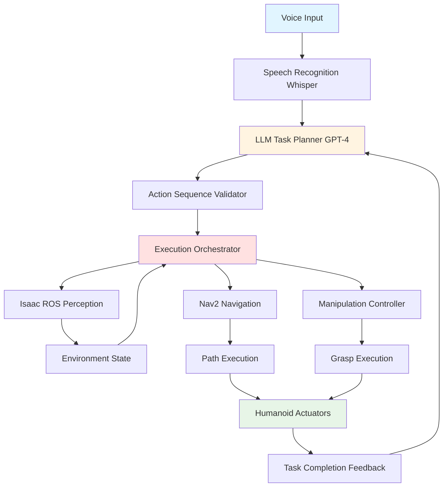
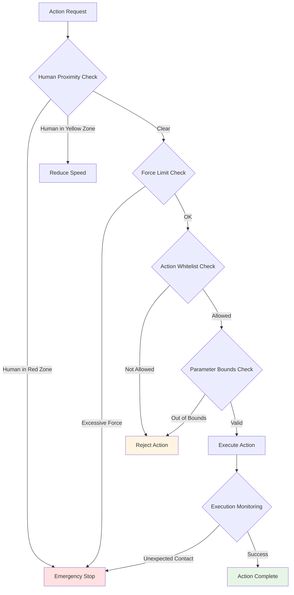
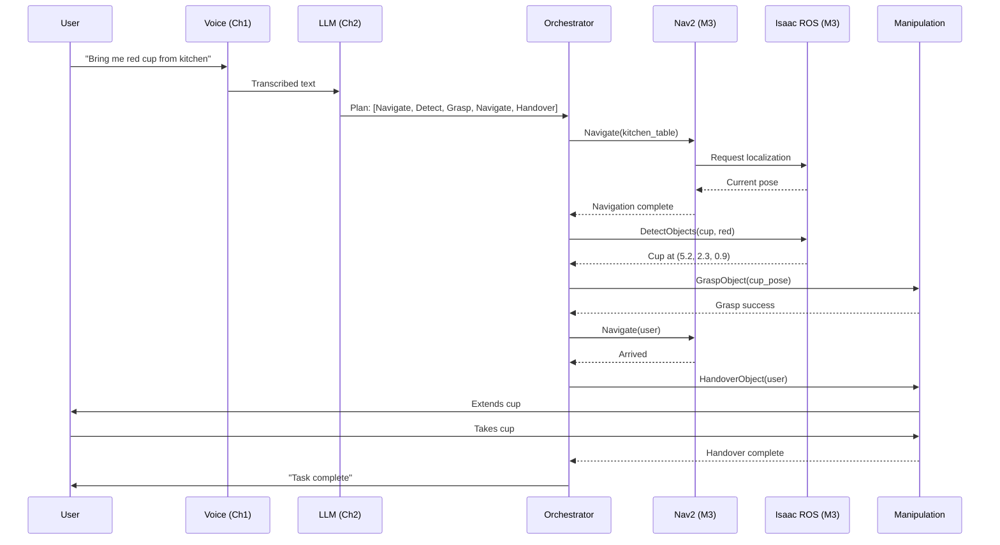
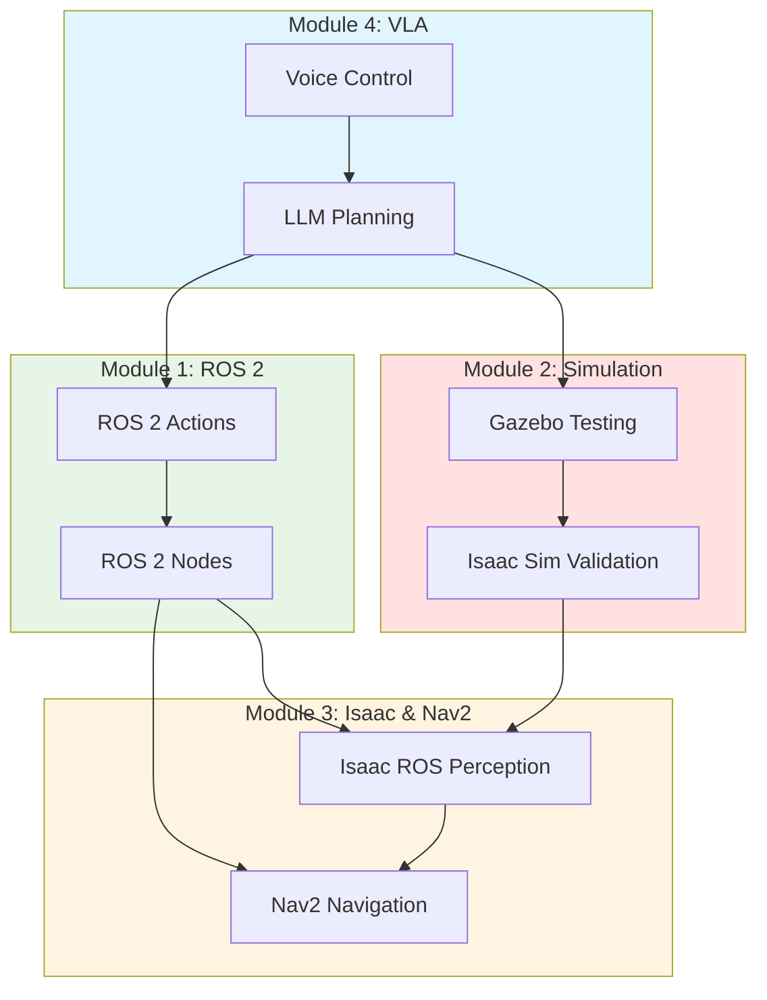

# Chapter 3: Capstone: Autonomous Humanoid Execution

We've journeyed from **ROS 2 fundamentals** (Module 1) through **simulation** (Module 2) to **perception and navigation** (Module 3), adding **voice control** (Chapter 1) and **LLM planning** (Chapter 2). Now we synthesize everything: a humanoid robot that listens to voice commands, plans complex tasks with LLMs, perceives its environment with Isaac ROS, navigates autonomously with Nav2, and executes manipulations—all working together as a **complete autonomous system**.

This chapter is the **capstone**: demonstrating how all four modules integrate, addressing system-level challenges, ensuring safe operation, and tracing end-to-end workflows from voice input to task completion.

## 3.1 End-to-End Autonomous Execution Pipeline

An autonomous humanoid isn't just components—it's an **orchestrated system** where voice, planning, perception, navigation, and manipulation cooperate.

### Complete VLA System Architecture



**System Components and Their Roles**:

1. **Voice Input** (Chapter 1): User speaks natural language command
   - Hardware: Microphone array
   - Output: Audio waveform

2. **Speech Recognition** (Chapter 1): Whisper converts audio to text
   - Input: Audio waveform
   - Output: Transcribed text ("bring me the red cup from the kitchen")

3. **LLM Task Planner** (Chapter 2): GPT-4 decomposes high-level task
   - Input: Transcribed text + robot capabilities
   - Output: Action sequence [Navigate(kitchen), DetectObjects(cup, red), GraspObject(detected_pose), Navigate(user), HandoverObject]

4. **Action Sequence Validator** (Chapter 2): Checks plan feasibility
   - Input: LLM action sequence
   - Output: Validated plan (or request LLM replan if infeasible)

5. **Execution Orchestrator** (This Chapter): Coordinates action execution
   - Input: Validated action sequence
   - Function: Sends action goals to appropriate subsystems, monitors progress, handles failures
   - Output: Execution status per action

6. **Isaac ROS Perception** (Module 3, Chapter 2): Provides environment understanding
   - Input: Camera images, depth data
   - Functions: VSLAM localization, object detection, human detection
   - Output: Robot pose, detected objects (class, color, pose), obstacles

7. **Nav2 Navigation** (Module 3, Chapter 3): Executes motion commands
   - Input: Goal poses from orchestrator
   - Functions: Global path planning, local obstacle avoidance, motion control
   - Output: Robot moves to target location, reports success/failure

8. **Manipulation Controller** (Future Module, conceptually): Executes grasps
   - Input: Target object pose
   - Functions: Inverse kinematics, grasp planning, force control
   - Output: Robot grasps object, reports success/failure

9. **Humanoid Actuators**: Physical motors executing commands
   - Input: Joint trajectories from Nav2/manipulation
   - Output: Physical robot motion

10. **Task Completion Feedback**: Reports results to LLM
    - Input: Action execution status (success/failure/partial)
    - Output: Feedback to LLM for replanning or task completion confirmation

### Data Flow and Orchestration

**Execution Flow** for "Bring me the red cup from the kitchen":

1. **Voice → Text**: User speaks → Whisper outputs "bring me the red cup from the kitchen"

2. **Text → LLM Plan**:
   ```
   LLM Prompt: Decompose "bring me the red cup from the kitchen"
   LLM Output:
   1. Navigate(kitchen)
   2. DetectObjects(class=cup, color=red)
   3. GraspObject(detected_cup_pose)
   4. Navigate(user_location)
   5. HandoverObject(user)
   ```

3. **Plan → Validation**: Validator checks:
   - Kitchen location known? ✓
   - Cup detection supported? ✓
   - Grasp within arm reach? (will check at runtime)
   - Plan approved → send to orchestrator

4. **Orchestrator Executes Actions Sequentially**:

   **Action 1: Navigate(kitchen)**
   - Orchestrator → Nav2: Goal pose (x=5.0, y=2.0, yaw=90°)
   - Nav2 uses Isaac ROS VSLAM for localization (Module 3, Ch 2)
   - Nav2 plans path, avoids obstacles (Module 3, Ch 3)
   - Robot moves to kitchen
   - Feedback: SUCCESS

   **Action 2: DetectObjects(cup, red)**
   - Orchestrator → Isaac ROS: Trigger object detection
   - Isaac ROS DetectNet (Module 3, Ch 2) scans scene
   - Detected: Red cup at pose (x=5.2, y=2.5, z=0.8)
   - Feedback: SUCCESS, cup_pose=(5.2, 2.5, 0.8)

   **Action 3: GraspObject(cup_pose)**
   - Orchestrator → Manipulation: Grasp target at (5.2, 2.5, 0.8)
   - Robot navigates hand to pre-grasp pose
   - Fingers close, force sensors confirm grasp
   - Feedback: SUCCESS

   **Action 4: Navigate(user_location)**
   - Orchestrator → Nav2: Goal pose at user's location
   - Nav2 plans path back (using updated VSLAM map)
   - Robot returns to user
   - Feedback: SUCCESS

   **Action 5: HandoverObject(user)**
   - Orchestrator → Manipulation: Extend arm toward user
   - Wait for user to grasp object (force sensor detects pull)
   - Release object
   - Feedback: SUCCESS

5. **Completion**: Orchestrator reports to user "Task complete: I brought you the red cup"

### Component Orchestration Strategies

**Sequential Execution** (default):
- Execute actions one-by-one: Action 1 completes → start Action 2
- Benefit: Simple, easy to debug
- Drawback: Slow (no parallelism)

**Parallel Execution** (advanced):
- Perception runs continuously (VSLAM updating at 30 Hz) while navigation executes
- LLM can preplan next task while current task executes
- Benefit: Faster, more responsive
- Challenge: Requires careful synchronization (ensure perception and action agree on world state)

## 3.2 System Integration Challenges

Integrating voice, LLM, perception, navigation, and manipulation isn't plug-and-play. Real systems face **latency**, **failure propagation**, and **state synchronization** challenges.

### Integration Challenges and Mitigations

| Challenge | Description | Mitigation Strategy |
|-----------|-------------|---------------------|
| **Latency Accumulation** | Voice (500ms) + LLM (2s) + VSLAM (30ms per frame) + Nav2 planning (200ms) = **2.7s total** delay before robot starts moving | **Async execution**: Start navigation while LLM plans next step. **Progress feedback**: Robot says "I'm planning" so user knows it's working. |
| **Failure Propagation** | VSLAM fails (lighting too dark) → Nav2 can't localize → navigation fails → LLM replanning triggered → delays task | **Graceful degradation**: If VSLAM fails, switch to odometry-only mode (less accurate but functional). **Fallback behaviors**: If navigation fails 3 times, ask user for help. |
| **State Synchronization** | LLM plans "pick up cup at table" but perception shows cup moved (someone picked it up) → grasp fails | **Perception-driven replanning**: Before each action, refresh object detection. If object moved, inform LLM → replan with updated state. |
| **Resource Contention** | Navigation and manipulation both need joint control → conflict | **Resource locking**: Orchestrator grants exclusive control. If navigation active, queue manipulation commands. |
| **Communication Failures** | ROS 2 messages dropped (network glitch) → action goal never received | **Acknowledgment + timeout**: Orchestrator waits for action server acknowledgment. If no response within 1 second, resend goal. |

### Latency Breakdown Example

**Task**: "Go to the kitchen"

| Stage | Latency | Cumulative |
|-------|---------|------------|
| Voice capture + wake word | 300ms | 300ms |
| Whisper speech-to-text (cloud) | 1500ms | 1800ms |
| LLM task decomposition (GPT-4 API) | 2000ms | 3800ms |
| Action validation | 50ms | 3850ms |
| Nav2 global path planning | 200ms | 4050ms |
| **Robot starts moving** | — | **4.05 seconds** |

**Perception**: User says "go to kitchen" → robot starts moving **4 seconds later**. For voice control, this feels slow but acceptable (not real-time).

**Optimizations**:
- **Local Whisper**: Reduces speech-to-text to 200ms (saves 1.3s)
- **Cached LLM plans**: If "go to kitchen" was done before, reuse plan (saves 2s)
- **Predictive planning**: As user speaks, start LLM planning before speech finishes
- **Result**: Latency reduced to ~1-2 seconds

### Debugging Multi-Component Systems

**Symptom**: Robot doesn't move after voice command

**Debugging Steps**:
1. **Check voice**: Did Whisper transcribe correctly? (View transcription log)
2. **Check LLM**: Did GPT-4 generate plan? (View LLM output)
3. **Check validation**: Did plan pass validation? (View validator log)
4. **Check orchestrator**: Did orchestrator send action goal? (View ROS 2 action client status)
5. **Check navigation**: Is Nav2 receiving goal? (Use ROS 2 CLI: `ros2 action list` shows active goals)
6. **Check VSLAM**: Is Isaac ROS providing localization? (View `/visual_slam/tracking/odometry` topic)
7. **Isolate failure**: Test each component independently (send Nav2 goal manually → if navigation works, issue is upstream)

**Tool**: Use **ROS 2 rqt_graph** (Module 1, Ch 3) to visualize node connections. If voice node not publishing to LLM node → communication issue.

## 3.3 Safety Constraints for Autonomous Operation

Autonomous humanoids operating near humans require **safety systems** to prevent injury, property damage, and loss of control.

### Safety Constraint Layers

**Layer 1: Perception-Based Safety (Isaac ROS)**
- **Human Detection** (Module 3, Ch 2): Isaac ROS human pose estimation detects people in workspace
- **Proximity Zones**:
  - **Red Zone** (less than 0.5m): Emergency stop immediately
  - **Yellow Zone** (0.5m-1.5m): Slow motion, increase caution
  - **Green Zone** (greater than 1.5m): Normal operation
- **Implementation**: If human detected in red zone → cancel all actions, hold position

**Layer 2: Motion Constraints (Nav2)**
- **Speed Limits** (Module 3, Ch 3):
  - Near humans: Max 0.2 m/s
  - Open space: Max 1.0 m/s
- **Collision Avoidance**: Nav2 costmap treats humans as dynamic obstacles (higher cost → robot avoids)
- **No-Go Zones**: Restricted areas (stairs, fragile equipment) marked in map → Nav2 never plans paths through them

**Layer 3: Manipulation Force Limits**
- **Grasp Force**: Max 10N (enough to hold object, not crush)
- **Contact Detection**: If unexpected resistance (robot arm hits something), stop immediately
- **Force Feedback**: Monitor gripper force sensors continuously

**Layer 4: LLM Plan Validation (Chapter 2)**
- **Action Whitelist**: LLM can only generate actions from approved list (no `Jump()`, no `SpinRapidly()`)
- **Parameter Bounds**: Navigation goals must be within map bounds, grasp targets within arm reach
- **Human-in-the-Loop for Risky Actions**: Before grasping fragile objects ("pick up the glass vase"), robot asks confirmation

**Layer 5: Emergency Stop**
- **Hardware E-Stop**: Physical button cuts power to actuators (bypasses all software)
- **Voice E-Stop**: User shouts "Emergency stop" → immediate halt (Chapter 1 safety feature)
- **Watchdog Timer**: If orchestrator hangs (no heartbeat for 2 seconds) → trigger automatic stop

### Safety Architecture Diagram



### Graceful Degradation

When components fail, the system **degrades gracefully** rather than crashing:

**Scenario 1: VSLAM Failure** (lighting too dark, camera obscured)
- **Degradation**: Switch to odometry-only localization (less accurate)
- **Impact**: Navigation continues but accumulates drift (may miss target by 0.5m)
- **User Notification**: "Vision system degraded, navigation less accurate"
- **Recovery**: When lighting improves, VSLAM re-initializes automatically

**Scenario 2: LLM API Timeout** (internet connection lost)
- **Degradation**: Fall back to scripted behaviors for common tasks
- **Impact**: Only handles pre-programmed commands ("go to kitchen" works, "organize bookshelf" fails)
- **User Notification**: "Planning unavailable, using basic commands only"

**Scenario 3: Object Detection Failure** (object not in trained classes)
- **Degradation**: Ask user for help ("I don't recognize that object. Can you point to it?")
- **Impact**: Task pauses, requires human assistance
- **Alternative**: Use generic "unknown object" detection (bounding box without class label)

## 3.4 Complete Autonomous Workflow Example

Let's trace a complete task end-to-end, showing how all 4 modules integrate.

### Example Task: "Bring me the red cup from the kitchen table"

**Step-by-Step Execution Trace**:

**1. Voice Recognition (Module 4, Chapter 1)**
- User speaks: "Bring me the red cup from the kitchen table"
- Whisper transcribes: "bring me the red cup from the kitchen table"
- NLU extracts intent: `fetch`, entities: `{object: cup, color: red, location: kitchen_table, target: user}`

**2. LLM Planning (Module 4, Chapter 2)**
```
LLM Prompt:
Robot capabilities: Navigate, DetectObjects, GraspObject, HandoverObject
Task: Bring the red cup from the kitchen table to the user

LLM Generated Plan:
1. Navigate(kitchen_table)
2. DetectObjects(class=cup, color=red, location=table)
3. GraspObject(detected_cup_pose)
4. Navigate(user_location)
5. HandoverObject(user)
```

**3. Validation**
- Check kitchen_table location in semantic map: ✓ Found (x=5.0, y=2.0)
- Check DetectObjects supports cup class: ✓ Supported
- Check user_location known: ✓ Last seen at (x=1.0, y=1.0)
- Plan approved

**4. Execution - Action 1: Navigate(kitchen_table)**
- **Module 3 (Nav2, Chapter 3)**: Navigate to (x=5.0, y=2.0, yaw=90°)
- **Module 3 (Isaac ROS VSLAM, Chapter 2)**: Continuous localization at 30 Hz
- **Nav2 Global Planner**: Computes path avoiding obstacles
- **Nav2 Local Planner**: Follows path with dynamic obstacle avoidance
- **Result**: Robot arrives at kitchen table (tolerance ±0.1m)
- **Time**: 8 seconds (3m distance at 0.4 m/s average speed)

**5. Execution - Action 2: DetectObjects(cup, red, table)**
- **Module 3 (Isaac ROS DetectNet, Chapter 2)**: Scan tabletop
- **Detection Result**: Red cup detected at (x=5.2, y=2.3, z=0.9)
- **Confidence**: 92%
- **Result**: Cup pose stored → (5.2, 2.3, 0.9)
- **Time**: 500ms

**6. Execution - Action 3: GraspObject(cup_pose)**
- **Manipulation Controller**: Navigate arm to pre-grasp pose (10cm above cup)
- **Approach**: Lower arm to cup (z=0.9)
- **Grasp**: Close gripper, force sensors detect object (8N force)
- **Lift**: Raise arm 10cm to verify grasp stable
- **Result**: Cup grasped successfully
- **Time**: 3 seconds

**7. Execution - Action 4: Navigate(user_location)**
- **Module 3 (Nav2)**: Navigate to user at (x=1.0, y=1.0)
- **Safety Layer**: Human detected in yellow zone (1.2m away) → reduce speed to 0.2 m/s
- **Result**: Robot arrives near user, maintains 0.8m distance
- **Time**: 12 seconds (safety speed limited)

**8. Execution - Action 5: HandoverObject(user)**
- **Manipulation Controller**: Extend arm toward user
- **Prompt**: Robot says "Here is your red cup" (voice synthesis)
- **Handover**: Wait for user to grasp cup (force sensor detects pull >5N)
- **Release**: Open gripper
- **Result**: Cup transferred to user
- **Time**: 3 seconds

**9. Task Completion**
- **Total Time**: 26.5 seconds (voice recognition → task complete)
- **Feedback to LLM**: All actions successful
- **User Notification**: "Task complete"

### Execution Sequence Diagram



### Failure Scenario and Recovery

**What if the cup is NOT red?**

**Step 5 (Modified): DetectObjects Result**
- Isaac ROS scans table
- **Detection Result**: No red cup found (only blue cup detected)
- **Feedback to Orchestrator**: FAILURE - red cup not detected

**Recovery**:
- **Orchestrator → LLM**: Report failure "red cup not detected, blue cup found instead"
- **LLM Replanning**:
  ```
  User asked for red cup, but only blue cup on table.
  Options:
  1. Ask user if blue cup acceptable
  2. Search other locations (kitchen counter, sink)
  3. Report task impossible

  Recommended: Ask user for clarification
  ```
- **Robot (via voice synthesis)**: "I don't see a red cup on the kitchen table, but there's a blue cup. Should I bring the blue cup instead?"
- **User**: "Yes, bring the blue cup"
- **LLM Updates Plan**: Replace DetectObjects(red) with DetectObjects(blue)
- **Execution Resumes**: GraspObject(blue_cup_pose) → task continues

**Result**: Graceful handling of unexpected state, human-in-the-loop clarification

## 3.5 Module 4 & Book Conclusion

### Module 4 Summary: Vision-Language-Action (VLA)

**What We Covered**:
- **Chapter 1: Voice Control** - Converting speech to robot actions with OpenAI Whisper and NLU
- **Chapter 2: LLM Planning** - Decomposing complex tasks with GPT-4 into executable action sequences
- **Chapter 3: Capstone Integration** - Orchestrating voice, LLM, Isaac ROS, Nav2, and manipulation into complete autonomous system

**Key Takeaway**: VLA systems enable **anyone** to command robots using natural language, without programming. LLMs provide **cognitive flexibility**, adapting to novel tasks and environments.

### Integration Across All 4 Modules

Module 4 synthesizes everything we've learned:

**Module 1: ROS 2 Foundations** → Voice commands trigger ROS 2 actions (NavigateToPose, GraspObject from Module 1, Ch 2)

**Module 2: Simulation** → LLM-generated plans are tested in Gazebo/Isaac Sim before real deployment (Module 2, Ch 2-3)

**Module 3: Isaac ROS & Nav2** → Autonomous execution uses Isaac ROS for perception (VSLAM, object detection from Module 3, Ch 2) and Nav2 for navigation (path planning, obstacle avoidance from Module 3, Ch 3)

**Module 4: VLA** → Voice + LLM provide high-level intelligence, orchestrating Modules 1-3 for complete autonomous behavior

**4-Module Integration Map**:



**How They Connect**:
1. **User speaks command** (Module 4, Ch 1) → triggers **ROS 2 action goal** (Module 1, Ch 2)
2. **LLM plans task** (Module 4, Ch 2) → validated in **Gazebo simulation** (Module 2, Ch 2)
3. **Isaac ROS detects objects** (Module 3, Ch 2) → informs **LLM replanning** (Module 4, Ch 2)
4. **Nav2 executes path** (Module 3, Ch 3) → guided by **VSLAM localization** (Module 3, Ch 2)
5. **Orchestrator coordinates all subsystems** (Module 4, Ch 3) → complete autonomous execution

### Complete Learning Journey

**Module 1 (ROS 2)**: You learned how robots communicate—nodes, topics, services, actions—the foundation for all robot software.

**Module 2 (Simulation)**: You learned how to test robots safely—Gazebo for physics, Isaac Sim for photorealistic environments—before real deployment.

**Module 3 (Isaac & Nav2)**: You learned how robots perceive and navigate—VSLAM for localization, object detection for understanding, Nav2 for autonomous movement.

**Module 4 (VLA)**: You learned how robots understand humans—voice recognition, LLM task planning, complete system integration—enabling true autonomous assistance.

**The Arc**: From **low-level communication** (Module 1) → **safe testing** (Module 2) → **perception and motion** (Module 3) → **human-robot interaction** (Module 4), you now understand the **full stack** of autonomous humanoid robotics.

### Future Learning Paths

This book provided conceptual foundations. Next steps for hands-on mastery:

**Hands-On Implementation**:
- **ROS 2 Robot Programming**: Build your own ROS 2 nodes (C++ or Python) for custom behaviors
- **Gazebo/Isaac Sim Projects**: Create custom simulation environments, model your own robots
- **Isaac ROS Deployment**: Run Isaac ROS on NVIDIA Jetson hardware for real-time perception
- **Nav2 Tuning**: Optimize Nav2 parameters for specific robots and environments

**Advanced Topics**:
- **Manipulation**: Grasping, inverse kinematics, motion planning with MoveIt 2
- **Imitation Learning**: Train robots by demonstration (teach by showing, not programming)
- **Reinforcement Learning**: Robots learn optimal behaviors through trial and error
- **Multi-Robot Systems**: Coordinate teams of humanoids for complex tasks

**Research Frontiers**:
- **Embodied AI**: Vision-language-action models (RT-1, RT-2) that learn from video to control robots
- **Sim-to-Real Transfer**: Train in simulation, deploy to real robots without performance loss
- **Long-Horizon Tasks**: Robots that plan and execute tasks spanning hours (cleaning entire house)

**Resources**:
- **ROS 2 Documentation**: [docs.ros.org](https://docs.ros.org/)
- **NVIDIA Isaac**: [developer.nvidia.com/isaac-ros](https://developer.nvidia.com/isaac-ros)
- **Open Robotics**: Community forums, tutorials, packages at [ros.org](https://www.ros.org/)
- **Research Papers**: Follow arXiv cs.RO (Robotics) for latest breakthroughs

---

Congratulations on completing **Humanoid Robotics: From ROS 2 to Autonomous Intelligence**. You've built a comprehensive understanding of autonomous humanoid systems—from fundamental communication to voice-controlled, LLM-powered autonomous execution. The robots of the future will be **cognitive**, **adaptive**, and **collaborative partners** in human environments. You're now equipped to build them.

**External References**:
- [OpenAI GPT API](https://platform.openai.com/docs/guides/text-generation) - LLM planning with GPT models
- [BehaviorTree.CPP](https://github.com/BehaviorTree/BehaviorTree.CPP) - Alternative orchestration framework for complex behaviors
- [RT-2: Vision-Language-Action Models](https://robotics-transformer2.github.io/) - Google Research on VLA transformers
- [Mobile ALOHA](https://mobile-aloha.github.io/) - Real-world mobile manipulation with imitation learning
