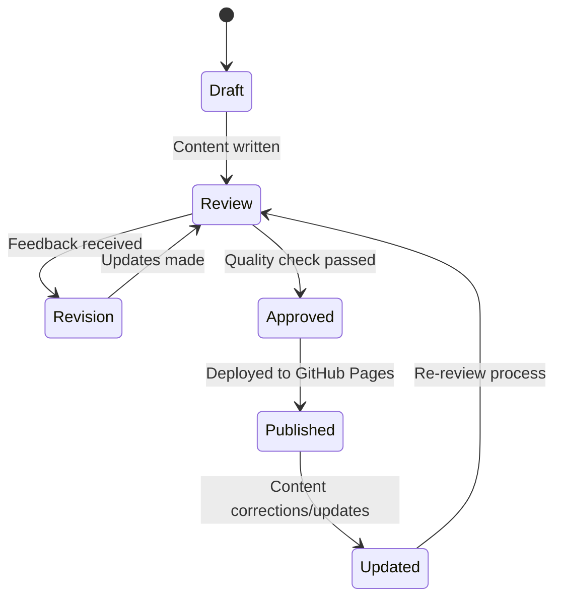

# Data Model: Module 1 – The Robotic Nervous System (ROS 2)

**Feature**: 001-ros2-module
**Date**: 2025-12-26
**Phase**: 1 (Design & Contracts)

## Overview

This document defines the content structure entities for Module 1. Unlike traditional software data models (databases, APIs), this model represents the **information architecture** for educational content: how modules, chapters, sections, and learning elements are organized and related.

---

## Entity Definitions

### 1. Module

**Purpose**: Top-level organizational unit representing a major topic area (e.g., "ROS 2 Robotic Nervous System")

**Attributes**:
- `module_id` (string): Unique identifier (e.g., "module-1")
- `title` (string): Display name (e.g., "The Robotic Nervous System (ROS 2)")
- `description` (text): Brief summary (2-3 sentences)
- `target_audience` (string): Reader background assumption (e.g., "AI engineers with Python experience")
- `estimated_time` (duration): Reading time estimate (e.g., "2-4 hours")
- `page_count` (integer): Estimated page count (e.g., 30-40)
- `order` (integer): Display order in book (Module 1 = 1)

**Relationships**:
- Has many `Chapter` entities (1-to-many)

**Example**:
```yaml
module_id: "module-1"
title: "The Robotic Nervous System (ROS 2)"
description: "Learn ROS 2 as the middleware layer enabling communication, control, and coordination in humanoid robotic systems."
target_audience: "AI engineers and robotics students transitioning from digital AI to physical/embodied AI"
estimated_time: "2-4 hours"
page_count: 35
order: 1
chapters: [chapter-1, chapter-2, chapter-3]
```

---

### 2. Chapter

**Purpose**: Major subdivision within a module covering a specific concept or skill (e.g., "ROS 2 Communication Primitives")

**Attributes**:
- `chapter_id` (string): Unique identifier (e.g., "chapter-2")
- `module_id` (string): Parent module reference
- `title` (string): Display name (e.g., "ROS 2 Communication Primitives")
- `learning_objectives` (list of strings): What readers will be able to do after completing chapter
- `order` (integer): Display order within module (Chapter 1 = 1)
- `estimated_time` (duration): Reading time for this chapter (e.g., "45 minutes")

**Relationships**:
- Belongs to one `Module` (many-to-1)
- Has many `Section` entities (1-to-many)
- Has many `LearningElement` entities (code blocks, diagrams, etc.)

**Example**:
```yaml
chapter_id: "chapter-2"
module_id: "module-1"
title: "ROS 2 Communication Primitives"
learning_objectives:
  - "Identify when to use topics vs. services in robot control scenarios"
  - "Describe message-passing flow with timing diagrams"
  - "Outline rclpy workflows for Python AI integration with ROS 2"
order: 2
estimated_time: "60 minutes"
sections: [section-2.1, section-2.2, section-2.3, section-2.4]
```

---

### 3. Section

**Purpose**: Subsection within a chapter focusing on a single concept (e.g., "ROS 2 Topics")

**Attributes**:
- `section_id` (string): Unique identifier (e.g., "section-2.1")
- `chapter_id` (string): Parent chapter reference
- `title` (string): Display name (e.g., "ROS 2 Topics")
- `content_type` (enum): One of ["concept", "workflow", "example", "comparison"]
- `markdown_file` (path): File path in docs/ (e.g., "docs/module-1/chapter-2-communication.md#ros-2-topics")
- `order` (integer): Display order within chapter

**Relationships**:
- Belongs to one `Chapter` (many-to-1)
- May have many `LearningElement` entities (diagrams, code snippets)

**Example**:
```yaml
section_id: "section-2.1"
chapter_id: "chapter-2"
title: "ROS 2 Topics"
content_type: "concept"
markdown_file: "docs/module-1/chapter-2-communication.md#ros-2-topics"
order: 1
learning_elements: [diagram-topic-flow, code-rclpy-publisher]
```

---

### 4. LearningElement

**Purpose**: Specific instructional component (diagram, code snippet, example, key takeaway box)

**Attributes**:
- `element_id` (string): Unique identifier (e.g., "diagram-perception-loop")
- `element_type` (enum): One of ["diagram", "code_snippet", "example_scenario", "key_takeaway", "external_link"]
- `section_id` (string): Parent section reference (optional, can be chapter-level)
- `content` (text or object): Actual content (e.g., Mermaid syntax, code block, bullet points)
- `caption` (string): Description or title (e.g., "Figure 1: Perception-Decision-Action Loop")
- `citation` (string): Source reference if applicable (e.g., URL to ROS 2 docs)

**Relationships**:
- Belongs to one `Section` or `Chapter` (many-to-1)

**Example (Diagram)**:
```yaml
element_id: "diagram-perception-loop"
element_type: "diagram"
section_id: "section-1.2"
content: |
  ```mermaid
  graph LR
      A[Sensors] -->|Data| B[Perception]
      B -->|State| C[Decision]
      C -->|Commands| D[Action]
      D -->|Effects| A
  ```
caption: "Figure 1.1: Perception-Decision-Action Loop in Robotic Systems"
citation: null
```

**Example (Code Snippet)**:
```yaml
element_id: "code-rclpy-publisher"
element_type: "code_snippet"
section_id: "section-2.1"
content: |
  ```python
  import rclpy
  from sensor_msgs.msg import Image

  # Create publisher for camera data
  publisher = node.create_publisher(Image, '/camera/image', 10)
  publisher.publish(image_msg)
  ```
caption: "Pseudocode: Publishing sensor data to a ROS 2 topic"
citation: "https://docs.ros.org/en/humble/Tutorials/Topics.html"
```

**Example (Key Takeaway)**:
```yaml
element_id: "takeaway-topics-services"
element_type: "key_takeaway"
section_id: "section-2.4"
content:
  - "Topics: Asynchronous, many-to-many, high-frequency data (sensors, state)"
  - "Services: Synchronous, request-response, intermittent operations (reset, calibration)"
  - "Choose topics for continuous data streams, services for on-demand actions"
caption: "Key Takeaways: Topics vs. Services"
citation: null
```

---

## Content Structure Hierarchy

```text
Module (e.g., Module 1: ROS 2 Robotic Nervous System)
│
├── Chapter 1 (Introduction to Robotic Nervous System)
│   ├── Section 1.1 (Physical AI and Embodied Intelligence)
│   │   ├── Diagram: Digital AI vs. Physical AI comparison
│   │   ├── Example: Self-driving car perception challenges
│   │   └── Key Takeaway: Why specialized middleware is needed
│   ├── Section 1.2 (ROS 2 as Middleware)
│   │   ├── Diagram: ROS 2 architecture overview
│   │   ├── Code Snippet: Basic ROS 2 node structure (pseudocode)
│   │   └── External Link: ROS 2 official documentation
│   ├── Section 1.3 (Perception-Decision-Action Loop)
│   │   ├── Diagram: Data flow through ROS 2 nodes
│   │   └── Example: Humanoid robot balance control loop
│   └── Section 1.4 (Human Nervous System Analogy)
│       ├── Diagram: Nervous system components → ROS 2 mapping
│       └── Key Takeaway: Conceptual parallels for intuition
│
├── Chapter 2 (ROS 2 Communication Primitives)
│   ├── Section 2.1 (ROS 2 Nodes)
│   ├── Section 2.2 (ROS 2 Topics)
│   ├── Section 2.3 (ROS 2 Services)
│   ├── Section 2.4 (Real-time Considerations and QoS)
│   └── Section 2.5 (Using rclpy for Python AI Integration)
│
└── Chapter 3 (Humanoid Robot Modeling with URDF)
    ├── Section 3.1 (Purpose of URDF)
    ├── Section 3.2 (Links: Rigid Body Components)
    ├── Section 3.3 (Joints: Connections and Degrees of Freedom)
    ├── Section 3.4 (Sensors and Actuators in URDF)
    ├── Section 3.5 (URDF for Simulation)
    └── Section 3.6 (URDF and ROS 2 Controllers)
```

---

## Metadata for RAG Chatbot

To support future RAG chatbot integration (constitution requirement), each entity should have structured metadata:

### Module Metadata
```yaml
metadata:
  keywords: ["ROS 2", "robotics middleware", "humanoid robots", "physical AI"]
  difficulty: "intermediate"
  prerequisites: ["Python basics", "AI/ML fundamentals"]
```

### Chapter Metadata
```yaml
metadata:
  keywords: ["ROS 2 topics", "ROS 2 services", "rclpy", "message passing"]
  related_chapters: ["chapter-3"]  # Links to URDF chapter
  external_resources:
    - url: "https://docs.ros.org/en/humble/Tutorials.html"
      title: "ROS 2 Official Tutorials"
```

### Section Metadata
```yaml
metadata:
  keywords: ["pub-sub pattern", "asynchronous communication", "QoS policies"]
  estimated_time: "15 minutes"
  diagrams: ["diagram-topic-flow"]
  code_examples: ["code-rclpy-publisher", "code-rclpy-subscriber"]
```

**RAG Ingestion Strategy**:
1. Extract markdown content with metadata (YAML front matter)
2. Generate embeddings for each section (text + metadata)
3. Store in Qdrant with section_id as key
4. Link back to source file path and line numbers (constitution: traceability)

---

## Validation Rules

### Module Level
- Must have at least 1 chapter
- Total estimated time should match sum of chapter times (±10%)
- Page count should be within 50-100 page book constraint

### Chapter Level
- Learning objectives must be measurable (use action verbs: "identify", "describe", "outline")
- Must have at least 2 sections
- Estimated time should be reasonable (10-90 minutes per chapter)

### Section Level
- Each section must map to at least one functional requirement from spec.md
- Content type must match actual content structure
- Markdown file path must exist in repo

### LearningElement Level
- Diagrams must use Mermaid syntax or valid image path (PNG/SVG in static/img/)
- Code snippets must include language identifier for syntax highlighting
- Citations must be valid URLs or null (if original content)
- Key takeaways must be concise (3-5 bullet points max)

---

## State Transitions

Educational content doesn't have traditional state transitions (like user workflows), but content lifecycle has stages:



**States**:
- **Draft**: Content being written (author working)
- **Review**: Content complete, undergoing quality check (peer review, link validation, spell-check)
- **Revision**: Issues found, author making corrections
- **Approved**: Content meets quality standards (constitution compliance verified)
- **Published**: Live on GitHub Pages, accessible to readers
- **Updated**: Published content modified (typo fix, broken link repair, technical update)

---

## Implementation Notes

This data model will be implemented as:

1. **File Structure**: Physical files in `docs/` directory following Docusaurus conventions
2. **Metadata**: YAML front matter in each markdown file
3. **Navigation**: `sidebars.js` configuration defining module/chapter hierarchy
4. **RAG Integration**: Metadata exported to JSON for chatbot ingestion pipeline (future work)

No database is required for content authoring phase. Data model serves as conceptual structure for organizing markdown files and planning RAG chatbot integration.
