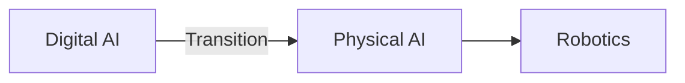

# Quickstart: Docusaurus Setup for AI Book Module 1

**Feature**: 001-ros2-module
**Date**: 2025-12-26
**Purpose**: Step-by-step instructions to initialize Docusaurus and create Module 1 documentation structure

---

## Prerequisites

- **Node.js**: Version 18.0 or higher ([Download](https://nodejs.org/))
- **npm**: Version 8.0 or higher (included with Node.js)
- **Git**: For version control
- **Text Editor**: VS Code, Sublime, or similar (VS Code recommended for markdown preview)

**Verify Installation**:
```bash
node --version  # Should show v18.0.0 or higher
npm --version   # Should show 8.0.0 or higher
git --version   # Any recent version
```

---

## Step 1: Initialize Docusaurus Project

### 1.1 Create Docusaurus Site

From the repository root (`C:\Users\laiba\Desktop\AI_Book\`), run:

```bash
npx create-docusaurus@latest . classic --typescript false
```

**What this does**:
- `create-docusaurus@latest`: Uses latest Docusaurus version (3.x)
- `.`: Creates in current directory (repo root)
- `classic`: Uses classic template (documentation-focused)
- `--typescript false`: Uses JavaScript (simpler for content-focused project)

**Expected Output**:
```
Success! Created Docusaurus site at C:\Users\laiba\Desktop\AI_Book
Inside that directory, you can run several commands:
  npm start
    Starts the development server.
  npm run build
    Bundles your website into static files for production.
```

### 1.2 Install Dependencies

```bash
npm install
```

This installs all required packages (React, Docusaurus core, plugins, etc.).

### 1.3 Verify Installation

```bash
npm start
```

**Expected Behavior**:
- Development server starts at `http://localhost:3000`
- Browser opens automatically showing Docusaurus welcome page
- Press `Ctrl+C` to stop server

---

## Step 2: Install Required Plugins

### 2.1 Mermaid Diagram Plugin

```bash
npm install @docusaurus/theme-mermaid
```

### 2.2 Update `docusaurus.config.js`

Open `docusaurus.config.js` and add Mermaid configuration:

```javascript
// Add to the top-level module.exports object
module.exports = {
  // ... existing config ...

  // Enable Mermaid diagrams
  markdown: {
    mermaid: true,
  },
  themes: ['@docusaurus/theme-mermaid'],

  // ... rest of config ...
};
```

---

## Step 3: Configure Project Metadata

Edit `docusaurus.config.js` to customize site information:

```javascript
module.exports = {
  title: 'AI/Physical Robotics Book',
  tagline: 'From Digital AI to Embodied Intelligence',
  favicon: 'img/favicon.ico',

  // Set the production URL (replace <username> with your GitHub username)
  url: 'https://<username>.github.io',
  baseUrl: '/AI_Book/',

  // GitHub Pages deployment config
  organizationName: '<username>',  // Your GitHub username
  projectName: 'AI_Book',          // Repo name

  onBrokenLinks: 'throw',
  onBrokenMarkdownLinks: 'warn',

  i18n: {
    defaultLocale: 'en',
    locales: ['en'],
  },

  presets: [
    [
      'classic',
      {
        docs: {
          routeBasePath: '/',  // Docs at root path (no /docs prefix)
          sidebarPath: './sidebars.js',
          editUrl: 'https://github.com/<username>/AI_Book/tree/master/',
        },
        blog: false,  // Disable blog (we're building a book, not a blog)
        theme: {
          customCss: './src/css/custom.css',
        },
      },
    ],
  ],

  themeConfig: {
    navbar: {
      title: 'AI/Physical Robotics',
      logo: {
        alt: 'Book Logo',
        src: 'img/logo.svg',
      },
      items: [
        {
          type: 'docSidebar',
          sidebarId: 'tutorialSidebar',
          position: 'left',
          label: 'Modules',
        },
        {
          href: 'https://github.com/<username>/AI_Book',
          label: 'GitHub',
          position: 'right',
        },
      ],
    },
    footer: {
      style: 'dark',
      links: [
        {
          title: 'Learn',
          items: [
            {
              label: 'Module 1: ROS 2',
              to: '/module-1/chapter-1-ros2-foundations',
            },
          ],
        },
        {
          title: 'Resources',
          items: [
            {
              label: 'ROS 2 Documentation',
              href: 'https://docs.ros.org/en/humble/',
            },
          ],
        },
      ],
      copyright: `Copyright © ${new Date().getFullYear()} AI/Physical Robotics Book. Built with Docusaurus.`,
    },
    prism: {
      theme: require('prism-react-renderer/themes/github'),
      darkTheme: require('prism-react-renderer/themes/dracula'),
      additionalLanguages: ['python', 'bash', 'yaml', 'xml'],  // For code highlighting
    },
  },
};
```

---

## Step 4: Create Module 1 Directory Structure

### 4.1 Create Directories

```bash
mkdir -p docs/module-1
mkdir -p static/img/module-1
```

### 4.2 Create Module 1 Category Configuration

Create `docs/module-1/_category_.json`:

```json
{
  "label": "Module 1: ROS 2 Robotic Nervous System",
  "position": 1,
  "link": {
    "type": "generated-index",
    "description": "Learn ROS 2 as the middleware layer for humanoid robotics."
  }
}
```

**What this does**:
- Creates "Module 1" category in sidebar
- Sets position (order in navigation)
- Generates index page with description

---

## Step 5: Create Chapter Files

### 5.1 Create Intro Page

Create `docs/intro.md`:

```markdown
---
sidebar_position: 0
---

# Welcome to AI/Physical Robotics

This book guides AI engineers and robotics students through the transition from **digital AI** (web, mobile, cloud) to **physical/embodied AI** (robots, drones, autonomous vehicles).

## What You'll Learn

- **Module 1: ROS 2 Robotic Nervous System** - Understand ROS 2 as middleware for humanoid robots
- More modules coming soon...

## Prerequisites

- Python programming basics
- Foundational AI/ML knowledge (neural networks, training, inference)
- Familiarity with software concepts (APIs, libraries, data structures)

## Get Started

Navigate to [Module 1: Chapter 1](/module-1/chapter-1-ros2-foundations) to begin your journey.
```

### 5.2 Create Chapter 1 File

Create `docs/module-1/chapter-1-ros2-foundations.md`:

```markdown
---
sidebar_position: 1
---

# Chapter 1: Introduction to the Robotic Nervous System

[Content will be written here following the contract in `/specs/001-ros2-module/contracts/chapter-1-outline.md`]

## Coming Soon

This chapter will cover:
- Physical AI and Embodied Intelligence
- ROS 2 as Middleware
- Perception-Decision-Action Loop
- Human Nervous System Analogy
```

### 5.3 Create Chapter 2 File

Create `docs/module-1/chapter-2-communication.md`:

```markdown
---
sidebar_position: 2
---

# Chapter 2: ROS 2 Communication Primitives

[Content will be written here following the contract in `/specs/001-ros2-module/contracts/chapter-2-outline.md`]

## Coming Soon

This chapter will cover:
- ROS 2 Nodes
- ROS 2 Topics (Publish-Subscribe)
- ROS 2 Services (Request-Response)
- Real-time Considerations and QoS
- Using rclpy for Python AI Integration
```

### 5.4 Create Chapter 3 File

Create `docs/module-1/chapter-3-urdf.md`:

```markdown
---
sidebar_position: 3
---

# Chapter 3: Humanoid Robot Modeling with URDF

[Content will be written here following the contract in `/specs/001-ros2-module/contracts/chapter-3-outline.md`]

## Coming Soon

This chapter will cover:
- Purpose of URDF in Humanoid Robotics
- Links: Rigid Body Components
- Joints: Connections and Degrees of Freedom
- Sensors and Actuators in URDF
- URDF for Simulation
- URDF and ROS 2 Controllers
```

---

## Step 6: Configure Sidebar

Edit `sidebars.js` to define navigation structure:

```javascript
module.exports = {
  tutorialSidebar: [
    'intro',
    {
      type: 'category',
      label: 'Module 1: ROS 2 Robotic Nervous System',
      link: {
        type: 'generated-index',
        description: 'Learn ROS 2 as middleware for humanoid robotics.',
      },
      items: [
        'module-1/chapter-1-ros2-foundations',
        'module-1/chapter-2-communication',
        'module-1/chapter-3-urdf',
      ],
    },
  ],
};
```

---

## Step 7: Test Local Development

### 7.1 Start Dev Server

```bash
npm start
```

### 7.2 Verify Navigation

1. Browser opens at `http://localhost:3000`
2. Click "Modules" in navbar
3. Verify sidebar shows:
   - "Welcome to AI/Physical Robotics"
   - Module 1 with 3 chapters
4. Click through each chapter to verify links work

### 7.3 Test Mermaid Diagram

Add this to `docs/intro.md` to test Mermaid:

````markdown
## Example Diagram


````

Verify diagram renders correctly in browser.

---

## Step 8: Build for Production

### 8.1 Run Build Command

```bash
npm run build
```

**Expected Output**:
```
[SUCCESS] Generated static files in "build".
```

### 8.2 Test Production Build

```bash
npm run serve
```

Opens production build at `http://localhost:3000`. Verify:
- All pages load correctly
- Navigation works
- Diagrams render
- No broken links

---

## Step 9: Setup GitHub Pages Deployment (Optional)

### 9.1 Create `.gitignore`

Ensure these lines are in `.gitignore`:

```
# Dependencies
node_modules/

# Production build
build/
.docusaurus/

# Cache
.cache/

# Misc
.DS_Store
```

### 9.2 Configure GitHub Pages

**Option 1: Manual Deployment**

```bash
npm run build
# Deploy build/ directory to GitHub Pages branch (gh-pages)
npx gh-pages -d build
```

**Option 2: GitHub Actions (Recommended)**

Create `.github/workflows/deploy.yml`:

```yaml
name: Deploy to GitHub Pages

on:
  push:
    branches: [master]

jobs:
  deploy:
    runs-on: ubuntu-latest
    steps:
      - uses: actions/checkout@v3
      - uses: actions/setup-node@v3
        with:
          node-version: 18
      - run: npm install
      - run: npm run build
      - uses: peaceiris/actions-gh-pages@v3
        with:
          github_token: ${{ secrets.GITHUB_TOKEN }}
          publish_dir: ./build
```

Push to master to trigger deployment.

### 9.3 Enable GitHub Pages

1. Go to repository settings on GitHub
2. Navigate to "Pages" section
3. Source: `gh-pages` branch
4. Save
5. Site will be live at `https://<username>.github.io/AI_Book/`

---

## Directory Structure (Final)

```
AI_Book/
├── docs/
│   ├── intro.md
│   └── module-1/
│       ├── _category_.json
│       ├── chapter-1-ros2-foundations.md
│       ├── chapter-2-communication.md
│       └── chapter-3-urdf.md
├── static/
│   └── img/
│       └── module-1/          # Diagrams go here
├── src/
│   └── css/
│       └── custom.css
├── docusaurus.config.js
├── sidebars.js
├── package.json
├── .gitignore
└── specs/                     # Planning artifacts (not deployed)
    └── 001-ros2-module/
        ├── spec.md
        ├── plan.md
        ├── research.md
        ├── data-model.md
        ├── quickstart.md      # This file
        └── contracts/
            ├── chapter-1-outline.md
            ├── chapter-2-outline.md
            └── chapter-3-outline.md
```

---

## Next Steps

1. **Content Authoring**: Fill chapter files following content contracts in `specs/001-ros2-module/contracts/`
2. **Diagram Creation**: Create diagrams in Mermaid (inline) or design tools (save to `static/img/module-1/`)
3. **Review**: Test locally with `npm start`, verify all links and diagrams
4. **Deploy**: Push to GitHub to trigger automatic deployment

---

## Common Commands Reference

| Command | Purpose |
|---------|---------|
| `npm start` | Start development server (hot reload) |
| `npm run build` | Build production site to `build/` |
| `npm run serve` | Serve production build locally |
| `npm run clear` | Clear Docusaurus cache |
| `npx gh-pages -d build` | Deploy to GitHub Pages manually |

---

## Troubleshooting

### Problem: `npm start` fails with "Port 3000 already in use"

**Solution**: Kill process on port 3000 or use different port:
```bash
npm start -- --port 3001
```

### Problem: Mermaid diagrams don't render

**Solution**:
1. Verify `@docusaurus/theme-mermaid` is installed: `npm list @docusaurus/theme-mermaid`
2. Check `docusaurus.config.js` has `markdown: { mermaid: true }` and `themes: ['@docusaurus/theme-mermaid']`
3. Restart dev server: `npm run clear && npm start`

### Problem: Sidebar doesn't show Module 1

**Solution**:
1. Verify `docs/module-1/_category_.json` exists
2. Check `sidebars.js` includes module-1 items
3. Restart dev server

### Problem: GitHub Pages deployment fails

**Solution**:
1. Verify `docusaurus.config.js` has correct `url`, `baseUrl`, `organizationName`, `projectName`
2. Check GitHub repo settings → Pages is enabled with `gh-pages` branch
3. Review GitHub Actions logs for errors

---

## Additional Resources

- [Docusaurus Documentation](https://docusaurus.io/docs)
- [Markdown Guide](https://www.markdownguide.org/)
- [Mermaid Diagram Syntax](https://mermaid.js.org/intro/)
- [GitHub Pages Docs](https://docs.github.com/en/pages)
