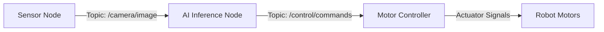
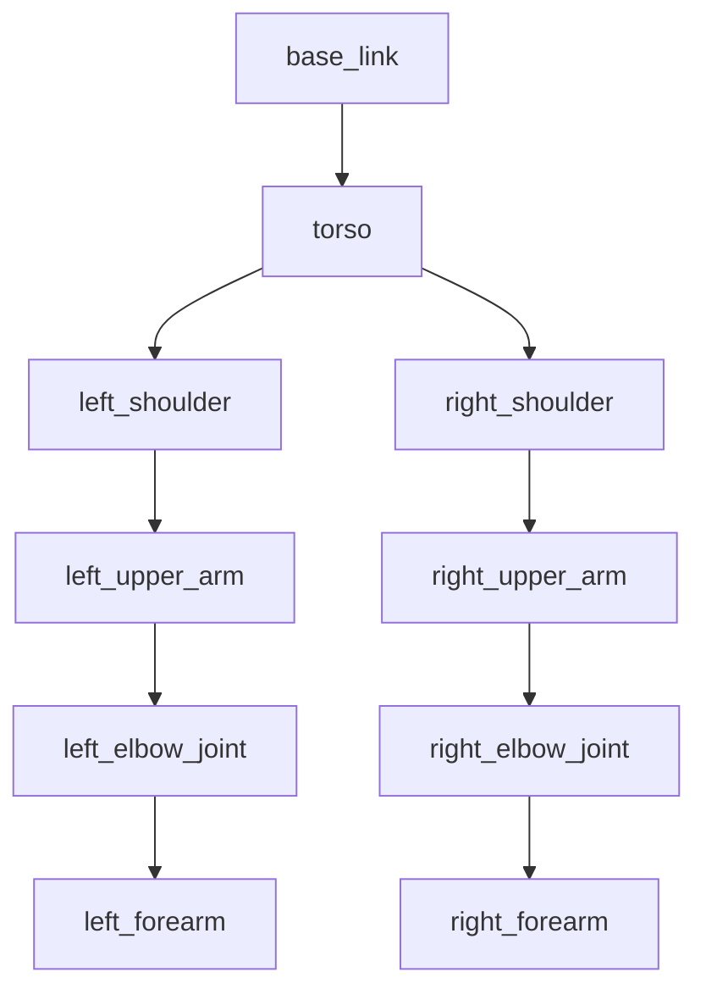

# Research: Module 1 – The Robotic Nervous System (ROS 2)

**Feature**: 001-ros2-module
**Date**: 2025-12-26
**Phase**: 0 (Outline & Research)

## Research Questions

1. **What Docusaurus version and plugins should be used for educational robotics content?**
2. **What diagram tools/formats best support ROS 2 architecture visualization?**
3. **What content structure patterns work best for technical education targeting AI engineers?**
4. **What are best practices for referencing external ROS 2 documentation in educational content?**
5. **How should URDF concepts be visualized for readers new to robotics?**

---

## Decision 1: Docusaurus Version and Setup

**Decision**: Use Docusaurus 3.x (latest stable) with classic template

**Rationale**:
- **Version stability**: Docusaurus 3.x is the current stable release with active maintenance
- **Classic template**: Provides documentation-focused layout out-of-box (sidebar navigation, markdown support, dark mode)
- **Markdown-first**: Native support for markdown with MDX for interactive components if needed
- **GitHub Pages integration**: Built-in deployment workflow for GitHub Pages
- **Plugin ecosystem**: Rich plugins for diagrams (Mermaid), search, and syntax highlighting
- **Performance**: Static site generation ensures fast page loads (meets <2s requirement)

**Alternatives Considered**:
- **GitBook**: Proprietary, less customizable, migration lock-in
- **MkDocs**: Python-based (less familiar to web dev ecosystem), smaller plugin ecosystem
- **Sphinx**: Complex setup, primarily for API docs not educational content
- **VuePress**: Less documentation-focused, smaller community than Docusaurus

**Key Plugins**:
- `@docusaurus/preset-classic`: Standard documentation preset
- `@docusaurus/plugin-mermaid` (or `docusaurus-plugin-mermaid`): Diagram generation from text
- `@docusaurus/plugin-google-gtag`: Analytics (optional, constitution allows for usage tracking)
- `docusaurus-lunr-search` or `@docusaurus/plugin-search`: Local search functionality

**Configuration Approach**:
```javascript
// docusaurus.config.js structure
module.exports = {
  title: 'AI/Physical Robotics Book',
  tagline: 'From Digital AI to Embodied Intelligence',
  url: 'https://<username>.github.io',
  baseUrl: '/AI_Book/',
  organizationName: '<username>',
  projectName: 'AI_Book',
  themeConfig: {
    navbar: { /* Module nav */ },
    sidebar: { /* Chapter hierarchy */ },
    prism: { theme: /* Python syntax */ }
  },
  presets: [
    ['classic', {
      docs: { routeBasePath: '/', sidebarPath: './sidebars.js' }
    }]
  ],
  markdown: { mermaid: true }
};
```

---

## Decision 2: Diagram Strategy

**Decision**: Use Mermaid for dynamic diagrams + PNG/SVG for complex illustrations

**Rationale**:
- **Mermaid advantages**:
  - Text-based (version controllable)
  - Renders in-browser (no build-time image generation)
  - Supports flowcharts, sequence diagrams, state diagrams (perfect for ROS 2 communication flows)
  - Native Docusaurus plugin support
  - Easy to update without graphic design tools

- **PNG/SVG for complex diagrams**:
  - Human nervous system analogy (requires artistic illustration)
  - Detailed URDF structure diagrams (better with annotations in design tools)
  - Robot CAD renderings (if including 3D visualizations)

**Example Mermaid Use Cases**:
- Perception-decision-action loop (flowchart)
- ROS 2 node communication (sequence diagram)
- Topic/service message flow (flowchart with nodes/arrows)
- URDF link-joint hierarchy (tree diagram)

**Example Mermaid Syntax for ROS 2 Flow**:


**PNG/SVG for**:
- `static/img/module-1/nervous-system-analogy.png`: Human brain/spinal cord with labels mapping to ROS 2 components
- `static/img/module-1/urdf-humanoid-structure.png`: Annotated humanoid robot showing links/joints

**Tools for Static Diagrams**:
- **draw.io (diagrams.net)**: Free, exports SVG/PNG, version control friendly (XML format)
- **Figma**: Professional design tool for polished illustrations (free tier sufficient)
- **Inkscape**: Open-source vector graphics editor

---

## Decision 3: Content Structure Pattern

**Decision**: Use "Explain-Show-Apply" (ESA) pattern for each concept

**Rationale**:
- **Explain**: Define concept with clear language, avoiding jargon
- **Show**: Provide visual diagram or pseudocode example
- **Apply**: Relate to real-world robot control scenario

**Pattern fits adult learning theory**:
- **Andragogy principles**: Adults learn best when new knowledge connects to existing experience (AI/ML → robotics)
- **Constructivist approach**: Learners build understanding incrementally
- **Worked examples**: Cognitive load theory shows examples reduce learning difficulty

**Chapter Structure Template**:

```markdown
## {Concept Name}

### What It Is (Explain)
{Definition with context for AI engineers}

### How It Works (Show)
{Diagram or pseudocode workflow}

### Why It Matters (Apply)
{Real-world humanoid robot scenario}

### Key Takeaways
- {Bullet point summary}
```

**Example for "ROS 2 Topics"**:

1. **Explain**: Topics are named channels for asynchronous publish-subscribe communication. Think of them like event buses in web applications or Kafka topics in data pipelines.
2. **Show**: Mermaid diagram showing sensor node publishing to `/camera/image` topic, consumed by multiple subscribers.
3. **Apply**: In a humanoid robot, camera data (30 Hz) must reach both object detection AI and visual SLAM localization without blocking either system. Topics enable this decoupled communication.
4. **Key Takeaways**: Topics are asynchronous, many-to-many, typed (message schemas), and use QoS for reliability tuning.

---

## Decision 4: External Documentation References

**Decision**: Use inline links to ROS 2 documentation with clear context

**Rationale**:
- **Constitution requirement**: All technical claims must cite authoritative sources
- **Avoids duplication**: Don't replicate official docs; provide learning pathway
- **Version control**: Specify ROS 2 version (Humble) in links to prevent 404s

**Reference Pattern**:

```markdown
ROS 2 nodes communicate via [topics](https://docs.ros.org/en/humble/Tutorials/Topics.html)
for asynchronous messaging. For detailed API reference, see the
[rclpy Topics guide](https://docs.ros.org/en/humble/Tutorials/Beginner-Client-Libraries/Writing-A-Simple-Py-Publisher-And-Subscriber.html).
```

**Best Practices**:
- Link to stable version docs (e.g., `/en/humble/` not `/en/latest/`)
- Provide context before link (what reader will find)
- Use descriptive link text (not "click here")
- Archive important links in case of upstream changes (constitution: traceability)

**Backup Strategy**:
- Maintain a `references.md` file listing all external URLs with access date
- Periodically check links (can automate with link checker tool)

---

## Decision 5: URDF Visualization Approach

**Decision**: Hierarchical tree diagrams + annotated robot images + XML snippets

**Rationale**:
- **Tree diagrams**: Show parent-child link relationships clearly (Mermaid tree or static image)
- **Annotated images**: Label robot body parts with link/joint names overlaid on humanoid figure
- **XML snippets**: Short, commented URDF code blocks to show syntax without overwhelming

**URDF Concept Breakdown**:

1. **Links as rigid bodies**:
   - Visual: Humanoid figure with highlighted body part (e.g., "upper arm link")
   - Explanation: Link defines physical properties (mass, inertia, collision geometry)

2. **Joints as connections**:
   - Visual: Elbow joint diagram showing rotation axis, limits
   - Explanation: Joint types (revolute for elbow, prismatic for slider, fixed for sensors)

3. **Full robot structure**:
   - Visual: Tree diagram from base_link → torso → limbs
   - Example: `base_link (root) → torso → shoulder_link → upper_arm_link → elbow_joint → forearm_link`

**Example Visualization (Mermaid Tree)**:



**XML Snippet Strategy**:
- Show minimal URDF for one joint (e.g., elbow) with inline comments
- Omit complex inertia tensors (note "simplified for clarity")
- Focus on conceptual understanding, not production-ready URDF

---

## Technology Stack Summary

| Component | Technology | Version | Justification |
|-----------|------------|---------|---------------|
| Static Site Generator | Docusaurus | 3.x (latest) | Best docs-focused SSG, GitHub Pages support |
| Content Format | Markdown + MDX | N/A | Version controllable, easy authoring |
| Diagrams (Dynamic) | Mermaid | 10.x | Text-based, version controlled, renders in browser |
| Diagrams (Static) | PNG/SVG | N/A | Complex illustrations (nervous system, URDF) |
| Syntax Highlighting | Prism.js | (included in Docusaurus) | Python pseudocode highlighting |
| Deployment | GitHub Pages | N/A | Free, static hosting, CI/CD via Actions |
| Version Control | Git + GitHub | N/A | Constitution requirement |
| Node Runtime | Node.js | 18+ LTS | Docusaurus requirement |

---

## Content Authoring Workflow

1. **Setup Docusaurus** (once):
   - Run `npx create-docusaurus@latest AI_Book classic`
   - Install plugins: `npm install @docusaurus/plugin-mermaid`
   - Configure `docusaurus.config.js` and `sidebars.js`

2. **Create Module 1 Structure**:
   - `docs/module-1/_category_.json` (sidebar label, position)
   - `docs/module-1/chapter-1-ros2-foundations.md`
   - `docs/module-1/chapter-2-communication.md`
   - `docs/module-1/chapter-3-urdf.md`

3. **Author Content** (per chapter):
   - Write "Explain-Show-Apply" sections
   - Add Mermaid diagrams inline
   - Insert PNG/SVG images from `static/img/module-1/`
   - Add citations to ROS 2 docs

4. **Review & Build**:
   - Run `npm start` (local dev server)
   - Verify navigation, links, diagrams
   - Run `npm run build` (production build)
   - Test build output locally

5. **Deploy to GitHub Pages**:
   - Push to `gh-pages` branch or use GitHub Actions workflow
   - Verify live site at `https://<username>.github.io/AI_Book/`

---

## Open Questions Resolved

All research questions answered. No additional clarifications needed for implementation planning phase.

**Next Steps**: Proceed to Phase 1 (Design & Contracts) to generate:
- `data-model.md`: Content structure entities (chapters, sections, code blocks)
- `contracts/`: Chapter outlines with learning objectives and key concepts
- `quickstart.md`: Step-by-step Docusaurus setup instructions
