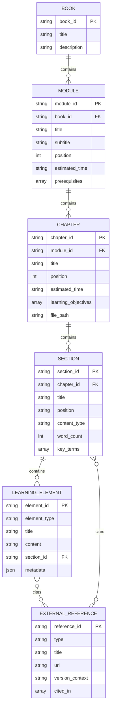

# Data Model: Module 2 – The Digital Twin (Gazebo & Unity)

**Feature**: 002-digital-twin-module
**Date**: 2025-12-26
**Purpose**: Define content structure and entities for Module 2 educational content

---

## Overview

Module 2 follows the same content model as Module 1, with educational entities organized hierarchically for Docusaurus rendering and future RAG chatbot ingestion.

---

## Content Structure Entities

### Module (Top-Level Container)

**Entity**: Module
**Purpose**: Logical grouping of related educational content on a major topic

**Attributes**:
- `module_id`: Unique identifier (e.g., "module-2")
- `title`: Display name (e.g., "Module 2: The Digital Twin")
- `subtitle`: Brief description (e.g., "Gazebo & Unity Simulation")
- `position`: Order in book navigation (2, after Module 1)
- `estimated_time`: Total reading time (e.g., "90-120 minutes")
- `prerequisites`: Required prior knowledge (e.g., ["Module 1: ROS 2"])

**Relationships**:
- Contains 1-N **Chapters**
- Belongs to **Book** (AI/Physical Robotics)

**Module 2 Instance**:
```yaml
module_id: module-2
title: "Module 2: The Digital Twin"
subtitle: "Gazebo & Unity Simulation"
position: 2
estimated_time: "90-120 minutes"
prerequisites: ["Module 1: ROS 2 Robotic Nervous System"]
```

---

### Chapter (Major Subdivision)

**Entity**: Chapter
**Purpose**: Self-contained learning unit covering a major subtopic

**Attributes**:
- `chapter_id`: Unique identifier (e.g., "chapter-1-digital-twins")
- `module_id`: Parent module reference
- `title`: Display name (e.g., "Digital Twin Fundamentals")
- `position`: Order within module (1, 2, 3)
- `estimated_time`: Reading time (e.g., "20-25 minutes")
- `learning_objectives`: List of measurable outcomes
- `file_path`: Docusaurus Markdown file (e.g., "docs/module-2/chapter-1-digital-twins.md")

**Relationships**:
- Belongs to 1 **Module**
- Contains 1-N **Sections**
- Contains 0-N **Learning Elements** (diagrams, examples, key takeaways)

**Module 2 Chapters**:
```yaml
- chapter_id: chapter-1-digital-twins
  module_id: module-2
  title: "Digital Twin Fundamentals"
  position: 1
  estimated_time: "20-25 minutes"
  learning_objectives:
    - "Explain the concept of digital twins in robotics"
    - "Identify when to use simulation vs hardware"
    - "Compare Gazebo and Unity capabilities"

- chapter_id: chapter-2-gazebo-physics
  module_id: module-2
  title: "Gazebo Physics Simulation"
  position: 2
  estimated_time: "35-45 minutes"
  learning_objectives:
    - "Understand Gazebo's physics engine capabilities"
    - "Describe environment and terrain modeling"
    - "Explain simulation validation workflows"

- chapter_id: chapter-3-sensors-unity
  module_id: module-2
  title: "Sensors and Unity HRI"
  position: 3
  estimated_time: "35-45 minutes"
  learning_objectives:
    - "Describe sensor simulation workflows (lidar, cameras, IMU)"
    - "Explain Unity's role in high-fidelity rendering"
    - "Design human-robot interaction scenarios"
```

---

### Section (Single-Concept Subsection)

**Entity**: Section
**Purpose**: Focused explanation of one concept (follows "Explain-Show-Apply" pattern)

**Attributes**:
- `section_id`: Unique identifier (e.g., "sec-2.1-physics-engine")
- `chapter_id`: Parent chapter reference
- `title`: Heading text (e.g., "Gravity, Collisions, and Rigid-Body Dynamics")
- `position`: Order within chapter (e.g., 2.1, 2.2)
- `content_type`: One of ["explanation", "example", "diagram", "reference"]
- `word_count`: Approximate length
- `key_terms`: List of technical terms defined (e.g., ["physics engine", "rigid body", "collision mesh"])

**Relationships**:
- Belongs to 1 **Chapter**
- Contains 0-N **Learning Elements**

**Example Section** (Chapter 2, Section 2.1):
```yaml
section_id: sec-2.1-physics-engine
chapter_id: chapter-2-gazebo-physics
title: "Gravity, Collisions, and Rigid-Body Dynamics"
position: 2.1
content_type: "explanation"
word_count: ~300
key_terms: ["physics engine", "gravity", "collision detection", "rigid body dynamics", "ODE", "Bullet"]
```

---

### Learning Element (Diagram, Example, Takeaway)

**Entity**: LearningElement
**Purpose**: Discrete learning component embedded in content (diagram, code snippet, key takeaway box)

**Attributes**:
- `element_id`: Unique identifier (e.g., "diagram-digital-twin-workflow")
- `element_type`: One of ["mermaid_diagram", "static_image", "example", "key_takeaway"]
- `title`: Caption or heading (e.g., "Digital Twin Lifecycle")
- `content`: Actual content (Mermaid code, image path, example text, takeaway list)
- `section_id`: Parent section reference (where element appears)
- `metadata`: Additional info for RAG retrieval (e.g., `{"concepts": ["digital twin", "sim-to-real"], "use_case": "validation"}`)

**Relationships**:
- Belongs to 1 **Section** (or 1 **Chapter** if chapter-level element)
- Referenced by **ExternalReference** (if sourced from external docs)

**Example Elements**:
```yaml
- element_id: diagram-digital-twin-workflow
  element_type: "mermaid_diagram"
  title: "Digital Twin Lifecycle"
  content: |
    graph LR
        A[Physical Robot] -->|Measure| B[System ID]
        B -->|Model| C[Digital Twin]
        C -->|Test| D[Simulation]
        D -->|Validate| E[Predictions]
        E -->|Deploy| A
  section_id: sec-1.1-digital-twin-concept
  metadata:
    concepts: ["digital twin", "system identification", "validation"]

- element_id: key-takeaway-gazebo-vs-unity
  element_type: "key_takeaway"
  title: "Gazebo vs Unity Decision Criteria"
  content: |
    - Use Gazebo for: Physics-accurate control testing, ROS 2 native integration
    - Use Unity for: Photorealistic visualization, human-robot interaction studies
    - Use both for: Complex projects needing physics AND rendering (e.g., HRI with accurate dynamics)
  section_id: sec-1.3-gazebo-vs-unity
  metadata:
    decision_criteria: ["physics_accuracy", "visual_fidelity", "ros2_integration"]
```

---

### External Reference

**Entity**: ExternalReference
**Purpose**: Citation to authoritative external source (Gazebo docs, Unity Robotics Hub, academic papers)

**Attributes**:
- `reference_id`: Unique identifier (e.g., "ref-gazebo-fortress-docs")
- `type`: One of ["official_docs", "tutorial", "academic_paper", "github_repo"]
- `title`: Source title (e.g., "Gazebo Fortress Documentation")
- `url`: Link (e.g., "https://gazebosim.org/docs/fortress")
- `version_context`: Version info (e.g., "Gazebo Fortress (2023+)")
- `cited_in`: List of section_ids where referenced

**Relationships**:
- Referenced by N **Sections** or **Learning Elements**

**Example References**:
```yaml
- reference_id: ref-gazebo-fortress-docs
  type: "official_docs"
  title: "Gazebo Fortress Documentation"
  url: "https://gazebosim.org/docs/fortress"
  version_context: "Gazebo Fortress (2023+)"
  cited_in: ["sec-2.1-physics-engine", "sec-2.2-environments"]

- reference_id: ref-unity-robotics-hub
  type: "github_repo"
  title: "Unity Robotics Hub"
  url: "https://github.com/Unity-Technologies/Unity-Robotics-Hub"
  version_context: "Unity 2021+"
  cited_in: ["sec-3.2-unity-rendering", "sec-3.3-hri-scenarios"]

- reference_id: ref-sim-to-real-paper
  type: "academic_paper"
  title: "Sim-to-Real Transfer with Domain Randomization"
  url: "https://arxiv.org/abs/1703.06907"
  version_context: "Peng et al., 2018"
  cited_in: ["sec-1.2-sim-vs-real", "sec-2.3-validation"]
```

---

## Content Structure Example (Chapter 1)

```text
Module 2: The Digital Twin (module-2)
└── Chapter 1: Digital Twin Fundamentals (chapter-1-digital-twins)
    ├── Section 1.1: Concept of Digital Twins (sec-1.1-concept)
    │   ├── Explanation paragraph (text)
    │   ├── [Diagram] Digital Twin Lifecycle (mermaid)
    │   └── [Example] Humanoid robot digital twin use case
    ├── Section 1.2: Simulation vs Real-World Deployment (sec-1.2-sim-vs-real)
    │   ├── Explanation paragraph (text)
    │   ├── [Key Takeaway] When to use simulation vs hardware
    │   └── [Reference] Sim-to-real transfer paper (external link)
    └── Section 1.3: Role of Gazebo and Unity (sec-1.3-tools)
        ├── Explanation paragraph (text)
        ├── [Diagram] Gazebo vs Unity comparison table
        ├── [Key Takeaway] Decision criteria
        └── [Reference] Gazebo Fortress docs (external link)
```

---

## Entity Relationships Diagram



---

## Validation Rules

### Module Level
- `position` must be unique within book
- `prerequisites` must reference existing modules
- `estimated_time` sum of chapter times

### Chapter Level
- `position` must be unique within module
- `learning_objectives` must be measurable and testable
- `file_path` must exist in `book_frontend/docs/`

### Section Level
- `position` format must match chapter.section (e.g., 2.1, 2.2)
- `key_terms` must be defined within section content
- `word_count` should be 200-500 for conceptual explanations

### Learning Element Level
- `element_type` "mermaid_diagram" must have valid Mermaid syntax
- `element_type` "static_image" must reference file in `book_frontend/static/img/`
- `metadata` must include relevant `concepts` array for RAG retrieval

### External Reference Level
- `url` must be stable (official docs, DOI for papers, permanent GitHub links)
- `version_context` required for software documentation (prevents confusion)
- `cited_in` must reference existing section_ids

---

## RAG Chatbot Integration (Future)

**Ingestion Strategy**:
- Parse Markdown files to extract **Sections** and **Learning Elements**
- Generate embeddings for each section + learning element combination
- Store in Qdrant with metadata:
  - `module_id`, `chapter_id`, `section_id`
  - `key_terms`, `concepts`, `learning_objectives`
  - `external_references` (for source attribution)

**Retrieval Strategy**:
- User query → embed → similarity search in Qdrant
- Return top-K sections with metadata
- Generate response restricted to retrieved content (prevent hallucination)
- Cite external references when applicable

**Example Query**: "How does Gazebo simulate gravity?"
- Retrieve: Section 2.1 (Physics Engine) + associated diagrams
- Response: Conceptual explanation from section + link to Gazebo Fortress docs
- Citation: "Module 2, Chapter 2: Gazebo Physics Simulation" + external reference

---

## Notes

- This data model mirrors Module 1 structure for consistency
- Entities designed for both Docusaurus rendering and RAG ingestion
- Validation rules ensure content quality and navigability
- External references prevent link rot via stable URLs + version context
