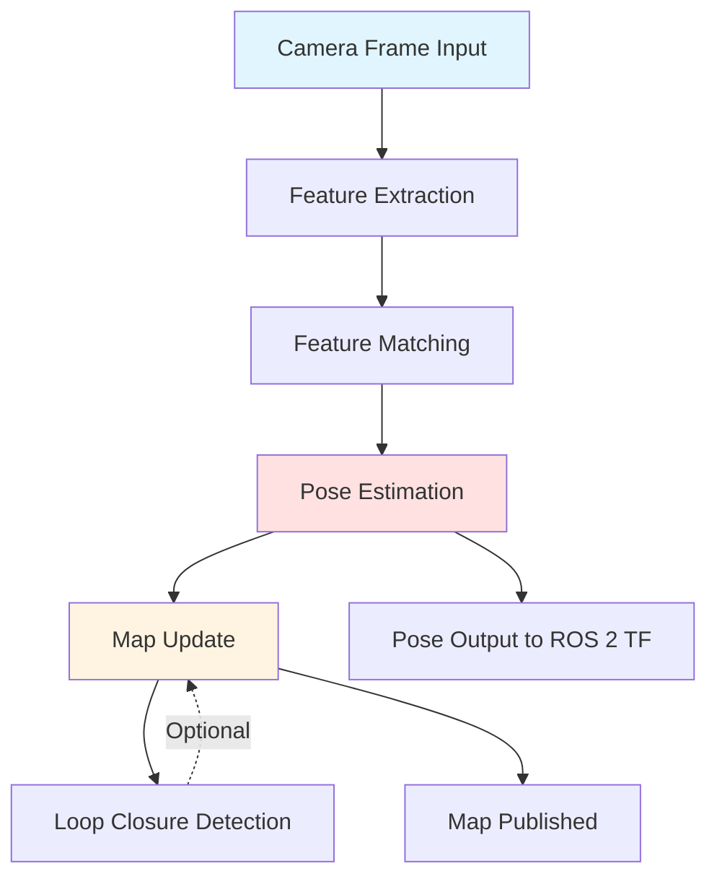
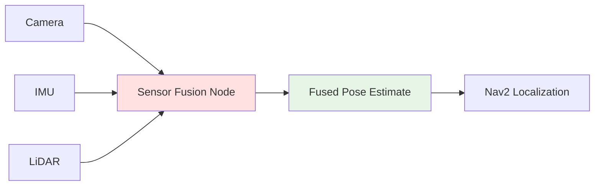

# Chapter 2 Content Contract: Isaac ROS: Perception & VSLAM

**Chapter ID**: `chapter-2`
**File**: `book_frontend/docs/module-3/chapter-2-isaac-ros-vslam.md`
**Estimated Length**: 12-15 pages
**Estimated Time**: 30-40 minutes

---

## Learning Objectives

By the end of this chapter, readers will be able to:

1. Explain Isaac ROS packages for hardware-accelerated perception (Visual SLAM, depth perception, AprilTag detection)
2. Describe Visual SLAM (VSLAM) workflow for humanoid localization and mapping
3. Understand sensor fusion techniques combining camera, IMU, and LiDAR data
4. Identify environment mapping strategies for dynamic humanoid operation

---

## Key Concepts

### 1. Hardware-Accelerated Perception with Isaac ROS

**Coverage**: Isaac ROS package ecosystem, GPU acceleration benefits (CUDA, TensorRT), ROS 2 node architecture, real-time performance considerations

**Learning Element**: Isaac ROS package overview table

| Package | Purpose | Input Sensors | Output |
|---------|---------|---------------|--------|
| isaac_ros_visual_slam | Localization & mapping | Stereo camera | Pose, map |
| isaac_ros_apriltag | Fiducial marker detection | RGB camera | Tag pose |
| isaac_ros_depth_segmentation | Obstacle detection | Depth camera | Segmented point cloud |
| isaac_ros_image_proc | Image preprocessing | RGB camera | Rectified images |

---

### 2. Visual SLAM (VSLAM) Workflow

**Coverage**: Feature extraction (corners, edges), feature tracking across frames, pose estimation (camera motion), loop closure detection, map building (3D landmarks)

**Learning Element**: VSLAM workflow diagram (Mermaid)

---

### 3. Sensor Fusion and Real-Time Perception

**Coverage**: Combining camera (visual features) + IMU (acceleration, rotation) + LiDAR (depth, obstacles), Extended Kalman Filter (EKF) intuition (without math), covariance estimation for uncertainty handling

**Learning Element**: Sensor fusion architecture diagram

---

### 4. Mapping and Environment Understanding

**Coverage**: Occupancy grids for 2D navigation, 3D point clouds for manipulation, semantic mapping (object labels), dynamic object handling (filtering moving obstacles)

**Learning Element**: Mapping types comparison table

| Map Type | Representation | Use Case | Isaac ROS Package |
|----------|----------------|----------|-------------------|
| Occupancy Grid | 2D grid (occupied/free) | Floor-based navigation | isaac_ros_occupancy_grid |
| Point Cloud | 3D points (x, y, z, intensity) | Manipulation, 3D obstacles | isaac_ros_pointcloud_utils |
| Semantic Map | Objects with labels (chair, table) | Task planning (sit on chair) | isaac_ros_dnn_inference |

---

## Content Structure

### Section 2.1: Hardware-Accelerated Perception with Isaac ROS
- Isaac ROS package ecosystem (Explain: GPU acceleration, node architecture)
- Isaac ROS packages overview (Show: table)
- Selecting packages for humanoid use case (Apply)

### Section 2.2: Visual SLAM (VSLAM) Workflow
- VSLAM stages (Explain: feature tracking → pose → map)
- VSLAM workflow (Show: diagram)
- Troubleshooting VSLAM failures (Apply: feature-poor environments)

### Section 2.3: Sensor Fusion and Real-Time Perception
- Sensor fusion intuition (Explain: combining complementary data)
- Sensor fusion architecture (Show: diagram)
- Camera + IMU + LiDAR integration (Apply)

### Section 2.4: Mapping and Environment Understanding
- Mapping types (Explain: occupancy, point cloud, semantic)
- Mapping comparison (Show: table)
- Dynamic obstacle handling (Apply)

---

## Required Diagrams

1. **Isaac ROS Packages Overview** (Markdown table)
2. **VSLAM Workflow** (Mermaid flowchart)
3. **Sensor Fusion Architecture** (Mermaid diagram)
4. **Mapping Types Comparison** (Markdown table)

---

## External References

- [Isaac ROS Visual SLAM](https://github.com/NVIDIA-ISAAC-ROS/isaac_ros_visual_slam) - Isaac ROS VSLAM package documentation
- [Isaac ROS Packages](https://nvidia-isaac-ros.github.io/repositories_and_packages/index.html) - Full Isaac ROS package index
- [ROS 2 Sensor Fusion](https://docs.ros.org/en/humble/Tutorials/Intermediate/Tf2/Introduction-To-Tf2.html) - ROS 2 TF for coordinate transforms
- [NVIDIA Jetson Orin](https://www.nvidia.com/en-us/autonomous-machines/embedded-systems/jetson-orin/) - Recommended hardware for Isaac ROS (GPU acceleration context)

---

## Acceptance Criteria

- [ ] All learning objectives testable
- [ ] 4 diagrams/tables included (packages overview, VSLAM workflow, sensor fusion, mapping types)
- [ ] External references cited (minimum 4 links to Isaac ROS GitHub, ROS 2 docs)
- [ ] VSLAM explained intuitively (no Kalman filter math)
- [ ] Sensor fusion conceptual (no covariance matrix equations)
- [ ] Bridge paragraph transitioning to Chapter 3 (Nav2 navigation)
- [ ] Estimated reading time: 30-40 minutes (1000-1400 words)
- [ ] Troubleshooting guidance (feature-poor environments, sensor calibration)
