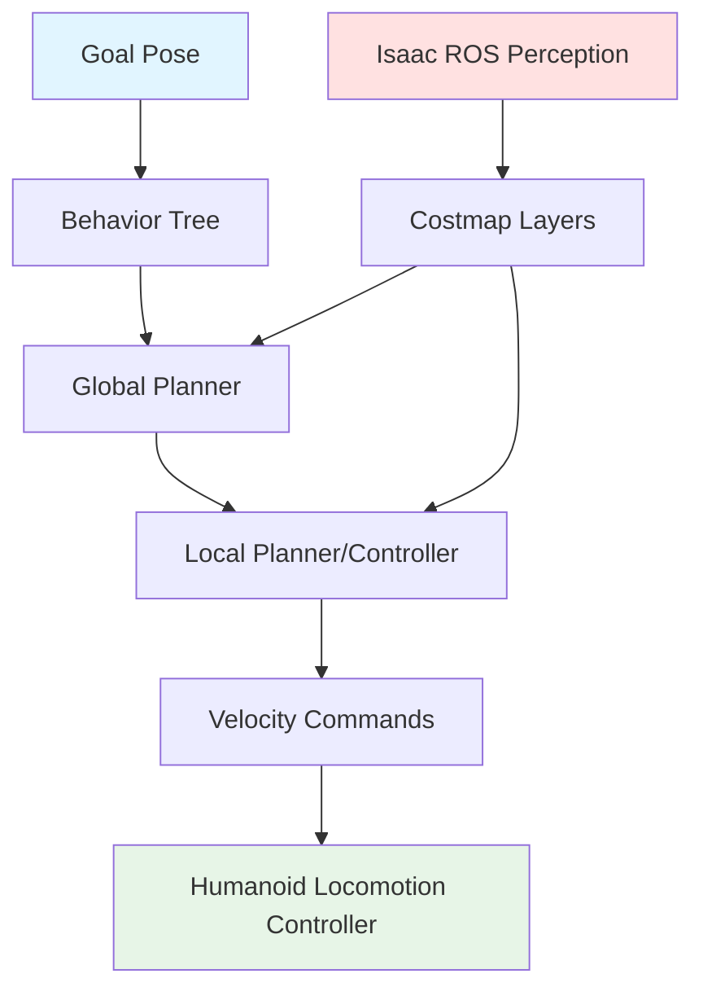
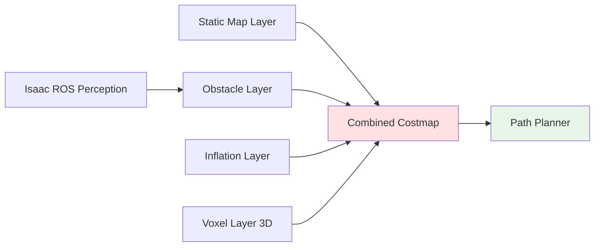
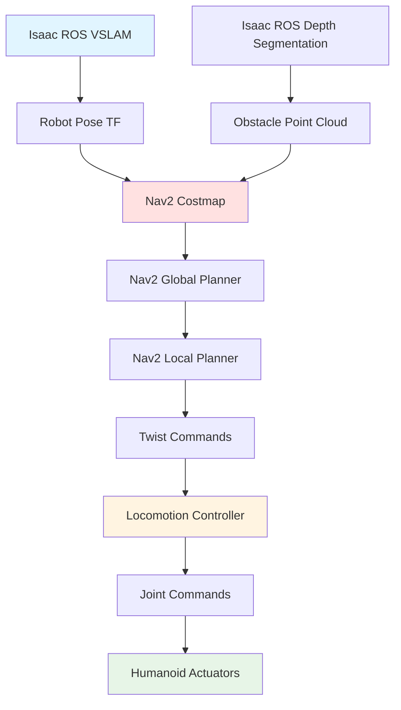

# Chapter 3 Content Contract: Navigation & Path Planning with Nav2

**Chapter ID**: `chapter-3`
**File**: `book_frontend/docs/module-3/chapter-3-nav2.md`
**Estimated Length**: 12-15 pages
**Estimated Time**: 30-40 minutes

---

## Learning Objectives

By the end of this chapter, readers will be able to:

1. Explain Nav2 stack architecture and its role in ROS 2 navigation for bipedal humanoids
2. Describe path planning algorithms (A*, DWB, Theta*) and their suitability for humanoid constraints
3. Understand obstacle avoidance strategies for dynamic environments (costmap layers, local planners)
4. Detail the perception-to-control pipeline connecting Isaac ROS perception to Nav2 motion commands

---

## Key Concepts

### 1. Nav2 Stack for Bipedal Humanoid Movement

**Coverage**: Nav2 architecture (behavior trees, planners, controllers), ROS 2 actions/services, humanoid-specific constraints (balance, gait, step height), Nav2 vs. traditional wheeled robot navigation

**Learning Element**: Nav2 architecture diagram (Mermaid)

---

### 2. Path Planning Algorithms

**Coverage**: Global planners (A* for optimal paths, Theta* for smooth paths), local planners (DWB for dynamic replanning), humanoid gait constraints (minimum turning radius, step height limits, balance stability zones)

**Learning Element**: Path planning algorithm comparison table

| Planner | Algorithm Type | Best For | Humanoid Suitability | Replanning Speed |
|---------|----------------|----------|---------------------|------------------|
| A* | Grid-based search | Static environments, optimal paths | Moderate (may have sharp turns) | Slow |
| Theta* | Any-angle search | Smooth paths, minimal turns | High (gentle curves fit gait) | Moderate |
| DWB | Dynamic window | Dynamic obstacles, frequent replanning | Very High (adapts to humans) | Fast |
| Smac Planner | Hybrid A* | Non-holonomic constraints | High (models turning radius) | Moderate |

---

### 3. Obstacle Avoidance & Costmap Layers

**Coverage**: Costmap representation (static, dynamic, inflation layers), dynamic obstacle tracking (Kalman filter for moving humans), safety zones (inflation radius for humanoid clearance), costmap tuning for bipedal robots

**Learning Element**: Costmap layers diagram

---

### 4. Perception-to-Control Pipeline

**Coverage**: Data flow from Isaac ROS (pose estimate, obstacle point cloud) → Nav2 (costmap update, path planning) → locomotion controller (velocity commands, footstep planning), latency considerations, failure recovery (replanning on perception updates)

**Learning Element**: End-to-end pipeline diagram

---

## Content Structure

### Section 3.1: Nav2 Stack for Bipedal Humanoid Movement
- Nav2 architecture overview (Explain: planners, controllers, behavior trees)
- Nav2 architecture diagram (Show: perception → costmap → planner → controller)
- Humanoid constraints (Apply: balance, gait, step height)

### Section 3.2: Path Planning Algorithms
- Global vs. local planners (Explain: A*, Theta*, DWB)
- Planner comparison table (Show: suitability for humanoids)
- Selecting planners for scenarios (Apply: narrow corridor vs. crowded room)

### Section 3.3: Obstacle Avoidance & Costmap Layers
- Costmap representation (Explain: static, dynamic, inflation)
- Costmap layers diagram (Show: layer fusion)
- Dynamic obstacle handling (Apply: moving humans)

### Section 3.4: Perception-to-Control Pipeline
- End-to-end data flow (Explain: Isaac ROS → Nav2 → locomotion)
- Pipeline diagram (Show: complete flow)
- Latency considerations (Apply: real-time constraints)

### Section 3.5: Module 3 Conclusion
- Summary of NVIDIA Isaac ecosystem (Isaac Sim → Isaac ROS → Nav2)
- Transition to hands-on modules (future: installation, configuration, deployment)

---

## Required Diagrams

1. **Nav2 Architecture** (Mermaid flowchart)
2. **Path Planning Algorithm Comparison** (Markdown table)
3. **Costmap Layers** (Mermaid diagram)
4. **Perception-to-Control Pipeline** (Mermaid end-to-end flowchart)

---

## External References

- [ROS 2 Nav2 Documentation](https://navigation.ros.org/) - Official Nav2 stack guide
- [Nav2 Planners](https://navigation.ros.org/plugins/index.html) - Planner plugin documentation
- [Nav2 Behavior Trees](https://navigation.ros.org/behavior_trees/index.html) - Behavior tree executor
- [Humanoid Navigation Research](https://arxiv.org/abs/2103.14616) - Academic paper on bipedal path planning (optional, if stable URL available)

---

## Acceptance Criteria

- [ ] All learning objectives testable
- [ ] 4 diagrams/tables included (Nav2 architecture, planner comparison, costmap layers, pipeline)
- [ ] External references cited (minimum 4 links to Nav2 docs, ROS 2 resources)
- [ ] Path planning explained for humanoids (gait constraints, balance)
- [ ] Obstacle avoidance strategies clear (dynamic objects, safety zones)
- [ ] Module 3 conclusion paragraph summarizes Isaac ecosystem
- [ ] Transition statement to future hands-on modules
- [ ] Estimated reading time: 30-40 minutes (1000-1400 words)
- [ ] No Nav2 parameter tuning (high-level selection only, consistent with research.md Decision 6)
