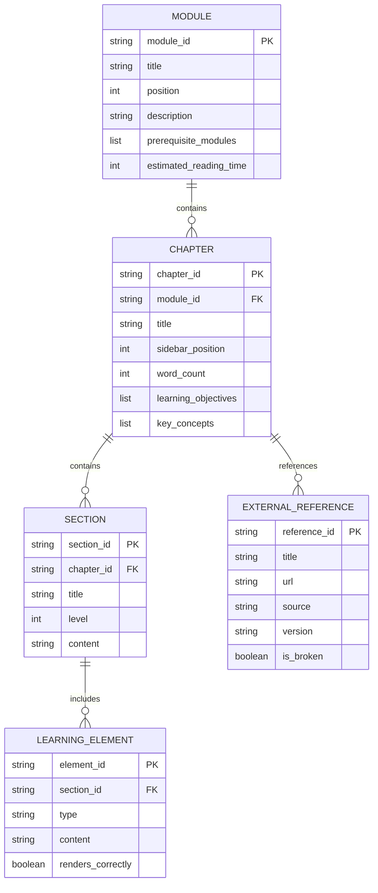

# Data Model: Module 3 – The AI-Robot Brain (NVIDIA Isaac™)

**Feature**: 003-isaac-ai-brain
**Created**: 2025-12-26
**Purpose**: Define content entities and their relationships for Module 3 educational material

## Overview

Module 3 is educational content (Markdown files) rather than a database-backed application. This data model defines the **content entities** that structure the educational material for Docusaurus rendering and RAG chatbot indexing.

## Content Entities

### Entity: Module

**Description**: Represents a top-level learning module in the book (Module 3: NVIDIA Isaac ecosystem).

**Attributes**:
- `module_id`: String - Unique identifier (e.g., "module-3", "003-isaac-ai-brain")
- `title`: String - Display title ("Module 3: The AI-Robot Brain (NVIDIA Isaac™)")
- `position`: Integer - Sidebar ordering (3, following Modules 1-2)
- `description`: String - Summary for generated index page and RAG context
- `prerequisite_modules`: List[String] - Required prior modules (["module-1", "module-2"])
- `estimated_reading_time`: Integer - Minutes (40-60 for Module 3)

**Validation Rules**:
- `module_id` must match directory name (`book_frontend/docs/module-3/`)
- `position` must be unique across all modules
- `prerequisite_modules` must reference valid existing modules

**Relationships**:
- Contains 1 to N Chapters (Module 3 contains 3 chapters)

**File Representation**: `book_frontend/docs/module-3/_category_.json`

```json
{
  "label": "Module 3: The AI-Robot Brain (NVIDIA Isaac™)",
  "position": 3,
  "link": {
    "type": "generated-index",
    "description": "Master advanced perception and navigation using NVIDIA Isaac Sim, Isaac ROS, and Nav2 for humanoid robots."
  }
}
```

---

### Entity: Chapter

**Description**: Represents a single educational chapter within a module (e.g., "Isaac Sim Overview").

**Attributes**:
- `chapter_id`: String - Unique identifier (e.g., "chapter-1-isaac-sim")
- `title`: String - Display title ("Chapter 1: NVIDIA Isaac Sim Overview")
- `sidebar_position`: Integer - Chapter ordering within module (1, 2, 3)
- `word_count`: Integer - Estimated length (1000-1400 words per chapter for Module 3)
- `learning_objectives`: List[String] - What reader will learn (3-5 objectives per chapter)
- `key_concepts`: List[String] - Main topics covered (e.g., ["photorealistic simulation", "synthetic data generation", "ROS 2 integration"])
- `diagrams`: List[Diagram] - Visual aids (Mermaid diagrams, tables)
- `external_references`: List[ExternalReference] - Links to official documentation

**Validation Rules**:
- `chapter_id` must match file name (e.g., `chapter-1-isaac-sim.md`)
- `sidebar_position` must be unique within parent module
- `word_count` should fall within 800-1500 words for readability
- Must include at least 2 diagrams/tables for visual learners
- Must include at least 3 external references for citation/traceability (constitution principle V)

**Relationships**:
- Belongs to 1 Module
- Contains 1 to N Sections
- References 0 to N ExternalReferences

**File Representation**: Markdown file `book_frontend/docs/module-3/chapter-1-isaac-sim.md` with frontmatter:

```markdown
---
sidebar_position: 1
---

# Chapter 1: NVIDIA Isaac Sim Overview

[Introduction paragraph...]

## 1.1 Photorealistic Simulation for Humanoid Robots
[Section content...]

## 1.2 Synthetic Data Generation for Training AI Models
[Section content...]

## 1.3 Integration with ROS 2 and Gazebo Environments
[Section content...]
```

---

### Entity: Section

**Description**: Represents a subsection within a chapter (e.g., "1.1 Photorealistic Simulation").

**Attributes**:
- `section_id`: String - Heading anchor (e.g., "photorealistic-simulation")
- `title`: String - Section heading ("1.1 Photorealistic Simulation for Humanoid Robots")
- `level`: Integer - Heading level (2 for ## sections, 3 for ### subsections)
- `content`: String - Markdown text (200-400 words per section)
- `code_examples`: List[CodeExample] - Optional code snippets (configuration examples)

**Validation Rules**:
- `level` must be 2 or 3 (Docusaurus best practice: avoid deep nesting)
- `content` must be non-empty
- Code examples must use proper syntax highlighting (```python, ```yaml, etc.)

**Relationships**:
- Belongs to 1 Chapter
- May contain 0 to N LearningElements (diagrams, tables, code examples)

**File Representation**: Markdown heading within chapter file

---

### Entity: LearningElement

**Description**: Represents visual or interactive elements that enhance learning (diagrams, tables, code examples).

**Subtypes**:
1. **MermaidDiagram**: Inline Mermaid syntax for workflows
2. **MarkdownTable**: Comparison tables (e.g., Isaac Sim vs Gazebo vs Unity)
3. **CodeSnippet**: Configuration examples (URDF, YAML)

**Attributes (MermaidDiagram)**:
- `diagram_type`: String - "flowchart", "sequence", "graph"
- `mermaid_code`: String - Mermaid syntax
- `caption`: String - Brief description
- `renders_correctly`: Boolean - Validation flag (must be true before deployment)

**Example (VSLAM Workflow Diagram)**:

```markdown
### VSLAM Workflow

```mermaid
graph TD
    A[Camera Frame Input] --> B[Feature Extraction]
    B --> C[Feature Matching]
    C --> D[Pose Estimation]
    D --> E[Map Update]
    E --> F[Loop Closure Detection]
    F -.Optional.-> E
    style A fill:#e1f5ff
    style E fill:#ffe1e1
    style F fill:#fff4e1
\```

This workflow illustrates how Visual SLAM builds a 3D map from camera observations...
```

**Attributes (MarkdownTable)**:
- `columns`: List[String] - Column headers
- `rows`: List[List[String]] - Table data
- `alignment`: List[String] - "left", "center", "right" for each column

**Example (Nav2 Planner Comparison)**:

```markdown
| Planner | Best For | Humanoid Suitability |
|---------|----------|---------------------|
| A* | Static environments, global planning | High (predictable paths) |
| DWB | Dynamic obstacles, local replanning | Very High (adapts to moving humans) |
| Theta* | Smooth paths, minimal turns | Moderate (may violate gait constraints) |
```

**Validation Rules**:
- Mermaid diagrams must render without errors (`npm run build` validates)
- Tables must have aligned columns (markdown-lint compatible)
- Code snippets must use valid syntax for specified language

---

### Entity: ExternalReference

**Description**: Represents a link to official external documentation (NVIDIA Isaac, ROS 2 Nav2, academic papers).

**Attributes**:
- `title`: String - Link text
- `url`: String - Stable URL (official documentation preferred)
- `source`: String - "NVIDIA", "ROS 2", "Academic", "GitHub"
- `version`: String - Optional version reference (e.g., "Isaac Sim 2023.1.1", "ROS 2 Humble")
- `accessed_date`: String - ISO date when link was verified
- `is_broken`: Boolean - Validation flag (link checker result)

**Validation Rules**:
- `url` must return HTTP 200 (link checker validation before deployment)
- Prefer official documentation URLs over community forums/blogs
- Include version references for stability (e.g., "Isaac Sim 2023.1.1" not "latest")

**Examples**:

```markdown
**References:**
- [NVIDIA Isaac Sim Documentation](https://docs.nvidia.com/isaac/isaac_sim/) - Official NVIDIA Isaac Sim user guide
- [Isaac ROS GitHub](https://github.com/NVIDIA-ISAAC-ROS/isaac_ros_visual_slam) - Isaac ROS Visual SLAM package README
- [ROS 2 Nav2 Documentation](https://navigation.ros.org/) - Official Nav2 navigation stack guide
```

**Relationships**:
- Referenced by 1 to N Chapters

---

## Content Relationships Diagram



## RAG Chatbot Integration

**Indexing Strategy**:
- Each Chapter is indexed as a separate document chunk (preserves context)
- Section headings used as metadata for semantic search
- LearningElements (diagrams, tables) indexed separately with captions
- ExternalReferences stored as metadata (chatbot can cite sources)

**Query Example**:
- User: "How does VSLAM build a map?"
- RAG retrieves: Chapter 2, Section 2.1 (VSLAM Workflow), VSLAM Workflow Mermaid diagram
- Chatbot response: "VSLAM builds a map through feature tracking → pose estimation → map update..." (cites Chapter 2)

**Validation**:
- RAG chatbot must restrict responses to Module 3 content (no hallucination from external sources)
- Citations must include chapter reference (e.g., "According to Module 3, Chapter 2...")

## Content Validation Checklist

Before deployment, validate:
- [ ] All Modules have valid `_category_.json` with unique positions
- [ ] All Chapters have frontmatter with unique `sidebar_position`
- [ ] All Sections use heading levels 2-3 (no deeper nesting)
- [ ] All MermaidDiagrams render correctly (`npm run build` passes)
- [ ] All MarkdownTables have aligned columns
- [ ] All CodeSnippets use valid syntax highlighting
- [ ] All ExternalReferences return HTTP 200 (link checker)
- [ ] Word counts fall within 800-1500 per chapter
- [ ] At least 2 diagrams/tables per chapter
- [ ] At least 3 external references per chapter
- [ ] RAG chatbot indexes all content correctly

This data model ensures consistency, traceability, and quality for Module 3 educational content.
