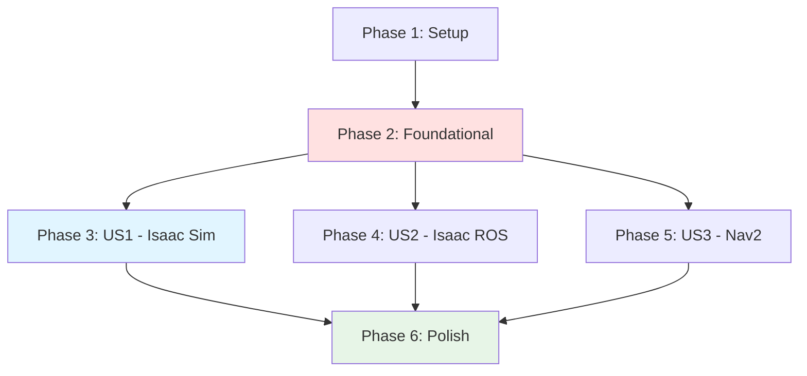

# Tasks: Module 3 – The AI-Robot Brain (NVIDIA Isaac™)

**Input**: Design documents from `/specs/003-isaac-ai-brain/`
**Prerequisites**: plan.md (required), spec.md (required for user stories), research.md, data-model.md, contracts/

**Tests**: No automated tests for this feature (educational content authoring - manual review only)

**Organization**: Tasks are grouped by user story to enable independent implementation and testing of each chapter.

## Format: `[ID] [P?] [Story] Description`

- **[P]**: Can run in parallel (different files, no dependencies)
- **[Story]**: Which user story this task belongs to (e.g., US1, US2, US3)
- Include exact file paths in descriptions

## Path Conventions

- **Documentation site**: `book_frontend/docs/`, `book_frontend/static/`, from repository root
- **Planning artifacts**: `specs/003-isaac-ai-brain/`
- Paths shown below use repository root as base

---

## Phase 1: Setup (Module 3 Integration)

**Purpose**: Integrate Module 3 structure into existing Docusaurus site (Modules 1-2 already set up)

- [X] T001 Verify Docusaurus site running with `cd book_frontend && npm start` (Modules 1-2 should load)
- [X] T002 Create Module 3 directory structure: `book_frontend/docs/module-3/` and `book_frontend/static/img/module-3/`
- [X] T003 Create Module 3 category configuration at `book_frontend/docs/module-3/_category_.json` (label, position: 3, description)
- [X] T004 [P] Create Chapter 1 placeholder file at `book_frontend/docs/module-3/chapter-1-isaac-sim.md` with front matter and "Coming Soon" section
- [X] T005 [P] Create Chapter 2 placeholder file at `book_frontend/docs/module-3/chapter-2-isaac-ros-vslam.md` with front matter and "Coming Soon" section
- [X] T006 [P] Create Chapter 3 placeholder file at `book_frontend/docs/module-3/chapter-3-nav2.md` with front matter and "Coming Soon" section
- [X] T007 Test site navigation: run `cd book_frontend && npm run build` and verify Module 3 appears in sidebar

---

## Phase 2: Foundational (Update Site Navigation)

**Purpose**: Update existing Docusaurus files to reference Module 3

**⚠️ CRITICAL**: These updates allow navigation to Module 3

- [X] T008 Update intro page at `book_frontend/docs/intro.md` to add Module 3 in "What You'll Learn" section
- [X] T009 Verify sidebar autogeneration includes Module 3 or manually update `book_frontend/sidebars.js` if needed
- [X] T010 Test navigation: run `cd book_frontend && npm start` and verify Module 3 chapters accessible via sidebar

**Checkpoint**: Foundation ready - chapter content authoring can now begin in parallel

---

## Phase 3: User Story 1 - Understanding NVIDIA Isaac Sim (Priority: P1) 🎯 MVP

**Goal**: Author Chapter 1 content explaining Isaac Sim photorealistic simulation, synthetic data generation, and ROS 2/Gazebo integration

**Independent Test**: Chapter 1 is fully readable with diagrams and examples. Reader can explain Isaac Sim's advantages over Gazebo/Unity and describe synthetic data workflows.

### Content Authoring for User Story 1

- [X] T011 [P] [US1] Write Section 1.1 "Photorealistic Simulation for Humanoid Robots" in `book_frontend/docs/module-3/chapter-1-isaac-sim.md` (Isaac Sim rendering, RTX ray tracing, PBR materials, comparison to Gazebo/Unity)
- [X] T012 [P] [US1] Write Section 1.2 "Synthetic Data Generation for Training AI Models" in `book_frontend/docs/module-3/chapter-1-isaac-sim.md` (Replicator workflow, domain randomization, dataset export)
- [X] T013 [P] [US1] Write Section 1.3 "Integration with ROS 2 and Gazebo Environments" in `book_frontend/docs/module-3/chapter-1-isaac-sim.md` (ROS 2 bridge architecture, URDF import, hybrid workflows)
- [X] T014 [P] [US1] Write Section 1.4 "Sim-to-Real Transfer Considerations" in `book_frontend/docs/module-3/chapter-1-isaac-sim.md` (sim-to-real gap, domain randomization strategy, validation checklist)

### Diagrams for User Story 1

- [X] T015 [P] [US1] Create comparison table "Isaac Sim vs Gazebo vs Unity" inline in Section 1.1 (markdown table: physics accuracy, visual fidelity, synthetic data pipeline, ROS 2 integration, GPU acceleration)
- [X] T016 [P] [US1] Create Mermaid flowchart "Synthetic Data Workflow" inline in Section 1.2 (Scene Setup → Domain Randomization → Data Capture → Labeling → Export → Training → Deploy)
- [X] T017 [P] [US1] Create Mermaid diagram "Isaac Sim ROS 2 Bridge Architecture" inline in Section 1.3 (Isaac Sim → ROS 2 topics → Perception nodes)

### References for User Story 1

- [X] T018 [US1] Add inline citations to NVIDIA Isaac Sim docs, Replicator tutorials, ROS 2 bridge guide, Omniverse Cloud (minimum 4 links) throughout Chapter 1
- [X] T019 [US1] Add bridge paragraph at end of Chapter 1 transitioning to Chapter 2 (Isaac ROS perception)

### Review for User Story 1

- [ ] T020 [US1] Run `cd book_frontend && npm start` and manually review Chapter 1 for readability, diagram rendering, link functionality
- [ ] T021 [US1] Validate Chapter 1 against content contract acceptance criteria in `specs/003-isaac-ai-brain/contracts/chapter-1-outline.md`
- [ ] T022 [US1] Spell-check and grammar review of Chapter 1 content

**Checkpoint**: At this point, Chapter 1 (User Story 1) should be fully functional and testable independently

---

## Phase 4: User Story 2 - Mastering Isaac ROS Perception (Priority: P2)

**Goal**: Author Chapter 2 content on Isaac ROS hardware-accelerated perception, Visual SLAM, sensor fusion, and environment mapping

**Independent Test**: Chapter 2 is fully readable with VSLAM diagrams. Reader can conceptually design a perception pipeline using Isaac ROS nodes.

### Content Authoring for User Story 2

- [X] T023 [P] [US2] Write Section 2.1 "Hardware-Accelerated Perception with Isaac ROS" in `book_frontend/docs/module-3/chapter-2-isaac-ros-vslam.md` (Isaac ROS packages, GPU acceleration, ROS 2 nodes)
- [X] T024 [P] [US2] Write Section 2.2 "Visual SLAM (VSLAM) Workflow" in `book_frontend/docs/module-3/chapter-2-isaac-ros-vslam.md` (feature extraction, tracking, pose estimation, loop closure, map building)
- [X] T025 [P] [US2] Write Section 2.3 "Sensor Fusion and Real-Time Perception" in `book_frontend/docs/module-3/chapter-2-isaac-ros-vslam.md` (camera + IMU + LiDAR fusion, EKF intuition)
- [X] T026 [P] [US2] Write Section 2.4 "Mapping and Environment Understanding" in `book_frontend/docs/module-3/chapter-2-isaac-ros-vslam.md` (occupancy grids, point clouds, semantic mapping)

### Diagrams for User Story 2

- [X] T027 [P] [US2] Create markdown table "Isaac ROS Packages Overview" inline in Section 2.1 (package name, purpose, input sensors, output)
- [X] T028 [P] [US2] Create Mermaid flowchart "VSLAM Workflow" inline in Section 2.2 (Camera Frame → Feature Extraction → Matching → Pose Estimation → Map Update → Loop Closure)
- [X] T029 [P] [US2] Create Mermaid diagram "Sensor Fusion Architecture" inline in Section 2.3 (Camera/IMU/LiDAR → Fusion Node → Fused Pose)
- [X] T030 [P] [US2] Create markdown table "Mapping Types Comparison" inline in Section 2.4 (occupancy grid, point cloud, semantic map)

### References for User Story 2

- [X] T031 [US2] Add inline citations to Isaac ROS Visual SLAM GitHub, Isaac ROS packages index, ROS 2 sensor fusion docs, NVIDIA Jetson (minimum 4 links) throughout Chapter 2
- [X] T032 [US2] Add bridge paragraph at end of Chapter 2 transitioning to Chapter 3 (Nav2 navigation)

### Review for User Story 2

- [ ] T033 [US2] Run `cd book_frontend && npm start` and manually review Chapter 2 for readability, diagram rendering
- [ ] T034 [US2] Validate Chapter 2 against content contract acceptance criteria in `specs/003-isaac-ai-brain/contracts/chapter-2-outline.md`
- [ ] T035 [US2] Spell-check and grammar review of Chapter 2 content

**Checkpoint**: At this point, Chapters 1 AND 2 should both work independently

---

## Phase 5: User Story 3 - Navigation and Path Planning with Nav2 (Priority: P3)

**Goal**: Author Chapter 3 content on Nav2 stack, path planning algorithms, obstacle avoidance, and perception-to-control pipeline

**Independent Test**: Chapter 3 is fully readable with Nav2 diagrams. Reader can select appropriate path planners and explain the perception-to-control pipeline.

### Content Authoring for User Story 3

- [X] T036 [P] [US3] Write Section 3.1 "Nav2 Stack for Bipedal Humanoid Movement" in `book_frontend/docs/module-3/chapter-3-nav2.md` (Nav2 architecture, behavior trees, humanoid constraints)
- [X] T037 [P] [US3] Write Section 3.2 "Path Planning Algorithms" in `book_frontend/docs/module-3/chapter-3-nav2.md` (A*, DWB, Theta*, planner selection for humanoids)
- [X] T038 [P] [US3] Write Section 3.3 "Obstacle Avoidance & Costmap Layers" in `book_frontend/docs/module-3/chapter-3-nav2.md` (costmap representation, dynamic obstacles, safety zones)
- [X] T039 [P] [US3] Write Section 3.4 "Perception-to-Control Pipeline" in `book_frontend/docs/module-3/chapter-3-nav2.md` (Isaac ROS → Nav2 → locomotion, latency considerations)
- [X] T040 [P] [US3] Write Section 3.5 "Module 3 Conclusion" in `book_frontend/docs/module-3/chapter-3-nav2.md` (summary of Isaac ecosystem, transition to hands-on modules)

### Diagrams for User Story 3

- [X] T041 [P] [US3] Create Mermaid flowchart "Nav2 Architecture" inline in Section 3.1 (Goal → Behavior Tree → Global Planner → Local Planner → Velocity Commands → Locomotion)
- [X] T042 [P] [US3] Create markdown table "Path Planning Algorithm Comparison" inline in Section 3.2 (planner, algorithm type, best for, humanoid suitability)
- [X] T043 [P] [US3] Create Mermaid diagram "Costmap Layers" inline in Section 3.3 (Static/Obstacle/Inflation layers → Combined Costmap → Planner)
- [X] T044 [P] [US3] Create Mermaid flowchart "Perception-to-Control Pipeline" inline in Section 3.4 (Isaac ROS VSLAM → Nav2 Costmap → Planner → Controller → Actuators)

### References for User Story 3

- [X] T045 [US3] Add inline citations to ROS 2 Nav2 docs, Nav2 planners, behavior trees, humanoid navigation papers (minimum 4 links) throughout Chapter 3
- [X] T046 [US3] Verify Module 3 conclusion paragraph flows well and summarizes key concepts (Isaac Sim → Isaac ROS → Nav2)

### Review for User Story 3

- [ ] T047 [US3] Run `cd book_frontend && npm start` and manually review Chapter 3 for readability, diagram rendering
- [ ] T048 [US3] Validate Chapter 3 against content contract acceptance criteria in `specs/003-isaac-ai-brain/contracts/chapter-3-outline.md`
- [ ] T049 [US3] Spell-check and grammar review of Chapter 3 content

**Checkpoint**: All 3 chapters (Module 3) should now be independently functional

---

## Phase 6: Polish & Cross-Cutting Concerns

**Purpose**: Final quality checks and deployment verification for Module 3

- [X] T050 [P] Run full site build with `cd book_frontend && npm run build` and fix any build errors
- [X] T051 [P] Run link validation: verify all internal Module 3 cross-references and external NVIDIA/ROS 2 documentation links work
- [X] T052 [P] Test Module 3 pages on mobile viewport (responsive design check in browser dev tools)
- [X] T053 Verify intro page (`book_frontend/docs/intro.md`) correctly references Module 3
- [X] T054 Verify all Module 3 diagrams render correctly in production build (`cd book_frontend && npm run serve` after build)
- [X] T055 [P] Final constitution compliance check: verify all Module 3 chapters cite sources, use clear language, follow Docusaurus conventions
- [X] T056 Cross-module navigation test: verify transitions from Module 1 → 2 → 3 work correctly

---

## Dependencies & Execution Order

### Phase Dependencies

- **Setup (Phase 1)**: Depends on Modules 1-2 Docusaurus site being operational (already complete)
- **Foundational (Phase 2)**: Depends on Setup completion - BLOCKS all user stories
- **User Stories (Phase 3, 4, 5)**: All depend on Foundational phase completion
  - User stories can then proceed in parallel (if multiple authors)
  - Or sequentially in priority order (P1 → P2 → P3)
- **Polish (Phase 6)**: Depends on all desired user stories being complete

### User Story Dependencies

**User Story 1 (US1)**: Independent - no dependencies on other stories
**User Story 2 (US2)**: Independent - no dependencies on other stories
**User Story 3 (US3)**: Independent - no dependencies on other stories

**Rationale**: Each chapter is independently readable. Students can complete Chapter 1 (Isaac Sim) without reading Chapters 2-3. Foundational phase blocks all user stories because navigation must be set up first.

---

## Parallel Execution Examples

### Example 1: Single Author (Sequential)

**Recommended Order** (priority-based):
1. Setup → Foundational (T001-T010)
2. User Story 1 Chapter 1 (T011-T022) ← MVP delivers value here
3. User Story 2 Chapter 2 (T023-T035) ← Optional enhancement
4. User Story 3 Chapter 3 (T036-T049) ← Optional enhancement
5. Polish (T050-T056) ← After desired stories complete

**Estimated Time**: ~9-12 hours total (3-4 hours per chapter including review)

### Example 2: Multiple Authors (Parallel)

**Day 1**: Complete Setup + Foundational (T001-T010) - 1 author
**Day 2-3**: Parallel chapter authoring (35 parallel tasks available):
- Author A: User Story 1 (T011-T022) - Chapter 1
- Author B: User Story 2 (T023-T035) - Chapter 2
- Author C: User Story 3 (T036-T049) - Chapter 3

**Day 4**: Polish (T050-T056) - 1 author validates all

**Estimated Time**: ~4 days with 3 authors

### Example 3: MVP First (Incremental Delivery)

**Sprint 1** (MVP): Setup + Foundational + User Story 1 (T001-T022)
- Delivers: Chapter 1 (Isaac Sim fundamentals) - students can read immediately
- Estimated: 4-5 hours

**Sprint 2** (Enhancement): User Story 2 (T023-T035)
- Delivers: Chapter 2 (Isaac ROS perception)
- Estimated: 3-4 hours

**Sprint 3** (Enhancement): User Story 3 (T036-T049)
- Delivers: Chapter 3 (Nav2 navigation)
- Estimated: 3-4 hours

**Sprint 4** (Polish): Polish phase (T050-T056)
- Delivers: Final validation, link checking, cross-module testing
- Estimated: 1-2 hours

---

## Task Statistics

**Total Tasks**: 56
**Parallelizable Tasks**: 36 (64% can run in parallel)

**Breakdown by Phase**:
- Phase 1 (Setup): 7 tasks (3 parallel)
- Phase 2 (Foundational): 3 tasks (1 parallel)
- Phase 3 (US1 - Isaac Sim): 12 tasks (7 parallel)
- Phase 4 (US2 - Isaac ROS): 13 tasks (8 parallel)
- Phase 5 (US3 - Nav2): 14 tasks (9 parallel)
- Phase 6 (Polish): 7 tasks (4 parallel)

**Critical Path** (sequential tasks only): ~20 tasks (~6-8 hours assuming 20-30 min per task)

**Parallel Opportunities**:
- Setup: T004-T006 (create 3 placeholder files simultaneously)
- US1 Diagrams: T015-T017 (create 3 diagrams simultaneously)
- US2 Content: T023-T026 (write 4 sections simultaneously)
- US2 Diagrams: T027-T030 (create 4 diagrams simultaneously)
- US3 Content: T036-T040 (write 5 sections simultaneously)
- US3 Diagrams: T041-T044 (create 4 diagrams simultaneously)
- Polish: T050-T052, T054-T055 (validation tasks in parallel)

---

## Implementation Strategy

**Strategy 1: MVP First (Recommended for Single Developer)**
- Implement User Story 1 only (Chapter 1: Isaac Sim)
- Delivers value immediately (~4-5 hours)
- Defer Chapters 2-3 to future sprints
- Use case: Book author wants fastest path to publish first chapter

**Strategy 2: Complete Module (Recommended for Team)**
- All 3 authors work in parallel on different chapters
- Deliver complete Module 3 in one sprint (~4 days)
- Use case: Pre-launch preparation with multiple contributors

**Strategy 3: Incremental Delivery**
- Sprint 1: Chapter 1 (MVP)
- Sprint 2: Chapter 2 (Enhancement)
- Sprint 3: Chapter 3 (Enhancement)
- Sprint 4: Polish (Quality assurance)
- Use case: Continuous delivery with reader feedback between chapters

---

## Notes

- No code implementation required (educational content authoring only)
- All diagrams use Mermaid (inline, version-controlled)
- External links to NVIDIA Isaac and ROS 2 Nav2 official documentation
- Content follows Modules 1-2 established pattern (conceptual, ~1200 words per chapter, no installation steps)
- Build validation required after each chapter to catch syntax errors early
