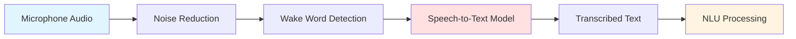

# Chapter 1 Content Contract: Voice-to-Action with OpenAI Whisper

**Chapter ID**: `chapter-1`
**File**: `book_frontend/docs/module-4/chapter-1-voice-to-action.md`
**Estimated Length**: 12-15 pages
**Estimated Time**: 35-45 minutes

---

## Learning Objectives

By the end of this chapter, readers will be able to:

1. Explain speech recognition workflows for converting voice commands to text (audio capture, noise reduction, speech-to-text)
2. Describe natural language understanding (NLU) for extracting intent and entities from voice commands
3. Understand voice-to-ROS 2 action integration patterns (mapping intents to action goals, parameter extraction)
4. Identify use cases and limitations for voice-controlled humanoid robots

---

## Key Concepts

### 1. Speech Recognition and Audio Processing

**Coverage**: Audio capture from microphones, noise reduction techniques, wake word detection, speech-to-text models (Whisper architecture), accuracy considerations (accents, background noise)

**Learning Element**: Voice-to-text workflow diagram (Mermaid)

---

### 2. Natural Language Understanding (NLU)

**Coverage**: Intent classification (navigation vs. manipulation vs. query), entity extraction (object names, locations, quantities), slot filling, handling ambiguity

**Learning Element**: NLU intent mapping table

| Voice Command | Intent | Entities | ROS 2 Action |
|--------------|--------|----------|--------------|
| "Go to the kitchen" | navigate | location: kitchen | NavigateToPose(kitchen_pose) |
| "Pick up the red cup" | grasp | object: cup, color: red | DetectObject(red, cup) + GraspObject |
| "Bring me water" | fetch | object: water, target: user | Navigate + Grasp + Navigate + Handover |

---

### 3. Voice-to-ROS 2 Action Integration

**Coverage**: Mapping voice intents to ROS 2 action servers (from Module 1), parameter extraction and validation, confirmation workflows, error handling for invalid commands

**Learning Element**: Integration architecture diagram showing voice node → action client → action server

---

## Content Structure

### Section 1.1: Speech Recognition and Audio Processing
- Audio capture workflow (Explain: microphone → preprocessing)
- Speech-to-text with Whisper (Show: diagram)
- Noise reduction and wake words (Apply: use cases)

### Section 1.2: Natural Language Understanding (NLU)
- Intent classification and entity extraction (Explain: NLU pipeline)
- Intent mapping table (Show: examples)
- Handling ambiguity (Apply: confirmation strategies)

### Section 1.3: Voice-to-ROS 2 Action Integration
- Integration patterns (Explain: voice node architecture)
- Parameter mapping (Show: voice → action goal)
- Error handling (Apply: invalid command recovery)

### Section 1.4: Use Cases and Limitations
- Voice control applications (Explain: when to use voice)
- Limitations (Show: comparison with other modalities)
- Safety considerations (Apply: confirmation, restricted actions)

---

## Required Diagrams

1. **Voice-to-Text Workflow** (Mermaid flowchart)
2. **NLU Intent Mapping** (Markdown table)
3. **Voice-to-ROS 2 Integration Architecture** (Mermaid diagram)
4. **Voice Control Use Cases vs. Limitations** (Comparison text or table)

---

## External References

- [OpenAI Whisper Documentation](https://platform.openai.com/docs/guides/speech-to-text) - Speech recognition API guide
- [ROS 2 Voice Packages](https://index.ros.org/search/?term=voice) - ROS 2 voice integration packages
- [Whisper Model Card](https://github.com/openai/whisper) - Technical details and accuracy benchmarks
- [Voice UI Best Practices for Robotics](https://arxiv.org/abs/2109.04456) - Research on voice-controlled robots (if available)

---

## Acceptance Criteria

- [ ] All learning objectives testable
- [ ] 4 diagrams/tables included
- [ ] External references cited (minimum 4 links)
- [ ] Voice pipeline explained end-to-end (audio → text → intent → action)
- [ ] NLU intent mapping clear with concrete examples
- [ ] Safety considerations addressed (confirmation, error handling)
- [ ] Bridge paragraph transitioning to Chapter 2 (LLM planning)
- [ ] Estimated reading time: 35-45 minutes (1200-1500 words)
