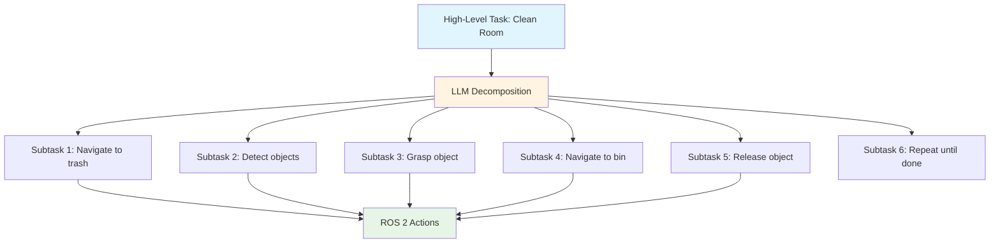

# Chapter 2 Content Contract: Cognitive Planning with LLMs

**Chapter ID**: `chapter-2`
**File**: `book_frontend/docs/module-4/chapter-2-llm-planning.md`
**Estimated Length**: 12-15 pages
**Estimated Time**: 35-45 minutes

---

## Learning Objectives

By the end of this chapter, readers will be able to:

1. Explain LLM-based task decomposition for translating high-level goals into robot action sequences
2. Describe how LLMs map abstract tasks to robot perception and motion capabilities
3. Understand LLM planning strategies (few-shot prompting, chain-of-thought, error recovery)
4. Identify when to use LLM planning vs. scripted behaviors for humanoid tasks

---

## Key Concepts

### 1. LLM Task Decomposition

**Coverage**: High-level task parsing ("clean the room"), breaking into subtasks, mapping to robot primitives (navigate, detect, grasp, place), sequencing with dependencies

**Learning Element**: Task decomposition diagram (Mermaid)

---

### 2. Mapping Tasks to Robot Capabilities

**Coverage**: LLM understanding of robot affordances (what robot can/cannot do), perception constraints (Isaac ROS capabilities), motion constraints (Nav2 limitations, humanoid gait), reality grounding (checking task feasibility)

**Learning Element**: Capability mapping table

| Task Component | Robot Capability Required | Module Reference |
|----------------|---------------------------|------------------|
| "Navigate to kitchen" | Nav2 path planning + VSLAM localization | Module 3, Ch 2-3 |
| "Find red cup" | Isaac ROS object detection | Module 3, Ch 2 |
| "Pick up cup" | Manipulation controller + grasp planning | (Future module) |
| "Avoid obstacles" | Nav2 costmap + dynamic avoidance | Module 3, Ch 3 |

---

### 3. LLM Planning Strategies

**Coverage**: Few-shot prompting (providing example tasks), chain-of-thought reasoning (showing step-by-step planning), error recovery (replanning when actions fail), validation (checking plan feasibility before execution)

**Learning Element**: LLM prompt template example and planning workflow

---

## Content Structure

### Section 2.1: LLM Task Decomposition
- High-level task understanding (Explain: LLM parsing)
- Task decomposition workflow (Show: diagram)
- Decomposition examples (Apply: "set the table", "clean room")

### Section 2.2: Mapping Tasks to Robot Capabilities
- Robot affordances and constraints (Explain: what robots can/cannot do)
- Capability mapping (Show: table linking tasks to modules)
- Reality grounding (Apply: feasibility checking)

### Section 2.3: LLM Planning Strategies
- Few-shot prompting (Explain: providing examples)
- Chain-of-thought reasoning (Show: planning workflow)
- Error recovery and replanning (Apply: handling failures)

### Section 2.4: LLM Planning vs. Scripted Behaviors
- When to use LLM planning (Explain: open-ended tasks)
- When to use scripts (Explain: safety-critical, deterministic)
- Hybrid approaches (Show: LLM + scripted safety checks)

---

## Required Diagrams

1. **LLM Task Decomposition Workflow** (Mermaid flowchart)
2. **Capability Mapping Table** (Markdown table with Module references)
3. **LLM Planning Strategies** (Diagram or conceptual workflow)
4. **LLM vs. Scripted Comparison** (Markdown table)

---

## External References

- [OpenAI API Documentation](https://platform.openai.com/docs/) - LLM API usage and prompting
- [SayCan: Grounding Language in Robotic Affordances](https://say-can.github.io/) - Research on grounded language planning
- [RT-1/RT-2: Robotics Transformer](https://robotics-transformer.github.io/) - Vision-language-action models
- [ROS 2 Planning Frameworks](https://moveit.ros.org/) - Alternative to LLM planning for structured tasks

---

## Acceptance Criteria

- [ ] All learning objectives testable
- [ ] 4 diagrams/tables included
- [ ] External references cited (minimum 4 links, including research papers)
- [ ] LLM task decomposition explained with concrete examples
- [ ] Capability mapping ties to Modules 1-3 (explicit cross-references)
- [ ] LLM planning strategies practical and actionable
- [ ] LLM vs. scripted comparison helps students make design decisions
- [ ] Bridge paragraph transitioning to Chapter 3 (capstone integration)
- [ ] Estimated reading time: 35-45 minutes (1200-1500 words)
