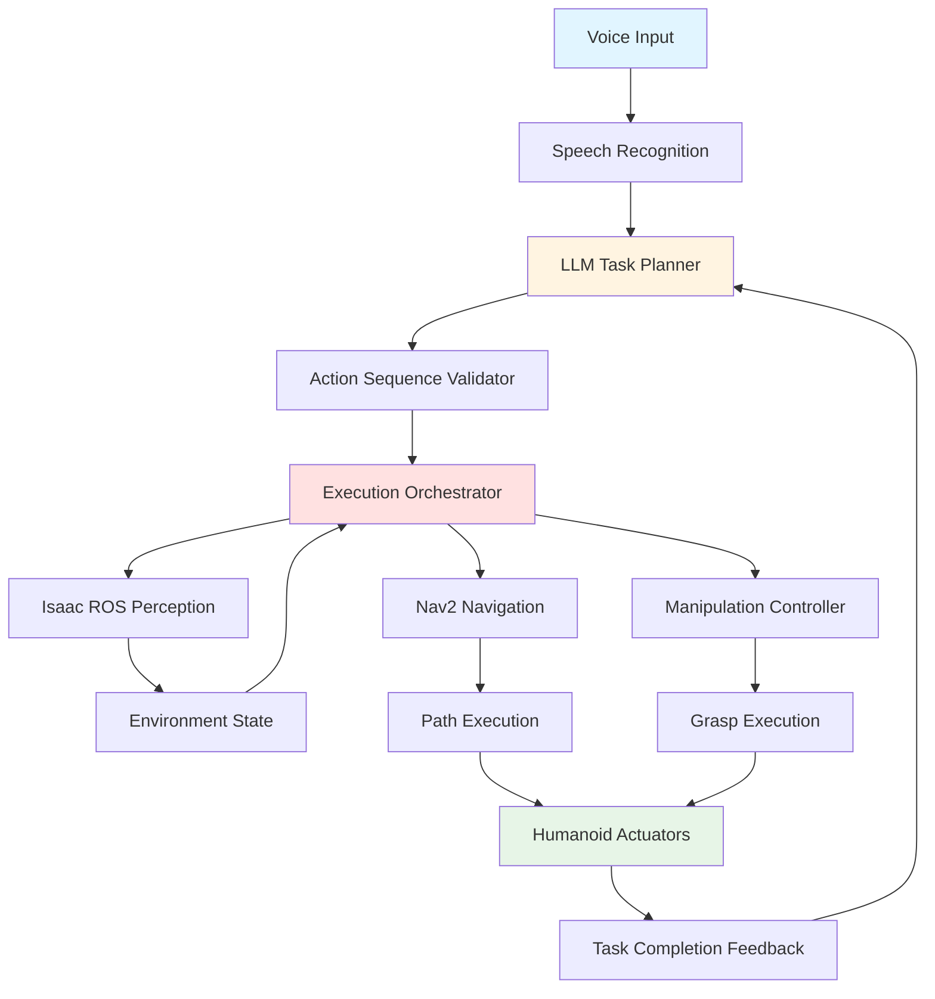

# Chapter 3 Content Contract: Capstone: Autonomous Humanoid Execution

**Chapter ID**: `chapter-3`
**File**: `book_frontend/docs/module-4/chapter-3-autonomous-execution.md`
**Estimated Length**: 15-20 pages (longer - capstone integration)
**Estimated Time**: 40-50 minutes

---

## Learning Objectives

By the end of this chapter, readers will be able to:

1. Explain the end-to-end autonomous execution pipeline integrating voice → LLM planning → Isaac ROS perception → Nav2 navigation → manipulation
2. Describe system integration challenges (latency, failure propagation, state synchronization) and debugging strategies
3. Understand safety constraints for autonomous humanoid operation (human detection, emergency stop, graceful degradation)
4. Trace complete autonomous workflows from voice command to task completion across all 4 modules

---

## Key Concepts

### 1. End-to-End Autonomous Execution Pipeline

**Coverage**: Complete system architecture integrating all modules, data flow from voice input to robot actuation, component orchestration, state management

**Learning Element**: Complete VLA system architecture (Mermaid - comprehensive diagram)

---

### 2. System Integration Challenges

**Coverage**: Latency accumulation across components, failure propagation (one component failure affects others), state synchronization (keeping perception, planning, execution in sync), debugging multi-component systems

**Learning Element**: Integration challenges table

| Challenge | Description | Mitigation Strategy |
|-----------|-------------|---------------------|
| Latency | Voice (100ms) + LLM (2s) + VSLAM (30ms) + Nav2 (50ms) = 2.2s total | Async execution, progress feedback |
| Failure Propagation | VSLAM fails → Nav2 can't plan → LLM replan triggered | Graceful degradation, fallback behaviors |
| State Sync | LLM assumes object at location, but perception shows it moved | Periodic state refresh, perception-driven replanning |

---

### 3. Safety Constraints for Autonomous Operation

**Coverage**: Human proximity detection (using Isaac ROS), speed limits near humans, force limits for manipulation, emergency stop triggers, restricted action sets, human-in-the-loop confirmation for risky tasks

**Learning Element**: Safety constraint layers diagram and validation checklist

---

### 4. Complete Autonomous Workflow Examples

**Coverage**: End-to-end examples demonstrating voice command → LLM planning → perception → navigation → manipulation → task completion

**Example Tasks**:
- "Bring me the red cup from the kitchen"
- "Clear the table and throw trash in the bin"
- "Follow me to the meeting room"

**Learning Element**: Detailed execution trace for one complete example

---

## Content Structure

### Section 3.1: End-to-End Autonomous Execution Pipeline
- System architecture overview (Explain: all components)
- Complete VLA system diagram (Show: Mermaid architecture)
- Data flow and orchestration (Apply: execution coordination)

### Section 3.2: System Integration Challenges
- Latency accumulation (Explain: component delays)
- Integration challenges table (Show: problems + mitigations)
- Debugging strategies (Apply: tracing failures across modules)

### Section 3.3: Safety Constraints for Autonomous Operation
- Safety requirements (Explain: human detection, force limits, E-stop)
- Safety constraint layers (Show: diagram or checklist)
- Graceful degradation (Apply: failure recovery)

### Section 3.4: Complete Autonomous Workflow Examples
- Example 1: "Bring me the red cup" (Explain: step-by-step trace)
- Execution trace (Show: detailed workflow)
- Failure scenarios (Apply: what happens when steps fail)

### Section 3.5: Module 4 & Book Conclusion
- Module 4 summary (voice → LLM → autonomous execution)
- Integration with Modules 1-3 (explicit cross-references)
- Complete learning journey (Modules 1-4 progression)
- Future learning paths (hands-on modules, advanced topics)

---

## Required Diagrams

1. **Complete VLA System Architecture** (Mermaid - comprehensive multi-component diagram)
2. **Integration Challenges Table** (Markdown table)
3. **Safety Constraint Layers** (Diagram or checklist)
4. **Autonomous Workflow Execution Trace** (Mermaid sequence diagram or detailed flowchart)
5. **4-Module Integration Map** (Diagram showing how Modules 1-4 connect - CAPSTONE REQUIREMENT)

---

## Module Integration Requirements (CAPSTONE)

**CRITICAL**: Chapter 3 must explicitly reference and integrate all prior modules.

**Required Cross-References**:
1. **Module 1 (ROS 2)**: Voice commands trigger ROS 2 actions (Ch 1.2), LLM plans use action servers (Ch 1.3)
2. **Module 2 (Simulation)**: LLM-generated plans tested in Gazebo/Isaac Sim before real deployment (Ch 2.2)
3. **Module 3 (Isaac & Nav2)**: Autonomous execution uses Isaac ROS for perception (Ch 2.2) and Nav2 for navigation (Ch 2.3)
4. **Complete Stack**: Show voice → LLM → Isaac ROS → Nav2 → manipulation working together

**Integration Points to Cover**:
- How voice commands use ROS 2 actions from Module 1
- How LLM plans are validated in simulation from Module 2
- How perception (Module 3 Ch 2) feeds autonomous execution
- How navigation (Module 3 Ch 3) executes LLM-planned paths
- How all components coordinate for complete autonomous behavior

---

## External References

- [OpenAI GPT API](https://platform.openai.com/docs/guides/text-generation) - LLM planning with GPT models
- [ROS 2 BehaviorTree.CPP](https://github.com/BehaviorTree/BehaviorTree.CPP) - Alternative orchestration framework
- [Google RT-2: Vision-Language-Action](https://robotics-transformer2.github.io/) - VLA research and architecture
- [Mobile ALOHA: Autonomous Manipulation](https://mobile-aloha.github.io/) - Real-world VLA deployment example

---

## Acceptance Criteria

- [ ] All learning objectives testable
- [ ] 5 diagrams/tables included (including 4-module integration map)
- [ ] External references cited (minimum 4 links)
- [ ] Complete VLA pipeline explained with all components
- [ ] Integration challenges addressed with practical mitigation strategies
- [ ] Safety constraints comprehensive (human proximity, E-stop, degradation)
- [ ] At least one detailed autonomous workflow example (voice → completion)
- [ ] **CAPSTONE REQUIREMENT**: All 4 modules explicitly referenced with integration points
- [ ] Module 4 conclusion summarizes complete learning journey
- [ ] Book conclusion provides future learning paths
- [ ] Estimated reading time: 40-50 minutes (1600-2000 words - longest chapter)
