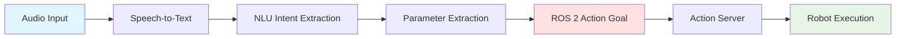
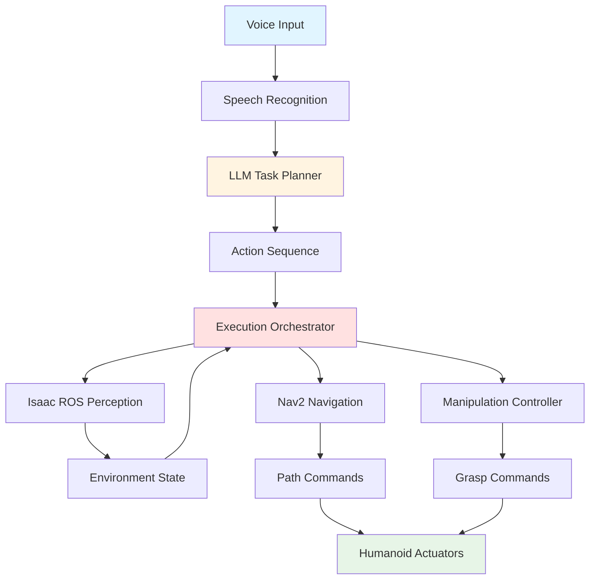
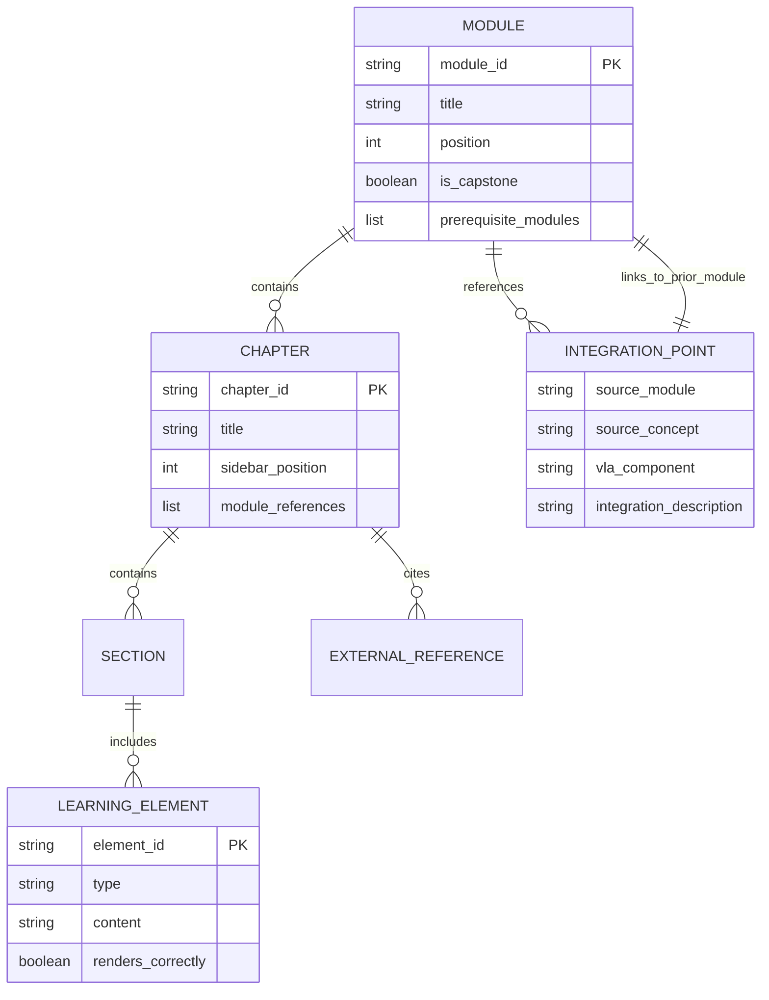

# Data Model: Module 4 – Vision-Language-Action (VLA)

**Feature**: 004-vla-module
**Created**: 2025-12-27
**Purpose**: Define content entities and their relationships for Module 4 educational material (capstone module)

## Overview

Module 4 is educational content (Markdown files) serving as the **capstone module** that integrates all prior modules. This data model defines the **content entities** that structure the VLA educational material for Docusaurus rendering and RAG chatbot indexing.

## Content Entities

### Entity: Module

**Description**: Represents Module 4 - the capstone learning module integrating voice control, LLM planning, and autonomous execution.

**Attributes**:
- `module_id`: String - "module-4", "004-vla-module"
- `title`: String - "Module 4: Vision-Language-Action (VLA)"
- `position`: Integer - 4 (after Modules 1-3)
- `description`: String - Summary for generated index and RAG context
- `prerequisite_modules`: List[String] - ["module-1", "module-2", "module-3"]
- `is_capstone`: Boolean - true (unique to Module 4)
- `estimated_reading_time`: Integer - 50-70 minutes

**Validation Rules**:
- `module_id` must match directory name (`book_frontend/docs/module-4/`)
- `position` must be unique (4)
- `is_capstone` flag indicates this module synthesizes all prior modules
- All prerequisite modules must be complete before Module 4

**Relationships**:
- Contains 3 Chapters
- References all prior Modules (1, 2, 3) in capstone chapter

**File Representation**: `book_frontend/docs/module-4/_category_.json`

---

### Entity: Chapter

**Description**: Represents a single educational chapter within Module 4 (Voice-to-Action, LLM Planning, Capstone).

**Attributes** (extends base Chapter entity from Module 3):
- `chapter_id`: String - "chapter-1-voice-to-action", "chapter-2-llm-planning", "chapter-3-autonomous-execution"
- `title`: String - Chapter display title
- `sidebar_position`: Integer - 1, 2, 3
- `word_count`: Integer - 1200-1800 words per chapter (Module 4 slightly longer due to integration complexity)
- `learning_objectives`: List[String] - 4-5 per chapter
- `module_references`: List[String] - References to prior modules (especially Chapter 3 capstone)
- `diagrams`: List[Diagram] - Mermaid workflow diagrams
- `external_references`: List[ExternalReference] - OpenAI, ROS 2, research papers

**Validation Rules** (extends Module 3 rules):
- Chapter 3 (capstone) MUST reference all prior modules (Modules 1, 2, 3)
- Chapter 3 MUST include end-to-end system integration diagram
- All chapters MUST include at least 3 diagrams/tables
- All chapters MUST include at least 4 external references

**Unique to Module 4**:
- **Cross-Module Integration Points**: Each entity that references prior modules must cite specific chapters (e.g., "Module 1, Chapter 2: ROS 2 Actions")

---

### Entity: IntegrationPoint

**Description**: Represents explicit connections between Module 4 and prior modules (unique to capstone).

**Attributes**:
- `source_module`: String - "module-1", "module-2", "module-3"
- `source_concept`: String - ROS 2 concept being integrated (e.g., "ROS 2 Actions", "Gazebo Simulation", "Isaac ROS VSLAM", "Nav2 Path Planning")
- `vla_component`: String - How VLA uses this concept (e.g., "Voice commands trigger ROS 2 actions", "LLM plans tested in Gazebo", "Perception from Isaac ROS feeds Nav2")
- `integration_description`: String - Conceptual explanation of how components connect
- `chapter_reference`: String - Where this integration is explained (e.g., "Chapter 3, Section 3.2")

**Example Integration Points**:
1. Voice Command → ROS 2 Action (Module 1): "Voice intents map to action goals from Module 1, Chapter 2"
2. LLM Plan → Gazebo Testing (Module 2): "LLM-generated action sequences validated in Gazebo simulation from Module 2, Chapter 2"
3. Autonomous Execution → Isaac ROS Perception (Module 3): "Voice-commanded tasks use Isaac ROS VSLAM for localization from Module 3, Chapter 2"
4. Autonomous Execution → Nav2 Navigation (Module 3): "LLM planning leverages Nav2 path planners from Module 3, Chapter 3"

**Validation Rules**:
- Capstone chapter (Chapter 3) must include at least 4 integration points
- Each integration point must cite specific prior module chapter
- RAG chatbot must index these for cross-module queries

---

### Entity: LearningElement

**Description**: Visual/interactive elements (same as Module 3, extended for VLA workflows).

**VLA-Specific Subtypes**:
1. **WorkflowDiagram**: Multi-stage process from voice to robot action
2. **IntegrationArchitecture**: System-level diagram showing all module components
3. **ComparisonTable**: Voice options, LLM vs. scripted planning, safety strategies

**Example (Voice-to-Action Pipeline)**:

**Example (Complete VLA System Architecture - Capstone)**:

---

### Entity: ExternalReference

**Description**: Links to external documentation (same as Module 3, extended for VLA sources).

**VLA-Specific Sources**:
- OpenAI Whisper documentation (speech recognition)
- OpenAI GPT API documentation (LLM planning)
- ROS 2 voice package repositories
- Robotics research papers (RT-1/RT-2 VLA models, SayCan grounded language planning)
- LLM prompt engineering resources

**Validation Rules** (extends Module 3):
- Prefer official documentation (OpenAI, ROS 2) over blog posts
- Research papers must be from reputable venues (arXiv accepted for recent work)
- Include version/date references for API documentation (e.g., "Whisper API v1", "GPT-4 Turbo")

---

## Content Relationships Diagram

## RAG Chatbot Integration (Extended for Capstone)

**Indexing Strategy**:
- Each Chapter indexed as document chunk (preserves context)
- Integration Points indexed separately with metadata (source_module, target_concept)
- Cross-module queries supported (e.g., "How does VLA use Nav2?" retrieves Integration Point + Chapter 3 content)

**Query Examples**:
- User: "How does voice control integrate with ROS 2?"
- RAG retrieves: Chapter 1 (Voice-to-Action), Integration Point (Voice → ROS 2 Actions from Module 1)
- Response: "Voice commands map to ROS 2 action goals (explained in Module 1, Chapter 2)..."

- User: "What's the complete autonomous workflow?"
- RAG retrieves: Chapter 3 (Capstone), all Integration Points
- Response: "Voice → LLM Planning → Isaac ROS Perception → Nav2 Navigation → Manipulation (cites all 4 modules)..."

**Validation**:
- RAG must retrieve cross-module integration points for capstone queries
- Citations must include both Module 4 content and referenced prior modules

## Content Validation Checklist

Before deployment, validate:
- [ ] All Chapters have valid frontmatter with unique `sidebar_position`
- [ ] Chapter 3 (capstone) has at least 4 Integration Points referencing Modules 1-3
- [ ] All Integration Points cite specific prior module chapters
- [ ] All MermaidDiagrams render correctly (`npm run build` passes)
- [ ] All ExternalReferences return HTTP 200 (link checker)
- [ ] Word counts fall within 1200-1800 per chapter (Module 4 allows higher due to integration)
- [ ] At least 3 diagrams/tables per chapter (Chapter 3 needs system architecture diagram)
- [ ] At least 4 external references per chapter
- [ ] RAG chatbot indexes all content + integration points correctly
- [ ] Capstone chapter demonstrates complete voice-to-execution workflow

This data model ensures Module 4 serves its capstone role by explicitly modeling cross-module integration points and comprehensive system synthesis.
