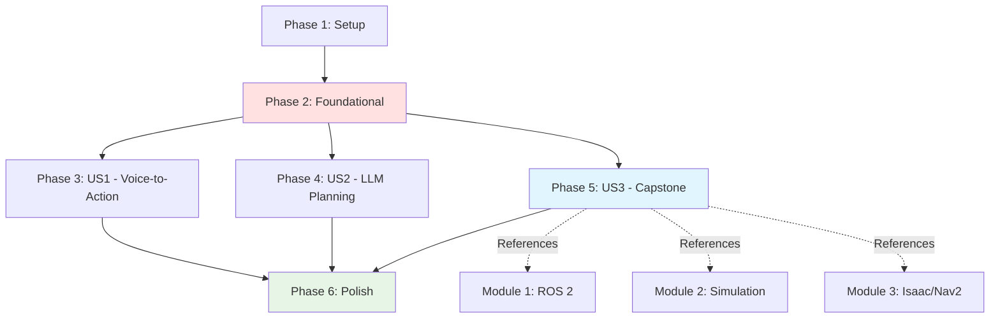

# Tasks: Module 4 – Vision-Language-Action (VLA)

**Input**: Design documents from `/specs/004-vla-module/`
**Prerequisites**: plan.md (required), spec.md (required for user stories), research.md, data-model.md, contracts/

**Tests**: No automated tests for this feature (educational content authoring - manual review only)

**Organization**: Tasks are grouped by user story to enable independent implementation and testing of each chapter. Chapter 3 (Capstone) includes additional integration tasks for cross-module synthesis.

## Format: `[ID] [P?] [Story] Description`

- **[P]**: Can run in parallel (different files, no dependencies)
- **[Story]**: Which user story this task belongs to (e.g., US1, US2, US3)
- Include exact file paths in descriptions

## Path Conventions

- **Documentation site**: `book_frontend/docs/`, `book_frontend/static/`, from repository root
- **Planning artifacts**: `specs/004-vla-module/`
- Paths shown below use repository root as base

---

## Phase 1: Setup (Module 4 Integration)

**Purpose**: Integrate Module 4 structure into existing Docusaurus site (Modules 1-3 already set up)

- [ ] T001 Verify Docusaurus site running with `cd book_frontend && npm start` (Modules 1-3 should load)
- [ ] T002 Create Module 4 directory structure: `book_frontend/docs/module-4/` and `book_frontend/static/img/module-4/`
- [ ] T003 Create Module 4 category configuration at `book_frontend/docs/module-4/_category_.json` (label, position: 4, description including "Capstone")
- [ ] T004 [P] Create Chapter 1 placeholder file at `book_frontend/docs/module-4/chapter-1-voice-to-action.md` with front matter and "Coming Soon" section
- [ ] T005 [P] Create Chapter 2 placeholder file at `book_frontend/docs/module-4/chapter-2-llm-planning.md` with front matter and "Coming Soon" section
- [ ] T006 [P] Create Chapter 3 placeholder file at `book_frontend/docs/module-4/chapter-3-autonomous-execution.md` with front matter and "Coming Soon" section (note: capstone chapter)
- [ ] T007 Test site navigation: run `cd book_frontend && npm run build` and verify Module 4 appears in sidebar

---

## Phase 2: Foundational (Update Site Navigation)

**Purpose**: Update existing Docusaurus files to reference Module 4 as capstone

**⚠️ CRITICAL**: These updates allow navigation to Module 4 and indicate its capstone nature

- [ ] T008 Update intro page at `book_frontend/docs/intro.md` to add Module 4 in "What You'll Learn" section with capstone indicator
- [ ] T009 Verify sidebar autogeneration includes Module 4 or manually update `book_frontend/sidebars.js` if needed
- [ ] T010 Test navigation: run `cd book_frontend && npm start` and verify Module 4 chapters accessible via sidebar

**Checkpoint**: Foundation ready - chapter content authoring can now begin in parallel

---

## Phase 3: User Story 1 - Voice-to-Action with Speech Recognition (Priority: P1) 🎯 MVP

**Goal**: Author Chapter 1 content explaining speech recognition, NLU, and voice-to-ROS 2 action integration

**Independent Test**: Chapter 1 is fully readable with workflow diagrams. Reader can explain voice-to-action pipeline and map voice intents to ROS 2 actions.

### Content Authoring for User Story 1

- [ ] T011 [P] [US1] Write Section 1.1 "Speech Recognition and Audio Processing" in `book_frontend/docs/module-4/chapter-1-voice-to-action.md` (audio capture, noise reduction, wake words, speech-to-text)
- [ ] T012 [P] [US1] Write Section 1.2 "Natural Language Understanding (NLU)" in `book_frontend/docs/module-4/chapter-1-voice-to-action.md` (intent classification, entity extraction, slot filling, ambiguity handling)
- [ ] T013 [P] [US1] Write Section 1.3 "Voice-to-ROS 2 Action Integration" in `book_frontend/docs/module-4/chapter-1-voice-to-action.md` (integration patterns, parameter mapping, error handling)
- [ ] T014 [P] [US1] Write Section 1.4 "Use Cases and Limitations" in `book_frontend/docs/module-4/chapter-1-voice-to-action.md` (when to use voice control, limitations, safety considerations)

### Diagrams for User Story 1

- [ ] T015 [P] [US1] Create Mermaid flowchart "Voice-to-Text Workflow" inline in Section 1.1 (Microphone → Noise Reduction → Wake Word → Speech-to-Text → Text Output)
- [ ] T016 [P] [US1] Create markdown table "NLU Intent Mapping" inline in Section 1.2 (voice command → intent → entities → ROS 2 action)
- [ ] T017 [P] [US1] Create Mermaid diagram "Voice-to-ROS 2 Integration Architecture" inline in Section 1.3 (Voice Node → Action Client → Action Server)

### References for User Story 1

- [ ] T018 [US1] Add inline citations to OpenAI Whisper docs, ROS 2 voice packages, speech recognition research (minimum 4 links) throughout Chapter 1
- [ ] T019 [US1] Add bridge paragraph at end of Chapter 1 transitioning to Chapter 2 (LLM cognitive planning)

### Review for User Story 1

- [ ] T020 [US1] Run `cd book_frontend && npm start` and manually review Chapter 1 for readability, diagram rendering, link functionality
- [ ] T021 [US1] Validate Chapter 1 against content contract acceptance criteria in `specs/004-vla-module/contracts/chapter-1-outline.md`
- [ ] T022 [US1] Spell-check and grammar review of Chapter 1 content

**Checkpoint**: Chapter 1 (User Story 1) should be fully functional and testable independently

---

## Phase 4: User Story 2 - Cognitive Planning with LLMs (Priority: P2)

**Goal**: Author Chapter 2 content on LLM task decomposition, capability mapping, and planning strategies

**Independent Test**: Chapter 2 is fully readable with planning diagrams. Reader can explain LLM task decomposition and map tasks to robot capabilities.

### Content Authoring for User Story 2

- [ ] T023 [P] [US2] Write Section 2.1 "LLM Task Decomposition" in `book_frontend/docs/module-4/chapter-2-llm-planning.md` (high-level task parsing, subtask generation, robot primitive mapping, sequencing)
- [ ] T024 [P] [US2] Write Section 2.2 "Mapping Tasks to Robot Capabilities" in `book_frontend/docs/module-4/chapter-2-llm-planning.md` (robot affordances, perception/motion constraints, reality grounding, feasibility checking)
- [ ] T025 [P] [US2] Write Section 2.3 "LLM Planning Strategies" in `book_frontend/docs/module-4/chapter-2-llm-planning.md` (few-shot prompting, chain-of-thought, error recovery, validation)
- [ ] T026 [P] [US2] Write Section 2.4 "LLM Planning vs. Scripted Behaviors" in `book_frontend/docs/module-4/chapter-2-llm-planning.md` (when to use each, hybrid approaches, safety considerations)

### Diagrams for User Story 2

- [ ] T027 [P] [US2] Create Mermaid flowchart "LLM Task Decomposition Workflow" inline in Section 2.1 (High-Level Task → LLM → Subtasks → Robot Actions)
- [ ] T028 [P] [US2] Create markdown table "Capability Mapping" inline in Section 2.2 (task component → robot capability → module reference)
- [ ] T029 [P] [US2] Create conceptual diagram "LLM Planning Strategies" inline in Section 2.3 (few-shot, chain-of-thought examples)
- [ ] T030 [P] [US2] Create markdown table "LLM vs. Scripted Comparison" inline in Section 2.4 (use cases, advantages, limitations)

### References for User Story 2

- [ ] T031 [US2] Add inline citations to OpenAI API docs, SayCan research, RT-1/RT-2 papers, ROS 2 planning frameworks (minimum 4 links including research papers) throughout Chapter 2
- [ ] T032 [US2] Add bridge paragraph at end of Chapter 2 transitioning to Chapter 3 (capstone integration)

### Review for User Story 2

- [ ] T033 [US2] Run `cd book_frontend && npm start` and manually review Chapter 2 for readability, diagram rendering
- [ ] T034 [US2] Validate Chapter 2 against content contract acceptance criteria in `specs/004-vla-module/contracts/chapter-2-outline.md`
- [ ] T035 [US2] Spell-check and grammar review of Chapter 2 content

**Checkpoint**: Chapters 1 AND 2 should both work independently

---

## Phase 5: User Story 3 - Capstone: Autonomous Humanoid Execution (Priority: P3) 🎯 CAPSTONE

**Goal**: Author Chapter 3 content integrating voice, LLM planning, perception, navigation into complete autonomous system. MUST reference Modules 1-3 explicitly.

**Independent Test**: Chapter 3 is fully readable with complete system diagrams and Module 1-3 integration points. Reader can trace end-to-end autonomous execution across all 4 modules.

### Content Authoring for User Story 3 (CAPSTONE)

- [ ] T036 [P] [US3] Write Section 3.1 "End-to-End Autonomous Execution Pipeline" in `book_frontend/docs/module-4/chapter-3-autonomous-execution.md` (system architecture, component orchestration, data flow)
- [ ] T037 [P] [US3] Write Section 3.2 "System Integration Challenges" in `book_frontend/docs/module-4/chapter-3-autonomous-execution.md` (latency, failure propagation, state sync, debugging strategies)
- [ ] T038 [P] [US3] Write Section 3.3 "Safety Constraints for Autonomous Operation" in `book_frontend/docs/module-4/chapter-3-autonomous-execution.md` (human detection, E-stop, force limits, graceful degradation)
- [ ] T039 [P] [US3] Write Section 3.4 "Complete Autonomous Workflow Examples" in `book_frontend/docs/module-4/chapter-3-autonomous-execution.md` (detailed execution trace with voice → LLM → perception → navigation → manipulation)
- [ ] T040 [P] [US3] Write Section 3.5 "Module 4 & Book Conclusion" in `book_frontend/docs/module-4/chapter-3-autonomous-execution.md` (Module 4 summary, Modules 1-4 integration, complete learning journey, future paths)

### Diagrams for User Story 3 (CAPSTONE)

- [ ] T041 [P] [US3] Create Mermaid diagram "Complete VLA System Architecture" inline in Section 3.1 (voice → LLM → Isaac ROS → Nav2 → manipulation with all components)
- [ ] T042 [P] [US3] Create markdown table "Integration Challenges" inline in Section 3.2 (challenge → description → mitigation)
- [ ] T043 [P] [US3] Create diagram "Safety Constraint Layers" inline in Section 3.3 (human proximity zones, force limits, E-stop triggers)
- [ ] T044 [P] [US3] Create Mermaid sequence diagram "Autonomous Workflow Execution Trace" inline in Section 3.4 (step-by-step execution with component interactions)
- [ ] T045 [P] [US3] Create Mermaid diagram "4-Module Integration Map" inline in Section 3.5 (CAPSTONE REQUIREMENT: show how Modules 1-4 connect)

### Cross-Module Integration Tasks (CAPSTONE-SPECIFIC)

- [ ] T046 [US3] Add explicit Module 1 cross-reference in Section 3.1: how voice commands trigger ROS 2 actions from Module 1, Chapter 2
- [ ] T047 [US3] Add explicit Module 2 cross-reference in Section 3.2: how LLM plans are validated in Gazebo/Isaac Sim from Module 2
- [ ] T048 [US3] Add explicit Module 3 cross-reference in Section 3.4: how Isaac ROS perception (Module 3, Chapter 2) feeds autonomous execution
- [ ] T049 [US3] Add explicit Module 3 cross-reference in Section 3.4: how Nav2 navigation (Module 3, Chapter 3) executes LLM-planned paths

### References for User Story 3

- [ ] T050 [US3] Add inline citations to OpenAI GPT API, RT-2 VLA research, BehaviorTree orchestration, Mobile ALOHA examples (minimum 4 links) throughout Chapter 3
- [ ] T051 [US3] Verify Module 4 conclusion summarizes all chapters and Book conclusion provides complete learning journey

### Review for User Story 3 (CAPSTONE)

- [ ] T052 [US3] Run `cd book_frontend && npm start` and manually review Chapter 3 for readability, diagram rendering
- [ ] T053 [US3] Validate Chapter 3 against content contract acceptance criteria in `specs/004-vla-module/contracts/chapter-3-outline.md` (includes capstone requirements)
- [ ] T054 [US3] Verify all Module 1-3 cross-references are present and cite specific chapters
- [ ] T055 [US3] Spell-check and grammar review of Chapter 3 content

**Checkpoint**: All 3 chapters (Module 4 VLA) complete with capstone integration

---

## Phase 6: Polish & Cross-Cutting Concerns

**Purpose**: Final quality checks and deployment verification for Module 4 (Capstone)

- [ ] T056 [P] Run full site build with `cd book_frontend && npm run build` and fix any build errors
- [ ] T057 [P] Run link validation: verify all internal Module 4 cross-references and external OpenAI/ROS 2/research links work
- [ ] T058 [P] Test Module 4 pages on mobile viewport (responsive design check)
- [ ] T059 Verify intro page (`book_frontend/docs/intro.md`) correctly references Module 4 as capstone
- [ ] T060 Verify all Module 4 diagrams render correctly in production build (`cd book_frontend && npm run serve`)
- [ ] T061 [P] Validate cross-module integration: verify Module 4 Chapter 3 correctly references Modules 1-3 with specific chapter citations
- [ ] T062 [P] Final constitution compliance check: verify all Module 4 chapters cite sources, use clear language, follow Docusaurus conventions
- [ ] T063 Complete book navigation test: verify transitions through all modules (1 → 2 → 3 → 4) work correctly
- [ ] T064 Verify 4-module integration map diagram in Chapter 3 shows all module connections accurately

---

## Dependencies & Execution Order

### Phase Dependencies

- **Setup (Phase 1)**: Depends on Modules 1-3 Docusaurus site being operational (already complete)
- **Foundational (Phase 2)**: Depends on Setup completion - BLOCKS all user stories
- **User Stories (Phase 3, 4, 5)**: All depend on Foundational phase completion
  - User stories can then proceed in parallel (if multiple authors)
  - Or sequentially in priority order (P1 → P2 → P3)
- **Polish (Phase 6)**: Depends on all desired user stories being complete

### User Story Dependencies

**User Story 1 (US1)**: Independent - no dependencies on other stories
**User Story 2 (US2)**: Independent - no dependencies on other stories
**User Story 3 (US3)**: Independent content authoring, but MUST reference Modules 1-3 for capstone synthesis

**Rationale**: Each chapter is independently readable. Students can complete Chapter 1 (Voice-to-Action) without Chapter 2-3. Chapter 3 (Capstone) requires referencing prior modules but not modifying them.

---

## Parallel Execution Examples

### Example 1: Single Author (Sequential - Recommended for Capstone)

**Recommended Order**:
1. Setup → Foundational (T001-T010)
2. User Story 1 Chapter 1 (T011-T022) ← MVP
3. User Story 2 Chapter 2 (T023-T035)
4. **User Story 3 Chapter 3 (T036-T055)** ← CAPSTONE (allocate extra time for Module 1-3 integration)
5. Polish (T056-T064) ← Capstone validation

**Estimated Time**: ~12-15 hours total (4h Ch1, 4h Ch2, 6h Ch3 capstone, 1h polish)

### Example 2: Multiple Authors (Parallel)

**Day 1**: Setup + Foundational (T001-T010) - 1 author
**Day 2-3**: Parallel chapter authoring:
- Author A: User Story 1 (T011-T022) - Chapter 1
- Author B: User Story 2 (T023-T035) - Chapter 2
- Author C: User Story 3 (T036-T055) - Chapter 3 **CAPSTONE** (needs Module 1-3 knowledge)

**Day 4**: Polish (T056-T064) - 1 author validates all + capstone integration

**Estimated Time**: 4 days with 3 authors (Author C needs strong Module 1-3 familiarity for capstone)

### Example 3: MVP First (Incremental)

**Sprint 1** (MVP): Setup + Foundational + US1 (T001-T022)
- Delivers: Chapter 1 (Voice-to-Action basics)
- Estimated: 5-6 hours

**Sprint 2**: User Story 2 (T023-T035)
- Delivers: Chapter 2 (LLM Planning)
- Estimated: 4-5 hours

**Sprint 3** (CAPSTONE): User Story 3 (T036-T055)
- Delivers: Chapter 3 with complete Module 1-4 integration
- Estimated: 6-7 hours (longer - capstone complexity)

**Sprint 4**: Polish (T056-T064)
- Delivers: Final validation, capstone verification
- Estimated: 1-2 hours

---

## Task Statistics

**Total Tasks**: 64
**Parallelizable Tasks**: 38 (59% can run in parallel)

**Breakdown by Phase**:
- Phase 1 (Setup): 7 tasks (3 parallel)
- Phase 2 (Foundational): 3 tasks (0 parallel - blocking)
- Phase 3 (US1 - Voice-to-Action): 12 tasks (7 parallel)
- Phase 4 (US2 - LLM Planning): 13 tasks (8 parallel)
- Phase 5 (US3 - Capstone): 20 tasks (12 parallel) ← Longest phase due to integration
- Phase 6 (Polish): 9 tasks (5 parallel)

**Critical Path**: ~26 sequential tasks (~8-10 hours)

**Parallel Opportunities**:
- Setup: T004-T006 (create 3 placeholder files)
- US1 Diagrams: T015-T017 (3 diagrams)
- US2 Content: T023-T026 (4 sections)
- US2 Diagrams: T027-T030 (4 diagrams)
- US3 Content: T036-T040 (5 sections)
- US3 Diagrams: T041-T045 (5 diagrams including integration map)
- US3 Integration: T046-T049 (4 cross-references to Modules 1-3)
- Polish: T056-T058, T060-T062, T064 (validation tasks)

---

## Implementation Strategy

**Strategy 1: MVP First**
- Implement User Story 1 only (Chapter 1: Voice-to-Action)
- Delivers: Voice control fundamentals (~5-6 hours)
- Use case: Quick publish of voice control chapter

**Strategy 2: Complete Capstone Module**
- All 3 chapters in sequential order (P1 → P2 → P3)
- Delivers: Complete VLA capstone including Module 1-3 integration
- Estimated: 12-15 hours
- Use case: Final book completion with comprehensive capstone

**Strategy 3: Parallel Team (with Capstone Specialist)**
- Chapters 1-2 in parallel, Chapter 3 by capstone specialist who knows Modules 1-3
- Delivers: Complete Module 4 in 4 days
- Use case: Team-based authoring with dedicated integration expert

---

## Capstone-Specific Notes

**Chapter 3 Complexity**:
- Longest chapter (1600-2000 words vs. 1200-1500 for Ch1-2)
- Requires Module 1-3 knowledge for cross-references
- Includes 4 cross-reference tasks (T046-T049)
- Must include 4-module integration map (T045)
- Book conclusion (end of learning journey)

**Integration Validation**:
- Task T054: Verify all Module 1-3 cross-references present
- Task T061: Validate cross-module integration accuracy
- Task T064: Verify 4-module integration map correctness

**Recommended Approach**:
- Author Chapters 1-2 first (build VLA knowledge)
- Review Modules 1-3 before authoring Chapter 3 (refresh prior concepts)
- Allocate 1.5-2× time for Chapter 3 vs. other chapters (integration complexity)

---

## Notes

- Module 4 is the capstone module synthesizing all prior learning
- Chapter 3 requires explicit cross-module integration (unique to Module 4)
- All diagrams use Mermaid (inline, version-controlled)
- External references include research papers (VLA models, grounded language planning)
- Content follows Modules 1-3 established pattern while adding capstone synthesis
