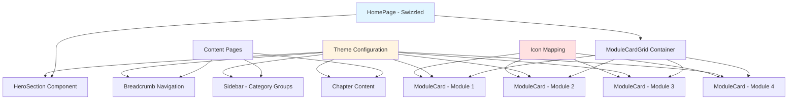

# Data Model: Docusaurus UI Upgrade

**Feature**: 005-docusaurus-ui-upgrade
**Created**: 2025-12-27
**Purpose**: Define UI components, configuration entities, and their relationships for the Docusaurus UI upgrade

## Overview

This UI upgrade is primarily a frontend/presentation layer enhancement with no traditional backend data models. However, we define "entities" as React components, configuration objects, and styling systems that structure the implementation.

## UI Component Entities

### Entity: ModuleCard

**Description**: Represents a single module card displayed on the landing page, providing an entry point to a learning module.

**Attributes**:
- `number`: Integer - Module number (1-4)
- `title`: String - Module display title (e.g., "ROS 2 Robotic Nervous System")
- `description`: String - Brief description (1-2 sentences, ~100-150 chars)
- `icon`: ReactNode - Lucide icon component (e.g., `<Network />`)
- `link`: String - Navigation path to module content (e.g., "/docs/module-1")
- `variant`: String - Optional visual variant for theming ("default", "featured")

**Validation Rules**:
- `number` must be 1-4
- `title` must not exceed 60 characters (for card layout)
- `description` must not exceed 200 characters
- `link` must be a valid Docusaurus route starting with "/"

**Relationships**:
- Rendered within `ModuleCardGrid` container
- Uses `Icon` entity for visual representation
- Links to `Module` documentation content

**File Representation**: React component at `src/components/ModuleCard.tsx`

---

### Entity: HeroSection

**Description**: Represents the hero section on the landing page, introducing the course with title and tagline.

**Attributes**:
- `title`: String - Course title ("Physical AI & Humanoid Robotics")
- `subtitle`: String - Course subtitle/tagline (explaining value proposition)
- `ctaText`: String - Call-to-action button text ("Start Learning", "Explore Modules")
- `ctaLink`: String - CTA button navigation link
- `backgroundStyle`: Object - CSS properties for background styling

**Validation Rules**:
- `title` should be concise (max 80 chars)
- `subtitle` should be 1-2 sentences (max 200 chars)
- `ctaLink` must be a valid internal route

**Relationships**:
- Rendered at top of HomePage component
- Precedes `ModuleCardGrid`
- Uses `ThemeConfig` for color theming

**File Representation**: React component within `src/pages/index.tsx` (swizzled HomePage)

---

### Entity: BreadcrumbNav

**Description**: Represents the breadcrumb navigation element showing user's current location in the content hierarchy.

**Attributes**:
- `crumbs`: Array<Breadcrumb> - Ordered list of breadcrumb items
- `separator`: String - Visual separator between crumbs (default: ">")
- `homeLabel`: String - Label for home crumb (default: "Home")
- `homeLink`: String - Link for home crumb (default: "/")

**Breadcrumb Item**:
- `label`: String - Display text
- `link`: String - Navigation path (null for current page)
- `isActive`: Boolean - Whether this is the current page

**Validation Rules**:
- First crumb must always be "Home"
- Last crumb (active) should not have a link
- Hierarchy must follow: Home > Module > Chapter

**Relationships**:
- Enhanced via CSS in `custom.css` (not swizzled component)
- Uses Docusaurus DocBreadcrumbs component
- Reads from Docusaurus route context

**File Representation**: CSS overrides in `src/css/custom.css`

---

### Entity: SidebarConfig

**Description**: Configuration for sidebar organization and collapsible module groups.

**Attributes**:
- `modules`: Array<ModuleGroup> - List of module groups
- `autoCollapse`: Boolean - Whether non-active modules auto-collapse
- `defaultCollapsed`: Boolean - Initial collapsed state for modules

**ModuleGroup**:
- `label`: String - Module label (e.g., "Module 1: ROS 2")
- `position`: Integer - Sort order in sidebar (1-4)
- `collapsible`: Boolean - Whether group can be collapsed
- `collapsed`: Boolean - Initial state (true/false)
- `items`: Array<String> - Chapter paths or auto-generated

**Validation Rules**:
- `position` values must be unique across modules
- `label` should match module title from content
- `items` paths must exist in docs folder

**Relationships**:
- Defined in `_category_.json` files per module
- Rendered by Docusaurus sidebar component
- Styled via CSS custom properties

**File Representation**: JSON config files at `docs/module-N/_category_.json`

---

## Configuration Entities

### Entity: ThemeConfig

**Description**: Represents theme configuration for light and dark modes, including colors, typography, and spacing.

**Attributes**:
- `mode`: String - Current theme mode ("light" | "dark")
- `colors`: Object - Color palette (primary, background, text, border)
- `typography`: Object - Font sizes, line heights, font stack
- `spacing`: Object - Spacing scale (xs, sm, md, lg, xl)
- `breakpoints`: Object - Responsive design breakpoints

**Color Palette** (per theme):
- `primary`: String - Primary brand color (hex)
- `bg`: String - Background color
- `text`: String - Primary text color
- `textMuted`: String - Secondary text color
- `border`: String - Border color
- `cardBg`: String - Card background color
- `codeBlockBg`: String - Code block background

**Typography**:
- `fontBase`: String - Base font size ("16px")
- `fontLg`: String - Large font size ("20px")
- `fontXl`: String - Extra large font size ("25px")
- `lineHeightBase`: Number - Base line height (1.6)
- `lineHeightHeading`: Number - Heading line height (1.2)
- `fontFamily`: String - Font stack

**Spacing Scale**:
- `xs`: String - Extra small spacing ("0.5rem")
- `sm`: String - Small spacing ("1rem")
- `md`: String - Medium spacing ("1.5rem")
- `lg`: String - Large spacing ("2rem")
- `xl`: String - Extra large spacing ("3rem")

**Validation Rules**:
- All color values must be valid CSS colors (hex, rgb, hsl)
- Font sizes must use valid CSS units (px, rem, em)
- Spacing values must use relative units (rem) for scalability

**Relationships**:
- Applied via CSS custom properties in `:root` and `[data-theme='dark']`
- Used by all styled components
- Synchronized with Docusaurus theme system

**File Representation**: CSS variables in `src/css/custom.css`

---

### Entity: IconMap

**Description**: Mapping between module identifiers and their visual icons from Lucide library.

**Attributes**:
- `moduleId`: String - Module identifier (e.g., "module-1", "module-2")
- `iconName`: String - Lucide icon component name (e.g., "Network", "Cuboid")
- `color`: String - Optional icon color override
- `size`: Number - Icon size in pixels (default: 24)

**Mapping Table**:
| Module ID | Icon Name | Semantic Meaning |
|-----------|-----------|------------------|
| module-1 | Network | ROS 2 communication/networking |
| module-2 | Cuboid | Simulation/virtual environment |
| module-3 | Eye | Perception/vision (Isaac ROS) |
| module-4 | Zap | AI/intelligence (VLA) |

**Validation Rules**:
- `iconName` must exist in Lucide React library
- `color` must be valid CSS color or null
- `size` must be positive integer

**Relationships**:
- Used by `ModuleCard` components
- Imported from Lucide React library
- Themed via CSS custom properties

**File Representation**: Constant object in `src/components/ModuleCard.tsx` or `src/utils/moduleConfig.ts`

---

## Component Hierarchy



## State Management

### Theme Preference State

**Description**: User's selected theme mode (light/dark) persisted across sessions.

**Storage Mechanism**: Docusaurus uses localStorage with key `theme`

**State Transitions**:
```
[Light Mode] <--(User toggles)--> [Dark Mode]
         ↓                           ↓
   (Save to localStorage)    (Save to localStorage)
         ↓                           ↓
   (Update CSS data-theme)   (Update CSS data-theme)
```

**Validation**:
- Only valid values: "light" or "dark"
- Default to "light" if localStorage is empty
- Respect `prefers-color-scheme` media query for initial load

**Implementation**: Handled by Docusaurus `useColorMode` hook

---

## CSS Architecture

### CSS Custom Properties Structure

```css
:root {
  /* Colors (Light Theme - Default) */
  --color-primary: #2563eb;
  --color-bg: #ffffff;
  --color-text: #1f2937;
  --color-border: #e5e7eb;

  /* Typography */
  --font-size-base: 16px;
  --line-height-base: 1.6;

  /* Spacing */
  --space-sm: 1rem;
  --space-md: 1.5rem;
  --space-lg: 2rem;
}

[data-theme='dark'] {
  /* Colors (Dark Theme Override) */
  --color-primary: #60a5fa;
  --color-bg: #111827;
  --color-text: #f3f4f6;
  --color-border: #374151;
}
```

All components reference these variables for consistent theming.

---

## Responsive Design Breakpoints

| Breakpoint | Min Width | Target Devices | Layout Changes |
|-----------|-----------|----------------|----------------|
| Mobile | 0px | Phones | 1-column module grid, stacked hero |
| Tablet | 768px | Tablets | 2-column module grid, side-by-side hero |
| Desktop | 996px | Desktops/Laptops | 2x2 module grid, full-width hero |

**Implementation**: CSS media queries in component styles

---

## File Structure Map

```text
book_frontend/
├── src/
│   ├── components/
│   │   ├── ModuleCard.tsx           # ModuleCard entity
│   │   └── ModuleCardGrid.tsx       # Container for module cards
│   ├── pages/
│   │   └── index.tsx                # Swizzled HomePage with HeroSection
│   ├── css/
│   │   └── custom.css               # ThemeConfig, BreadcrumbNav styling
│   └── utils/
│       └── moduleConfig.ts          # IconMap and module metadata
├── docs/
│   ├── module-1/
│   │   └── _category_.json          # SidebarConfig for Module 1
│   ├── module-2/
│   │   └── _category_.json          # SidebarConfig for Module 2
│   ├── module-3/
│   │   └── _category_.json          # SidebarConfig for Module 3
│   └── module-4/
│       └── _category_.json          # SidebarConfig for Module 4
└── docusaurus.config.js             # Docusaurus configuration (Mermaid theme)
```

---

## Validation Checklist

Before implementation, validate that:
- [ ] All entity attributes have clear types and validation rules
- [ ] Component hierarchy matches Docusaurus patterns (swizzling guidelines)
- [ ] Theme configuration supports both light and dark modes
- [ ] Icon mapping covers all 4 modules
- [ ] Responsive breakpoints align with Docusaurus defaults
- [ ] CSS custom properties follow naming conventions
- [ ] File structure matches Docusaurus v3 conventions

This data model ensures all UI components are well-defined, relationships are clear, and implementation follows Docusaurus best practices.
