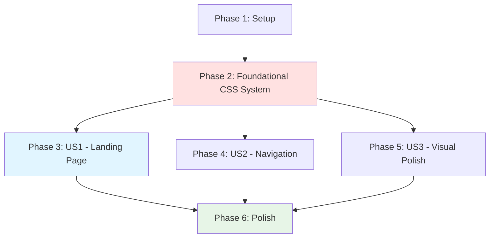

# Tasks: Docusaurus UI Upgrade

**Input**: Design documents from `/specs/005-docusaurus-ui-upgrade/`
**Prerequisites**: plan.md (required), spec.md (required for user stories), research.md, data-model.md, contracts/

**Tests**: No automated tests for this feature (UI/UX implementation - manual testing only)

**Organization**: Tasks are grouped by user story to enable independent implementation and testing of each UI improvement phase. User stories are prioritized P1 (MVP Landing Page) → P2 (Navigation) → P3 (Visual Polish).

## Format: `[ID] [P?] [Story] Description`

- **[P]**: Can run in parallel (different files, no dependencies)
- **[Story]**: Which user story this task belongs to (e.g., US1, US2, US3)
- Include exact file paths in descriptions

## Path Conventions

- **Docusaurus site**: `book_frontend/src/`, `book_frontend/docs/`, from repository root
- **Planning artifacts**: `specs/005-docusaurus-ui-upgrade/`
- Paths shown below use repository root as base

---

## Phase 1: Setup & Dependencies ✅

**Purpose**: Install dependencies and verify development environment

- [x] T001 Navigate to book_frontend directory and verify Docusaurus site runs with `cd book_frontend && npm start` (confirm site loads at localhost:3000)
- [x] T002 Install Lucide React icon library: `cd book_frontend && npm install lucide-react`
- [x] T003 Verify lucide-react installation in `book_frontend/package.json` dependencies
- [x] T004 Create directories: `book_frontend/src/components/` and `book_frontend/src/utils/` if they don't exist
- [x] T005 Read planning documents: `specs/005-docusaurus-ui-upgrade/plan.md`, `research.md`, `data-model.md`, `contracts/component-interfaces.md`, `contracts/css-styling-contract.md`

---

## Phase 2: Foundational (CSS System Setup) ✅

**Purpose**: Establish CSS custom properties and global styling system - BLOCKS all user stories

**⚠️ CRITICAL**: These CSS variables are used by all components in US1, US2, US3

- [x] T006 Backup existing `book_frontend/src/css/custom.css` file (if exists)
- [x] T007 Define CSS custom properties for colors (light theme) in `book_frontend/src/css/custom.css` (:root selector with --color-primary, --color-bg, --color-text, --color-border, --color-code-bg)
- [x] T008 Define CSS custom properties for dark theme colors in `book_frontend/src/css/custom.css` ([data-theme='dark'] selector overriding color variables)
- [x] T009 [P] Define CSS custom properties for typography in `book_frontend/src/css/custom.css` (--font-size-base, --font-size-lg, --font-size-xl, --line-height-base, --font-family-base, --font-family-mono)
- [x] T010 [P] Define CSS custom properties for spacing scale in `book_frontend/src/css/custom.css` (--space-xs through --space-3xl)
- [x] T011 [P] Define CSS custom properties for borders, shadows, transitions in `book_frontend/src/css/custom.css` (--radius-md, --shadow-md, --transition-base)
- [x] T012 Apply global typography styles in `book_frontend/src/css/custom.css` (html, headings h1-h6, paragraphs, links, code blocks)
- [x] T013 Test CSS variables loaded correctly: run `npm start`, inspect element in browser DevTools, verify custom properties appear in computed styles

**Checkpoint**: ✅ CSS foundation ready - user story components can now reference these variables

---

## Phase 3: User Story 1 - Landing Page Discovery (Priority: P1) 🎯 MVP

**Goal**: Create custom landing page with hero section and 4 module cards for instant course discoverability

**Independent Test**: Visit homepage (localhost:3000 or root URL), confirm: (1) hero displays "Physical AI & Humanoid Robotics" title and tagline, (2) 4 module cards visible with icons (Network, Cuboid, Eye, Zap), titles, and descriptions, (3) clicking any card navigates to that module's content

### Component Creation for User Story 1

- [x] T014 [P] [US1] Create ModuleCard component file at `book_frontend/src/components/ModuleCard.tsx` with TypeScript interface (number, title, description, icon, link props)
- [x] T015 [P] [US1] Create ModuleCard styles file at `book_frontend/src/components/ModuleCard.module.css` with card layout, icon container, title, description, link styles
- [x] T016 [P] [US1] Create ModuleCardGrid component file at `book_frontend/src/components/ModuleCardGrid.tsx` with responsive CSS Grid layout

### HomePage Implementation for User Story 1

- [x] T017 [US1] Swizzle HomePage component: run `cd book_frontend && npm run swizzle @docusaurus/theme-classic HomePage -- --eject` (creates `src/pages/index.tsx` or `index.js`)
- [x] T018 [US1] Implement HeroSection in `book_frontend/src/pages/index.tsx` with course title "Physical AI & Humanoid Robotics", tagline, and optional CTA button
- [x] T019 [US1] Create module configuration data in `book_frontend/src/utils/moduleConfig.ts` with 4 module objects (number, title, description, link for each module)
- [x] T020 [US1] Implement ModuleCardGrid in `book_frontend/src/pages/index.tsx` rendering 4 ModuleCard components with Lucide icons (Network, Cuboid, Eye, Zap)
- [x] T021 [US1] Import Lucide icons in `book_frontend/src/pages/index.tsx`: Network (Module 1), Cuboid (Module 2), Eye (Module 3), Zap (Module 4)

### Styling for User Story 1

- [x] T022 [P] [US1] Add hero section CSS to `book_frontend/src/css/custom.css` (.hero, .hero__title, .hero__subtitle, .hero__cta classes with responsive styling)
- [x] T023 [P] [US1] Add module grid CSS to `book_frontend/src/css/custom.css` (.module-cards-grid with CSS Grid, responsive breakpoints for 1 col mobile, 2x2 desktop)
- [x] T024 [US1] Apply hover effects and transitions to ModuleCard component in `book_frontend/src/components/ModuleCard.module.css` (translateY on hover, box-shadow transition)

### Testing for User Story 1

- [x] T025 [US1] Run `cd book_frontend && npm start` and manually test landing page: verify hero section displays, 4 module cards visible, icons render correctly
- [x] T026 [US1] Test module card navigation: click each of 4 cards and verify navigation to module-1, module-2, module-3, module-4 content
- [x] T027 [US1] Test responsive design for landing page: use browser DevTools to test mobile (375px), tablet (768px), desktop (1200px) viewports
- [x] T028 [US1] Test keyboard accessibility: tab through module cards, verify focus indicators visible, press Enter to navigate
- [x] T029 [US1] Validate P1 against acceptance criteria: hero title/tagline present, 4 cards with icons, navigation functional

**Checkpoint**: ✅ User Story 1 (Landing Page MVP) fully functional and production-ready

---

## Phase 4: User Story 2 - Module-Based Learning Navigation (Priority: P2)

**Goal**: Enhance navigation with improved breadcrumbs and sidebar organization for better learning experience

**Independent Test**: Navigate to any chapter (e.g., Module 3, Chapter 2), confirm: (1) breadcrumbs show "Home > Module 3: Isaac & Nav2 > Chapter 2" with clickable links, (2) sidebar groups chapters under their parent module, (3) current chapter is highlighted

### Breadcrumb Navigation for User Story 2

- [ ] T030 [P] [US2] Add breadcrumb CSS overrides to `book_frontend/src/css/custom.css` (.theme-doc-breadcrumbs, .breadcrumbs__item, .breadcrumbs__link styles)
- [ ] T031 [P] [US2] Style breadcrumb separators in `book_frontend/src/css/custom.css` (use '›' character via ::after pseudo-element)
- [ ] T032 [P] [US2] Add breadcrumb hover effects in `book_frontend/src/css/custom.css` (color transition, underline on hover)
- [ ] T033 [US2] Implement mobile breadcrumb condensation in `book_frontend/src/css/custom.css` (hide intermediate crumbs on mobile, show only "... > Current")

### Sidebar Enhancement for User Story 2

- [ ] T034 [P] [US2] Verify `book_frontend/docs/module-1/_category_.json` has collapsible:true and proper label "Module 1: The Robotic Nervous System (ROS 2)"
- [ ] T035 [P] [US2] Verify `book_frontend/docs/module-2/_category_.json` has collapsible:true and proper label
- [ ] T036 [P] [US2] Verify `book_frontend/docs/module-3/_category_.json` has collapsible:true and proper label
- [ ] T037 [P] [US2] Verify `book_frontend/docs/module-4/_category_.json` has collapsible:true and proper label "Module 4: Vision-Language-Action (VLA)"
- [ ] T038 [US2] Add sidebar CSS enhancements to `book_frontend/src/css/custom.css` (.theme-doc-sidebar-menu, .menu__link, .menu__link--active styles)
- [ ] T039 [US2] Style module category headers in sidebar: add CSS for `.menu__list-item--collapsed` with semibold font and left border accent in `book_frontend/src/css/custom.css`
- [ ] T040 [US2] Add visual separators between modules in sidebar: CSS for `.theme-doc-sidebar-item-category-level-1` with bottom border in `book_frontend/src/css/custom.css`

### Testing for User Story 2

- [ ] T041 [US2] Run `cd book_frontend && npm start` and test breadcrumb navigation: navigate to multiple chapters, verify breadcrumbs show correct hierarchy
- [ ] T042 [US2] Test breadcrumb click navigation: click "Home" and module links in breadcrumbs, verify navigation works
- [ ] T043 [US2] Test sidebar organization: verify chapters grouped under parent modules, current chapter highlighted
- [ ] T044 [US2] Test sidebar collapsible modules: expand/collapse module groups, verify state persists during navigation
- [ ] T045 [US2] Test mobile breadcrumbs: use DevTools mobile viewport, verify breadcrumbs condense to "... > Current Chapter"
- [ ] T046 [US2] Validate P2 against acceptance criteria: breadcrumbs show hierarchy, sidebar groups modules, navigation orientation clear

**Checkpoint**: User Story 1 AND User Story 2 should both work independently

---

## Phase 5: User Story 3 - Visual Clarity and Theme Support (Priority: P3)

**Goal**: Add dark theme support, improve typography across all content, ensure theme-aware diagrams for professional polish

**Independent Test**: Toggle between light and dark themes, confirm: (1) all content readable in both themes with proper contrast, (2) Mermaid diagrams adapt to theme, (3) typography hierarchy clear with improved spacing, (4) no layout shift when toggling

### Theme Configuration for User Story 3

- [ ] T047 [P] [US3] Configure Mermaid theme in `book_frontend/docusaurus.config.js`: add mermaid.theme.light='default' and mermaid.theme.dark='dark' in themeConfig
- [ ] T048 [P] [US3] Verify Docusaurus Mermaid theme plugin installed in `book_frontend/package.json` (should be @docusaurus/theme-mermaid)
- [ ] T049 [US3] Test Mermaid theme configuration: run `npm start`, toggle theme, verify diagrams in Module 1-4 adapt to light/dark mode

### Typography System for User Story 3

- [ ] T050 [P] [US3] Apply improved heading typography in `book_frontend/src/css/custom.css` (h1-h6 with modular scale font sizes, line-height 1.2, increased margins)
- [ ] T051 [P] [US3] Apply improved paragraph spacing in `book_frontend/src/css/custom.css` (p with margin-bottom, line-height 1.6-1.8)
- [ ] T052 [P] [US3] Style code blocks with theme-aware colors in `book_frontend/src/css/custom.css` (pre code, inline code with background and text colors from CSS variables)
- [ ] T053 [P] [US3] Style tables for both themes in `book_frontend/src/css/custom.css` (table, th, td with borders, alternating row colors, proper padding)

### Theme Validation for User Story 3

- [ ] T054 [US3] Test light theme readability: run `npm start`, view all 4 modules' chapters, verify headings, code blocks, tables, diagrams are clear
- [ ] T055 [US3] Test dark theme readability: toggle to dark mode, verify all content has proper contrast (WCAG AA minimum), check all Mermaid diagrams
- [ ] T056 [US3] Test theme toggle performance: use browser DevTools Performance panel, verify theme switch completes in less than 100ms with zero layout shift (CLS less than 0.1)
- [ ] T057 [US3] Test theme preference persistence: toggle theme, refresh page, verify theme preference saved in localStorage
- [ ] T058 [US3] Validate typography hierarchy: confirm heading sizes descend logically (h1 > h2 > h3), spacing provides clear visual breaks
- [ ] T059 [US3] Validate P3 against acceptance criteria: syntax highlighting works in both themes, no layout shift on toggle, spacing consistent, tables readable

**Checkpoint**: All 3 user stories (US1 Landing, US2 Navigation, US3 Visual) complete and independently testable

---

## Phase 6: Polish & Cross-Cutting Concerns

**Purpose**: Final quality checks, performance validation, accessibility compliance

- [ ] T060 [P] Run full site build with `cd book_frontend && npm run build` and fix any build errors or warnings
- [ ] T061 [P] Serve production build with `cd book_frontend && npm run serve` and test at localhost:3000
- [ ] T062 [P] Run Lighthouse audit on homepage (desktop): verify Performance 90+, Accessibility 95+, Best Practices 95+, SEO 90+
- [ ] T063 [P] Run Lighthouse audit on homepage (mobile): verify Performance 85+, Accessibility 95+, Best Practices 95+, SEO 90+
- [ ] T064 [P] Run Lighthouse audit on sample content page (e.g., Module 1 Chapter 1) desktop: verify no performance regression
- [ ] T065 [P] Run Lighthouse audit on sample content page (mobile): verify no performance regression
- [ ] T066 [P] Test browser compatibility: verify UI works in Chrome 90+, Firefox 88+, Safari 14+, Edge 90+ (test at minimum 2 browsers)
- [ ] T067 [P] Test accessibility with axe DevTools: scan homepage and content page, fix any WCAG AA violations
- [ ] T068 Test keyboard navigation across entire site: verify all interactive elements (cards, links, buttons, theme toggle) accessible via keyboard
- [ ] T069 Test responsive design comprehensively: verify layout at 375px (mobile), 768px (tablet), 1200px (desktop), 1920px (wide desktop)
- [ ] T070 Verify all module card links navigate correctly: click all 4 cards, verify each goes to correct module content
- [ ] T071 Verify backward compatibility: test existing bookmarked URLs (sample chapters), confirm all URLs work without redirects
- [ ] T072 Test Mermaid diagrams in both themes: toggle theme while viewing diagrams in all 4 modules, verify diagrams adapt correctly and remain readable
- [ ] T073 Final visual regression check: compare new UI to original, verify all content still accessible, no missing pages or broken functionality

---

## Dependencies & Execution Order

### Phase Dependencies

- **Setup (Phase 1)**: No dependencies - can start immediately
- **Foundational (Phase 2)**: Depends on Setup completion - BLOCKS all user stories
- **User Stories (Phase 3, 4, 5)**: All depend on Foundational phase completion
  - User stories can then proceed in parallel (if multiple developers)
  - Or sequentially in priority order (P1 → P2 → P3) recommended for single developer
- **Polish (Phase 6)**: Depends on all desired user stories being complete

### User Story Dependencies

**User Story 1 (US1)**: Independent - creates landing page components and styles
**User Story 2 (US2)**: Independent - enhances breadcrumbs and sidebar (different files than US1)
**User Story 3 (US3)**: Independent - applies global theme and typography (complements US1 and US2)

**Rationale**: After Foundational CSS system is ready, all three user stories can proceed in parallel because they modify different files and components. US1 creates new components, US2 enhances navigation, US3 applies global styling.

---

## Parallel Execution Examples

### Example 1: Single Developer (Sequential - Recommended for Learning)

**Recommended Order**:
1. Setup → Foundational (T001-T013)
2. User Story 1 Landing Page (T014-T029) ← MVP - ship this first
3. User Story 2 Navigation (T030-T046)
4. User Story 3 Visual Polish (T047-T059)
5. Polish (T060-T073)

**Estimated Time**: ~10-12 hours total (1h setup, 4h US1, 3h US2, 3h US3, 1h polish)

### Example 2: Multiple Developers (Parallel)

**Day 1**: Setup + Foundational (T001-T013) - 1 developer
**Day 2**: Parallel user story implementation:
- Developer A: User Story 1 (T014-T029) - Landing page components
- Developer B: User Story 2 (T030-T046) - Breadcrumb and sidebar styling
- Developer C: User Story 3 (T047-T059) - Theme system and typography

**Day 3**: Polish (T060-T073) - 1 developer validates all + performance testing

**Estimated Time**: 3 days with 3 developers (2 days parallel work)

### Example 3: MVP First (Incremental Delivery)

**Sprint 1** (MVP): Setup + Foundational + US1 (T001-T029)
- Delivers: Professional landing page with module discovery
- Estimated: 5-6 hours

**Sprint 2**: User Story 2 (T030-T046)
- Delivers: Enhanced navigation for active learners
- Estimated: 3 hours

**Sprint 3**: User Story 3 (T047-T059)
- Delivers: Dark theme and visual polish
- Estimated: 3 hours

**Sprint 4**: Polish (T060-T073)
- Delivers: Production-ready, validated UI
- Estimated: 1-2 hours

---

## Task Statistics

**Total Tasks**: 73
**Parallelizable Tasks**: 21 (29% can run in parallel)

**Breakdown by Phase**:
- Phase 1 (Setup): 5 tasks (0 parallel)
- Phase 2 (Foundational): 8 tasks (3 parallel)
- Phase 3 (US1 - Landing Page): 16 tasks (4 parallel)
- Phase 4 (US2 - Navigation): 17 tasks (7 parallel)
- Phase 5 (US3 - Visual Polish): 13 tasks (6 parallel)
- Phase 6 (Polish): 14 tasks (9 parallel)

**Critical Path**: ~52 sequential tasks (~8-10 hours)

**Parallel Opportunities**:
- Foundational: T009-T011 (typography, spacing, borders definitions)
- US1 Components: T014-T016 (ModuleCard, styles, grid)
- US1 Styling: T022-T023 (hero CSS, grid CSS)
- US2 Breadcrumbs: T030-T032 (breadcrumb styles, separators, hover)
- US2 Sidebar: T034-T037 (verify all 4 _category_.json files)
- US3 Typography: T050-T053 (headings, paragraphs, code, tables)
- Polish Testing: T060-T067 (build, serve, Lighthouse audits, browser tests)

---

## Implementation Strategy

**Strategy 1: MVP First (Recommended for Solo Developer)**
- Implement User Story 1 only (Landing Page)
- Delivers: Professional homepage with module discovery (~5-6 hours)
- Use case: Quick win to improve first impressions immediately

**Strategy 2: Complete UI Upgrade (All User Stories)**
- All 3 user stories in sequential order (P1 → P2 → P3)
- Delivers: Complete modern, course-grade experience
- Estimated: 10-12 hours
- Use case: Comprehensive UI upgrade in one release

**Strategy 3: Parallel Team**
- User Stories 1-3 in parallel by multiple developers
- Delivers: Complete upgrade in 2-3 days
- Use case: Team-based implementation with dedicated developers per story

---

## Notes

- This is a frontend-only feature (no backend, no API, no database)
- All changes isolated to `book_frontend/` directory
- No content files modified (only UI components and styling)
- Performance-first design: Lighthouse 90+/85+ target
- Accessibility-first: WCAG AA compliance required
- Backward compatibility: 100% of existing URLs must continue working
- Incremental delivery enabled: Ship P1 (MVP) first, then P2, then P3
